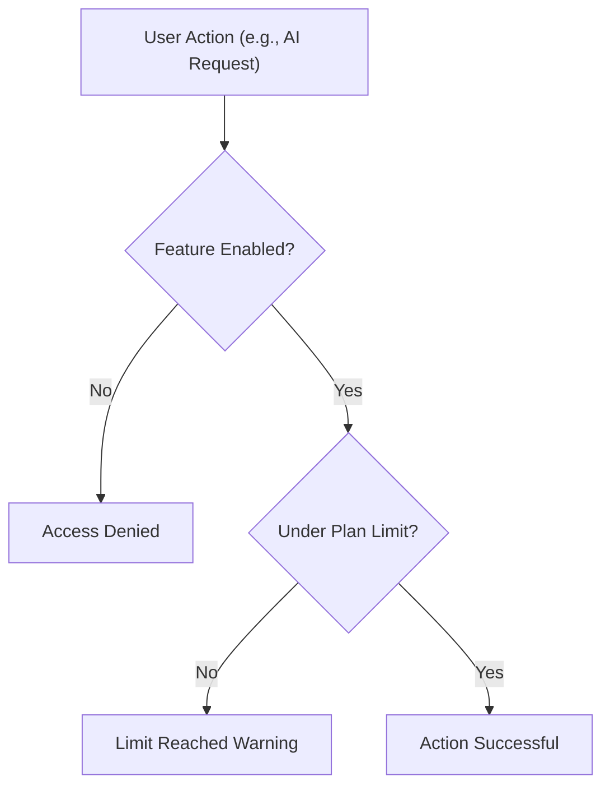

Customize your experience by updating your personal preferences, managing component-specific settings, and tracking your organization's feature limits. Whether you are tweaking the UI or monitoring your API usage, this guide covers everything you need to keep your account running smoothly.

<Card title="Need to upgrade?" icon="pi pi-star" href="/docs/billing">
  If you are hitting feature limits, check out our billing and subscription guide to upgrade your plan.
</Card>

## Managing User Preferences

Preferences allow you to save specific settings for different parts of the platform. Behind the scenes, every preference is tied to a specific **component** (like the dashboard, a specific project view, or notifications) and a **key** (the name of the setting).

### How to update a preference

You can manage your preferences directly through the platform interface, or programmatically via the API if you are building a custom integration.

<Steps>
<Step title="Identify the component">
Determine which part of the application you want to customize (e.g., `dashboard`, `editor`, `notifications`).
</Step>
<Step title="Set the preference key and value">
Choose the specific setting you want to change, such as setting the `theme` key to `dark`. 
</Step>
<Step title="Save your changes">
Once applied, the platform will remember this configuration every time you load that specific component.
</Step>
</Steps>

If you are using the API, you can set a preference using the `/preference` endpoint:

```bash
curl -X PUT "https://api.example.com/preference?component=dashboard&key=theme" \
  -H "Content-Type: application/json" \
  -d '{"value": "dark"}'
```

> [!TIP]
> You can retrieve all of your saved preferences at once by making a `GET` request to the `/preferences` endpoint. You can also filter this list by passing a specific `component` in the query string.

## Feature Flags and Subscriptions

Your organization's access to certain capabilities is governed by **feature flags** tied to your subscription plan. The platform automatically checks these flags to determine what tools and features are available to your team.

### Monitoring Usage Limits

Certain features are metered based on your current subscription plan. The platform continuously validates if your organization has enough quota remaining to perform specific actions.

| Feature Key | Description | Requires Documentation ID? |
|-------------|-------------|----------------------------|
| `documentations` | The total number of documentation projects or pages your organization can create. | No |
| `ai_requests` | The volume of AI-assisted generation or modification requests allowed. | Yes |
| `resources` | Additional assets or storage limits associated with a specific document. | Yes |

> [!WARNING]
> If you exceed your plan's limits, the system will return a `400 Bad Request` when validating the feature limit. You will need to upgrade your subscription or wait for the next billing cycle to resume usage.

### How limit validation works

When you attempt to use a metered feature (like generating content with AI), the platform performs a quick validation check:



## Frequently Asked Questions

<Accordion>
<AccordionTab title="How do I delete a preference?">
If you want to revert a component back to its default state, you can delete the custom preference. Via the API, send a `DELETE` request to `/preference` with the relevant `key` and `component` parameters.
</AccordionTab>
<AccordionTab title="Why am I getting a 'Forbidden' error when checking features?">
Feature validation and subscription endpoints require organization-level permissions. Ensure you are passing the correct `organization_id` and that your user account has the appropriate administrative roles within that organization.
</AccordionTab>
</Accordion>