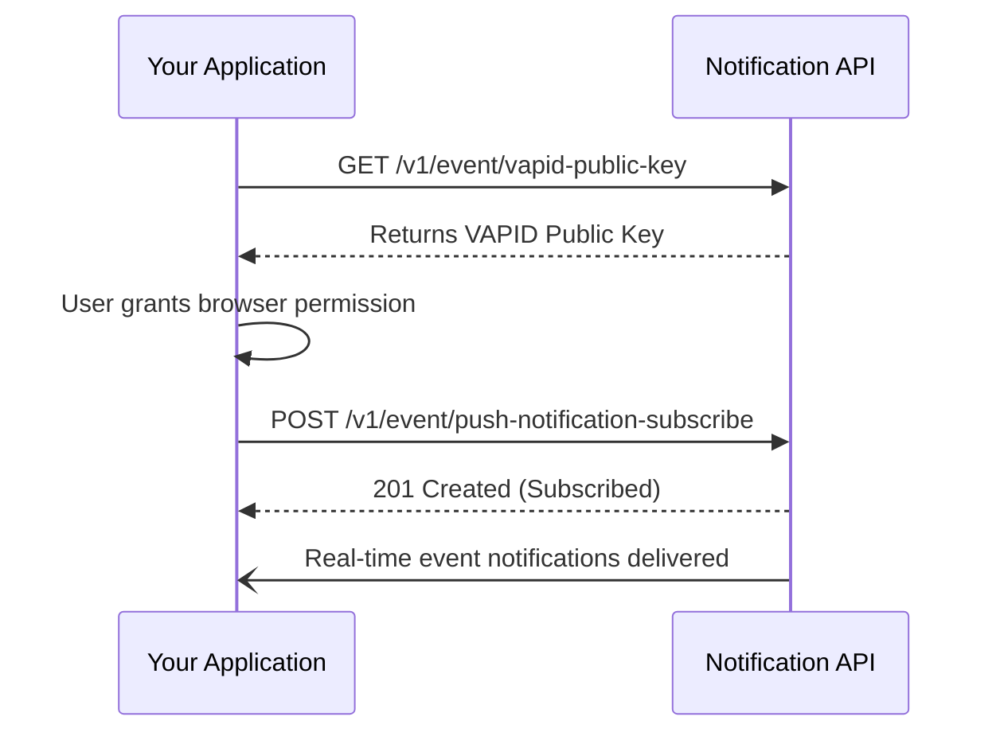

Stay informed about important system events and project updates by configuring push notifications. By setting up event tracking, you can receive real-time alerts in your browser or application and review historical logs of everything happening in your projects. 

<Card title="Real-time Alerts" icon="pi pi-bell">
Configure Web Push notifications to get instantly notified about critical updates without refreshing your page.
</Card>

> [!NOTE]  
> Most notification endpoints require a valid Bearer token. Ensure you have authenticated and have your token ready before testing these endpoints.

## How push notifications work

Our system uses the Web Push standard (VAPID) to securely deliver messages to your application. The flow involves retrieving a public key, generating a subscription in your client, and registering that subscription with our servers.



## Configuring your application

Follow these steps to enable push notifications and view event streams.

<Steps>
<Step title="Retrieve the VAPID Public Key">
First, you need our server's VAPID public key. Your application will use this key to authenticate the push subscription with the browser's push service.

This is a public endpoint and does not require authentication.

```bash
curl -X GET https://api.yourdomain.com/v1/event/vapid-public-key \
  -H "Accept: application/json"
```
</Step>

<Step title="Subscribe to Push Notifications">
Once your client application generates a push subscription object (using the VAPID key and user permissions), send that data to the subscription endpoint.

```bash
curl -X POST https://api.yourdomain.com/v1/event/push-notification-subscribe \
  -H "Authorization: Bearer YOUR_TOKEN" \
  -H "Content-Type: application/json" \
  -d '{
    "endpoint": "https://fcm.googleapis.com/fcm/send/...",
    "keys": {
      "p256dh": "BLW...",
      "auth": "x8..."
    }
  }'
```

> [!TIP]
> The exact structure of the payload depends on the standard PushSubscription object generated by the browser's `PushManager`.
</Step>

<Step title="Review Project Events">
To view a historical list of events or poll for missed notifications, use the event list endpoint. You must specify the project you want to check.

```bash
curl -X POST "https://api.yourdomain.com/v1/event/list?project-id=YOUR_PROJECT_ID" \
  -H "Authorization: Bearer YOUR_TOKEN" \
  -H "Content-Type: application/json" \
  -d '{
    "limit": 50,
    "status": "unread"
  }'
```
</Step>
</Steps>

## Endpoint Reference

Here is a quick reference for the parameters used when fetching project events via the `POST /v1/event/list` endpoint:

| Parameter | Type | Location | Required | Description |
|-----------|------|----------|----------|-------------|
| `project-id` | `string` | Query | Yes | The unique identifier for the project you want to view events for. |
| `input` | `object` | Body | No | Optional filter options (like date ranges or event types) to narrow down the results. |

> [!WARNING]
> If you receive a `401 Unauthorized` error on the subscription or event list endpoints, verify that your Bearer token is not expired and is correctly formatted in the `Authorization` header.

## Frequently Asked Questions

<Accordion>
<AccordionTab title="Why aren't my push notifications showing up?">
First, ensure that the user has granted notification permissions in their browser. If permissions are granted but notifications still fail, check that your Bearer token is valid and that the subscription payload was successfully sent to the `/v1/event/push-notification-subscribe` endpoint (it should return a `201 Created` status).
</AccordionTab>
<AccordionTab title="What is a VAPID key?">
VAPID (Voluntary Application Server Identification) is a specification that allows push services to identify the application server sending the messages. It ensures that only your server can send messages to your users' browsers.
</AccordionTab>
</Accordion>