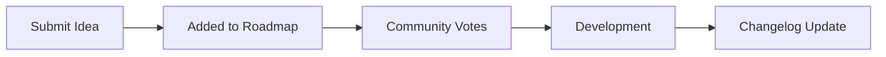

Whether you need help troubleshooting an issue, want to track recent product updates, or have a brilliant idea for a new feature, our platform provides a complete ecosystem for support and feedback. You can interact with these features directly through our API to build custom portals, automate ticket creation, or sync roadmap data with your internal tools.

<Card title="Feedback Lifecycle" icon="pi pi-sync">
  From a simple idea to a shipped feature, learn how your feedback shapes the product roadmap and eventually becomes part of our changelog.
</Card>

## The Feedback Lifecycle

Understanding how ideas become features can help you better engage with our platform. Here is the typical journey of user feedback:



## Managing Support Tickets

When you run into issues, our support system is here to help. Support tickets are scoped to your specific Organization ID. 

<Steps>
<Step title="Open a new ticket">
Create a new support request by sending a `POST` request to `/organization/{organization_id}/support/tickets`. You will need to provide the details of your issue in the request body.
</Step>
<Step title="Check ticket status">
Retrieve the status and details of a specific ticket using `GET /organization/{organization_id}/support/tickets/{ticket_id}`.
</Step>
<Step title="Reply to the thread">
Keep the conversation going by adding new messages to an existing ticket via `POST /organization/{organization_id}/support/tickets/{ticket_id}/messages`.
</Step>
</Steps>

> [!WARNING]
> All support endpoints require a valid Bearer token and must include your `organization_id` in the URL path. Requests without proper authorization will return a `403 Forbidden` error.

## Ideas and Roadmap

We actively encourage users to submit feature requests and vote on the public roadmap. 

### Submitting an Idea

You can submit a new idea directly to our product team. The only required field is a `title`, but providing a detailed `description` helps us understand your use case better.

```json
// POST /tasks/ideas
{
  "title": "Dark Mode Support",
  "description": "It would be great to have a dark mode option for the dashboard to reduce eye strain at night."
}
```

### Voting on Roadmap Items

Once an idea is approved and moved to the public roadmap, users can vote on it. Voting helps our team prioritize what to build next.

| Action | Endpoint | Description |
|--------|----------|-------------|
| **View Roadmap** | `GET /tasks/roadmap` | Fetch all public roadmap items, including their current status, priority, and vote count. |
| **Add Vote** | `POST /tasks/items/{item_id}/vote` | Cast a vote for a specific roadmap item. |
| **Remove Vote** | `DELETE /tasks/items/{item_id}/vote` | Remove your previously cast vote. |

> [!TIP]
> Roadmap items include useful metadata like `start_date`, `due_date`, and `assignee_ids`, making it easy to see exactly when a highly-voted feature is scheduled for release.

## Tracking Updates (Changelog)

Stay up-to-date with the latest fixes, improvements, and features. Our changelog endpoints provide paginated access to all release notes.

To view the latest updates, use the `GET /tasks/changelogs` endpoint. You can control the pagination using query parameters:
* `page`: The page number to retrieve (default: 1)
* `page_size`: The number of items per page (default: 20)

If you need the release notes for a specific version, you can fetch them directly using `GET /tasks/changelogs/version/{version_id}`.

## Frequently Asked Questions

<Accordion>
<AccordionTab title="How do I know if customer ideas are currently enabled?">
Administrators can toggle the ability to receive new ideas. You can check the current configuration status by making a `GET` request to `/tasks/ideas/config`. This will return whether the ideas portal is currently `enabled`.
</AccordionTab>
<AccordionTab title="Can I list all support tickets for my organization?">
Yes! You can retrieve a paginated list of all your organization's tickets using `GET /organization/{organization_id}/support/tickets`. Just like the changelog, you can use `page` and `page_size` query parameters to navigate through your ticket history.
</AccordionTab>
</Accordion>