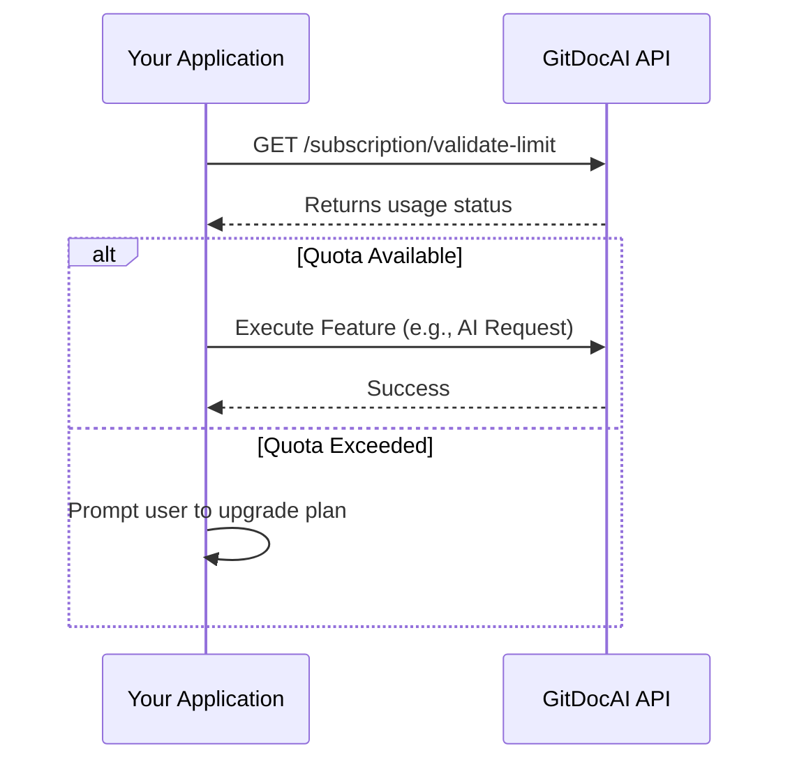

Managing your organization's subscription ensures you have uninterrupted access to the features and usage limits your team needs. By monitoring your plan, you can proactively check feature availability, track your usage quotas, and know exactly when it's time to upgrade.

<Card title="Feature Access" icon="pi pi-star">
Verify which capabilities are included in your current plan.
</Card>
<Card title="Usage Limits" icon="pi pi-chart-line">
Monitor your quota for documentations, AI requests, and resources.
</Card>

## Understanding subscription features

Your subscription plan determines your access to various features and usage quotas. When interacting with the API or managing your account, you will primarily track three key features:

| Feature Key | Description |
|---|---|
| `documentations` | The total number of documentation projects your organization can create. |
| `ai_requests` | The volume of AI-assisted generation or queries available to your team. |
| `resources` | The amount of underlying system resources allocated to your projects. |

> [!NOTE]  
> When tracking usage for `ai_requests` and `resources`, the limits are often tied to a specific documentation project. You will need to reference the `documentation_id` when checking these quotas.

## Validating usage and limits

To prevent unexpected errors during large operations, it is a best practice to programmatically validate your limits before executing actions. 



You can use the Subscription API to check your organization's current standing:

<Steps>
<Step title="Verify feature availability">
Check if your current plan includes a specific feature using the `validate-feature` endpoint. This is useful for conditionally showing UI elements in your own integrations.

```bash
curl -X GET "https://api.gitdocai.com/organization/{organization_id}/subscription/validate-feature?feature=ai_requests" \
  -H "Authorization: Bearer YOUR_TOKEN"
```
</Step>
<Step title="Check specific feature values">
If you need to know the exact configuration or limit value for a feature on your plan, you can retrieve it directly.

```bash
curl -X GET "https://api.gitdocai.com/organization/{organization_id}/subscription/feature-value?feature=documentations" \
  -H "Authorization: Bearer YOUR_TOKEN"
```
</Step>
<Step title="Validate remaining quota">
Before performing a resource-intensive action, check if you have enough quota remaining based on your current usage and plan limits. 

```bash
# Check overall documentation limits
curl -X GET "https://api.gitdocai.com/organization/{organization_id}/subscription/validate-limit?feature=documentations" \
  -H "Authorization: Bearer YOUR_TOKEN"

# Check AI request limits for a specific documentation project
curl -X GET "https://api.gitdocai.com/organization/{organization_id}/subscription/validate-limit?feature=ai_requests&documentation_id=doc_12345" \
  -H "Authorization: Bearer YOUR_TOKEN"
```
</Step>
</Steps>

> [!TIP]
> Always validate limits before initiating bulk operations. If a validation check fails, the API will return a `400 Bad Request` indicating that the limit does not allow more usage.

## Frequently asked questions

<Accordion>
<AccordionTab title="What happens when I exceed my AI request limit?">
If you exceed your AI request limit, the `validate-limit` endpoint will return a restriction, and further AI-assisted actions will be paused until your billing cycle resets or you upgrade your plan.
</AccordionTab>
<AccordionTab title="Can I check limits for multiple features at once?">
Currently, the API requires you to check features individually by passing the specific `feature` key in your request query.
</AccordionTab>
<AccordionTab title="How do I upgrade my plan?">
If you find that your usage frequently hits the plan limits, you can upgrade your subscription at any time by navigating to the **Billing** section in your organization settings via the web dashboard.
</AccordionTab>
</Accordion>