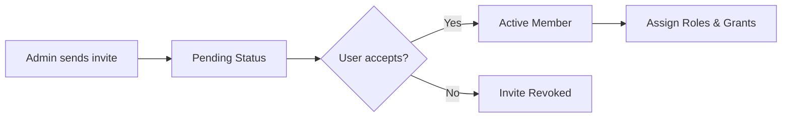

Organizations serve as the central hub for your company's workspaces, billing, and team collaboration. By setting up an organization, you create a secure environment where your team can build, share, and manage documentation together.

This guide walks you through configuring your organization profile, inviting team members, and managing access permissions.

## Setting up your organization

When you first create an account, you'll be prompted to create an organization and complete the onboarding process. 

<Steps>
<Step title="Create your organization">
Choose a clear, recognizable name for your organization. This is usually your company or team name.
</Step>
<Step title="Upload your logo">
Personalize your workspace by uploading a company logo. This helps team members ensure they are in the right workspace, especially if they belong to multiple organizations.
</Step>
<Step title="Complete onboarding">
Fill out the remaining profile details to finish your setup. Once onboarding is complete, your organization is fully active and ready for your team.
</Step>
</Steps>

> [!TIP]
> You can update your organization's name and logo at any time from your organization settings page.

## Managing your team

Once your organization is set up, you can start inviting colleagues. The platform tracks users across two main states: **Pending** and **Active**.

### The invitation lifecycle

When you invite a new user, they don't immediately get access to your organization. They must first accept the invitation.

### User statuses

| Status | Description | Available Actions |
|--------|-------------|-------------------|
| **Pending** | The user has been sent an invitation but hasn't accepted it yet. | Resend invite, Revoke invite |
| **Active** | The user has accepted the invitation and can access the organization. | Change role, Manage doc grants, Remove user |

### Roles and permissions

Every active user in your organization requires a role, which dictates what they can see and do across your workspaces. 

As an administrator, you can update a user's role at any time. If someone changes teams or leaves the company, you can also permanently remove them from the organization, which immediately revokes their access to all internal documents.

> [!WARNING]
> Removing a user from the organization is an immediate action. They will instantly lose access to all workspaces, documents, and settings associated with your company.

## Managing document access

Sometimes you need to give specific users access to individual documents without granting them broad permissions across the entire organization. 

You can manage granular **Document Grants** for individual members. 

> [!NOTE]
> Currently, document-level grants can only be assigned with **Reader** permissions. This is perfect for sharing specific documentation with stakeholders who need to view, but not edit, the content.

To grant access:
1. Navigate to the user's profile in your organization directory.
2. Select **Manage Access**.
3. Add or remove the specific documents they should be allowed to read.

## Frequently asked questions

<Accordion>
<AccordionTab title="Can I belong to multiple organizations?">
Yes! Your single user account can be invited to multiple organizations. You can easily switch between them using the organization switcher in your dashboard.
</AccordionTab>
<AccordionTab title="What happens if I delete my organization?">
Deleting an organization is a permanent action. It will immediately remove all associated workspaces, documents, and user access. We recommend exporting any critical data before initiating a deletion.
</AccordionTab>
</Accordion>

<Card title="Automate with the API" icon="pi pi-code" href="/docs/api/organization">
Are you looking to automate team provisioning? All organization management features—from sending invites to updating roles—are fully supported by our REST API.
</Card>