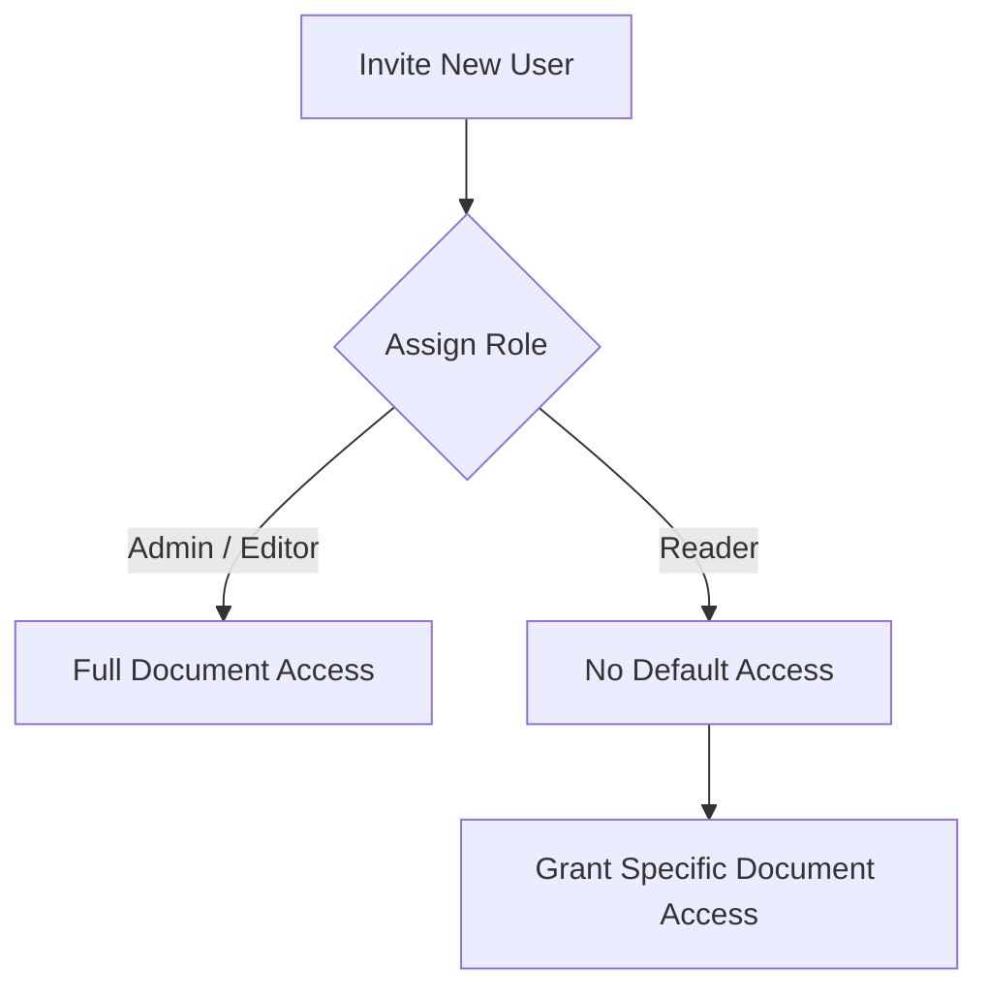

Managing your team's access is critical for both security and effective collaboration. GitDocAI allows you to assign specific roles to organization members, ensuring everyone has the exact permissions they need to view, edit, or publish content. 

This guide covers how to understand access levels, change user roles, and restrict document visibility.

## Understanding Access Levels

GitDocAI uses organization-level roles to determine what a user can do across your workspace. 

| Role | Permissions | Best For |
|---|---|---|
| **Admin** | Full access to organization settings, billing, user management, and all documentation. | Team leads and system administrators. |
| **Editor** | Can create, edit, and publish documentation, but cannot manage organization settings or billing. | Technical writers and developers. |
| **Reader** | Read-only access. By default, readers cannot see any documents until explicitly granted access. | External stakeholders or clients. |

## Managing Team Members

Organization administrators can update roles, manage document access, or remove users at any time.

### Changing a User's Role

If a team member changes positions or needs elevated permissions, you can easily update their role.

<Steps>
<Step title="Navigate to Team Settings">
Open your organization dashboard and go to the **Users** or **Team** settings page.
</Step>
<Step title="Locate the User">
Find the user in your active users list. You can filter between active and pending invitations if they haven't accepted yet.
</Step>
<Step title="Update the Role">
Select the new role (e.g., Admin, Editor, or Reader) from the permissions dropdown next to their name. Changes take effect immediately.
</Step>
</Steps>

### Managing Document Access for Readers

To maintain strict access control, users assigned the **Reader** role do not automatically get access to all documentation. You must explicitly grant them access to specific docs.

> [!NOTE]  
> Currently, granular document-level access (adding or removing specific document grants) is only applicable to users with the **Reader** role. Admins and Editors inherently have access to all organization documents.

To update a Reader's access:
1. Select the Reader from your organization's user list.
2. Open their **Document Access** settings.
3. Select the specific documentations you want to **Add** or **Remove** from their view.

### Removing a User

If a team member leaves or no longer needs access to your organization, you can remove them entirely. 

> [!WARNING]  
> Removing a user immediately revokes their access to all organization resources, including any documents they were previously granted access to. 

To remove a user, locate them in your team settings and select the **Remove User** option. 

## Automating Team Management

For enterprise teams managing users at scale, GitDocAI provides API endpoints to automate role assignments and document access.

<Accordion>
<AccordionTab title="View API Endpoints for User Management">
You can manage users programmatically using the following endpoints. All requests require a valid Bearer token.

*   **Update Role:** `PATCH /v1/organization/{organization_id}/user/{user_id}/role`
    *   *Body:* `{"role": "reader"}`
*   **Update Document Access:** `PATCH /v1/organization/{organization_id}/users/{user_id}/documentations`
    *   *Body:* `{"add": ["doc_id_1"], "remove": ["doc_id_2"]}`
*   **Remove User:** `DELETE /v1/organization/{organization_id}/user/{user_id}`
*   **Invite User:** `POST /v1/organization/{organization_id}/user/invite`
</AccordionTab>
</Accordion>