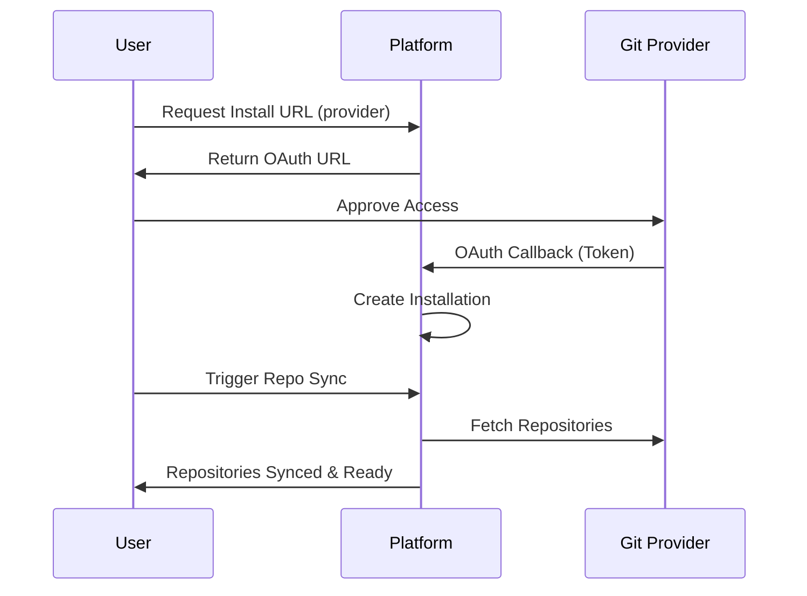

Connect your Git repositories to seamlessly integrate your source code with your organization. By authorizing your GitHub, GitLab, or Bitbucket accounts via OAuth, you can automatically sync repositories, manage installations, and access file contents directly through the platform.

> [!INFO]
> All Git provider actions are scoped to your specific `organization_id`. Ensure you have the appropriate permissions within your organization before initiating an OAuth connection.

## How the Connection Works

Connecting a Git provider involves a standard OAuth flow. You request an installation URL, authorize the application, and then sync your repositories to make them accessible.



## Connecting a Provider

Follow these steps to authorize and connect a new Git provider to your organization.

<Steps>
<Step title="Generate the installation URL">
First, request the OAuth installation URL for your desired Git provider (e.g., `github`, `gitlab`, or `bitbucket`).

```bash
GET /v1/organizations/{organization_id}/git-provider/install-url?provider=github
```
</Step>
<Step title="Authorize the application">
Redirect the user to the URL returned in the previous step. Once the user approves the connection, the Git provider will send OAuth callback data to your callback endpoint, which creates the installation.

```bash
POST /v1/organizations/{organization_id}/git-provider/callback
```
</Step>
<Step title="Sync your repositories">
Once the installation is created, trigger a sync to pull the list of available repositories from the connected Git provider into your organization.

```bash
POST /v1/organizations/{organization_id}/git-provider/repositories/sync
```
</Step>
</Steps>

## Managing Repositories

After successfully syncing, you can browse and search through your connected repositories. 

### Listing and Filtering

When retrieving your repositories via `GET /v1/organizations/{organization_id}/git-provider/repositories`, you can use the following query parameters to narrow down your results:

| Parameter | Type | Description |
|-----------|------|-------------|
| `installation_id` | String | Filter repositories belonging to a specific OAuth installation. |
| `provider` | String | Filter by the Git provider type (e.g., `github`). |
| `search` | String | Search for a specific repository by its name. |

### Reading File Content

You can fetch the raw content of any file within a connected repository. This is useful for reading configuration files, documentation, or source code directly via the API.

```bash
GET /v1/organizations/{organization_id}/git-provider/repositories/{repository_id}/content?path=README.md&branch=main
```

> [!TIP]
> The `branch` parameter is optional. If you don't provide it, the API will automatically fetch the file from the repository's default branch (usually `main` or `master`).

## Managing Installations

An "installation" represents a single connected Git account. You can have multiple installations within a single organization.

* **List installations:** `GET /v1/organizations/{organization_id}/git-provider/installations`
* **View specific installation:** `GET /v1/organizations/{organization_id}/git-provider/installations/{installation_id}`
* **Remove an installation:** `DELETE /v1/organizations/{organization_id}/git-provider/installations/{installation_id}`

> [!WARNING]
> Deleting an installation immediately revokes access to all repositories associated with that Git account. Any workflows or integrations relying on those repositories will fail.

<Accordion>
<AccordionTab title="What happens if I add a new repository to my Git account?">
New repositories are not automatically pulled in real-time. You will need to call the Sync Repositories endpoint (`POST .../repositories/sync`) again to update your organization's repository list with the latest additions.
</AccordionTab>
<AccordionTab title="Can I connect multiple GitHub accounts?">
Yes. Each time you complete the OAuth flow, a new unique `installation_id` is generated. You can connect multiple accounts from the same provider to a single organization.
</AccordionTab>
</Accordion>