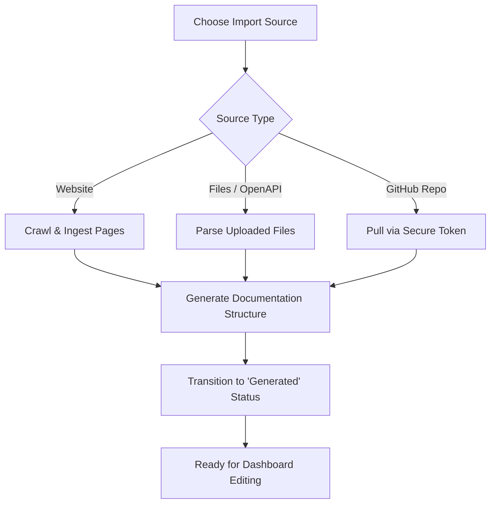

Creating documentation doesn't mean you have to start from a blank page. You can easily kickstart your project by bringing in existing content—whether that means scraping a live website, uploading files, or connecting your code repositories.

<Card title="Website Import" icon="fa fa-globe">
Crawl an existing website to automatically generate structured documentation.
</Card>
<Card title="File & OpenAPI Upload" icon="fa fa-file">
Upload Markdown files or OpenAPI specs to instantly build your pages.
</Card>
<Card title="GitHub Integration" icon="fa fa-code">
Sync directly with your repositories to keep docs close to your code.
</Card>

## Importing from a Website

If you already have documentation or content hosted online, you can import it directly. When you provide a website URL, the system attaches the site as a temporary resource, crawls the pages to ingest the content, and kicks off the generation process.

<Steps>
<Step title="Enter your URL">
Navigate to the import wizard and provide the starting URL of the website you want to bring in.
</Step>
<Step title="Wait for the crawl">
The system will scan the website and extract the text, structure, and hierarchy.
</Step>
<Step title="Review and edit">
Once generation is complete, your new documentation will be ready for you to edit and refine in the dashboard.
</Step>
</Steps>

> [!TIP]
> Website importing is perfect for migrating from older documentation platforms, pulling in a company wiki, or consolidating scattered web resources.

## Importing Files and OpenAPI Specs

You can upload files directly from your computer to build your documentation structure. 

### Standard Files
If you have existing Markdown or text files, you can upload them into the system. The platform will process these files and convert them into editable documentation pages, preserving your original formatting.

### OpenAPI and Swagger Specs
For API documentation, you can import an OpenAPI or Swagger specification file. This automatically seeds your project with a dedicated API reference section and kicks off the OpenAPI generator.

You have two ways to provide an OpenAPI spec:

| Source Variant | Required Information | Best For |
|----------------|----------------------|----------|
| **Direct Upload** | The OpenAPI `.json` or `.yaml` file. | One-off imports or testing an API spec you have saved locally. |
| **Repository File** | GitHub installation, repository, branch, and file path. | Keeping your API reference securely synced with your codebase. |

> [!NOTE]
> When using a repository file for your OpenAPI spec, ensure the file path exactly matches the location of the spec inside your GitHub repository.

## Connecting a GitHub Repository

For teams that treat documentation like code, you can initialize your project directly from a GitHub repository. 

By connecting your GitHub account, the system uses a secure installation token to pull your repository's contents. This kicks off a generation pipeline that automatically builds your product documentation based on your codebase's structure and Markdown files.

## How the Import Process Works

Regardless of which method you choose, the system follows a standard pipeline to turn your raw data into a polished documentation site:

## Other Ways to Start

If you don't have existing files or a website to import, you still have great options to get started quickly without staring at a blank screen.

<Accordion>
<AccordionTab title="Start with AI">
Provide a simple prompt describing what you need. The AI will seed a pending document, write a first draft, and set up your initial sections. You can watch the progress live in the dashboard as it generates!
</AccordionTab>
<AccordionTab title="Start from a Template">
Use a preset template to instantly apply a polished theme (including colors, fonts, and dark/light modes). This injects a fully structured demo—complete with multiple pages, folders, and hero images—so you can just fill in the blanks.
</AccordionTab>
</Accordion>