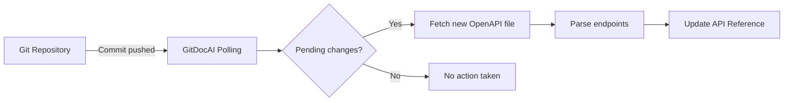

Generate beautiful, interactive API references automatically by importing your OpenAPI or Swagger specifications. GitDocAI parses your specification files to create structured, easy-to-navigate documentation for your endpoints, complete with request and response schemas.

You can bring your OpenAPI specifications into GitDocAI using two primary methods:

<Card title="Direct File Upload" icon="pi pi-upload">
Upload a static `.json` or `.yaml` OpenAPI file directly from your local machine.
</Card>
<Card title="Repository Sync" icon="pi pi-github">
Link a file from your connected Git repository to automatically update your docs whenever you push changes.
</Card>

## Importing your specification

Follow these steps to add an OpenAPI specification to your documentation project:

<Steps>
<Step title="Add a new section">
Navigate to your project dashboard and click **Add Section**. When prompted for the section kind, select **OpenAPI**.
</Step>
<Step title="Choose your source">
Select whether you want to **Upload a file** or connect a **Repository file**. 
- If uploading, select the file from your computer.
- If using a repository, select your linked repository, branch (e.g., `main`), and the exact file path to your `openapi.yaml` or `swagger.json` file.
</Step>
<Step title="Start the import">
Click **Import**. GitDocAI will begin fetching and processing your specification.
</Step>
</Steps>

> [!NOTE]
> If you don't have an OpenAPI specification yet, you can choose the **Describe with AI** or **Blank** section types to generate or write your API documentation from scratch.

## Processing and status

Once you initiate the import, GitDocAI processes your file in the background. You can monitor the ingestion progress on your dashboard.

| Status | Description |
|--------|-------------|
| `processing` | GitDocAI is currently fetching the file and parsing your API endpoints. |
| `completed` | The specification was successfully parsed. Your API reference is now live. |
| `failed` | GitDocAI encountered an error. This usually happens if the file is not valid JSON/YAML or violates the OpenAPI specification rules. |

> [!WARNING]
> Ensure your OpenAPI file is valid before importing. Syntax errors or missing required fields (like `info.title` or `paths`) will cause the import to fail.

## What gets imported?

When a specification is successfully parsed, GitDocAI extracts key metadata to build your documentation. You can view these details in your section settings:

*   **Spec Title:** The name of your API (extracted from `info.title`).
*   **Spec Version:** The version of your API (extracted from `info.version`).
*   **Endpoint Count:** The total number of individual API routes and methods parsed from the file.

## Keeping your documentation in sync

If you imported your OpenAPI specification via **Repository Sync**, GitDocAI ensures your documentation is always up-to-date with your codebase. 

GitDocAI periodically checks the remote repository for updates. It compares the `remote_commit_sha` of your file against the last ingested `commit_sha`. If it detects pending changes, it automatically re-fetches the file, updates the content hash, and regenerates your API reference.

> [!TIP]
> You can also manually trigger a sync from the dashboard if you need your documentation updated immediately after a push.

## Frequently asked questions

<Accordion>
<AccordionTab title="What file formats are supported?">
GitDocAI supports both JSON (`.json`) and YAML (`.yaml` or `.yml`) file formats for OpenAPI and Swagger specifications.
</AccordionTab>
<AccordionTab title="What happens if my repository sync fails?">
If a sync fails (for example, if the file was deleted or renamed in the repository), your existing documentation will remain visible, but the section will show a `failed` status for the latest sync attempt. You will need to update the file path in your section settings.
</AccordionTab>
<AccordionTab title="Can I edit the generated API reference manually?">
API references generated from an OpenAPI specification are read-only in the GitDocAI editor to prevent them from being overwritten during the next sync. To make changes, update your source OpenAPI file and let GitDocAI sync the updates.
</AccordionTab>
</Accordion>