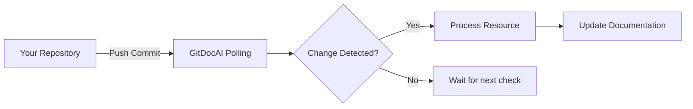

Keep your documentation perfectly aligned with your codebase. By connecting your repository, GitDocAI automatically tracks changes, detects drift, and ingests new content whenever you push updates to your default branch.

<Card title="Need to connect a repository first?" icon="fa fa-plug" href="/docs/connecting-data-sources/github">
  Learn how to install the GitDocAI app and link your first repository before configuring sync settings.
</Card>

## How syncing works

When a repository is connected to GitDocAI, the system continuously monitors it for new commits. When changes are detected, GitDocAI compares the remote repository to your currently published documentation and automatically processes the differences.

> [!TIP]
> GitDocAI tracks the exact commit SHA and commit messages for every sync. This ensures you always know exactly which version of your code is currently reflected in your documentation.

## Manually triggering a sync

While GitDocAI automatically polls your repository for changes, you can also force a manual sync if you need your documentation updated immediately. 

<Steps>
<Step title="Navigate to your Data Sources">
Go to your project dashboard and select **Data Sources** from the sidebar.
</Step>
<Step title="Select your installation">
Locate the repository or organization installation you want to update.
</Step>
<Step title="Trigger the sync">
Click the **Sync Now** button. This tells GitDocAI to immediately check for pending changes and fetch the latest commits.
</Step>
</Steps>

### Understanding sync results

When a sync completes, GitDocAI provides a summary of the actions taken during the process. You will see counts for the following metrics:

| Action | Description |
|--------|-------------|
| **Added** | New files discovered in your repository that have been ingested into your docs. |
| **Updated** | Existing files that were modified in your repository since the last sync. |
| **Removed** | Files that were deleted from your repository and subsequently removed from your docs. |
| **Synced** | The total number of repositories successfully checked and processed. |

## Monitoring sync progress

Large repositories or complex OpenAPI specifications might take a few moments to fully ingest. You can monitor the status of any ongoing sync in your dashboard.

A sync will display one of three statuses:
* **Processing**: GitDocAI is actively fetching files and ingesting content. You'll see a progress indicator showing the number of items processed versus the total items found.
* **Completed**: All files have been successfully fetched and ingested.
* **Failed**: An error occurred during the sync (e.g., permissions were revoked or a file was unreadable). 

> [!WARNING]
> If a sync fails, your documentation will safely remain on the last successful commit. No partially-synced changes will be published.

## Drift detection and pending changes

GitDocAI is designed to let you know if your documentation is falling behind your codebase. 

If automatic syncing is paused or if a manual sync is required, GitDocAI will flag your repository as having **Pending Changes**. The dashboard will display exactly how many **Commits Ahead** the remote repository is compared to your currently ingested documentation.

<Accordion>
<AccordionTab title="How often does GitDocAI check for changes?">
GitDocAI regularly polls your connected repositories. You can view the exact timestamp of the last check by looking at the "Last Checked At" indicator on your repository settings page.
</AccordionTab>
<AccordionTab title="Does syncing work for OpenAPI specs and websites too?">
Yes! The sync engine supports standard repository files, OpenAPI specifications, and even connected websites. GitDocAI tracks the content hashes and crawl depths to ensure all your connected sources stay up to date.
</AccordionTab>
<AccordionTab title="What happens if I change my default branch?">
GitDocAI tracks the default branch configured in your provider (like GitHub or GitLab). If you change your default branch, GitDocAI will detect this during the next sync and begin pulling content from the new branch.
</AccordionTab>
</Accordion>