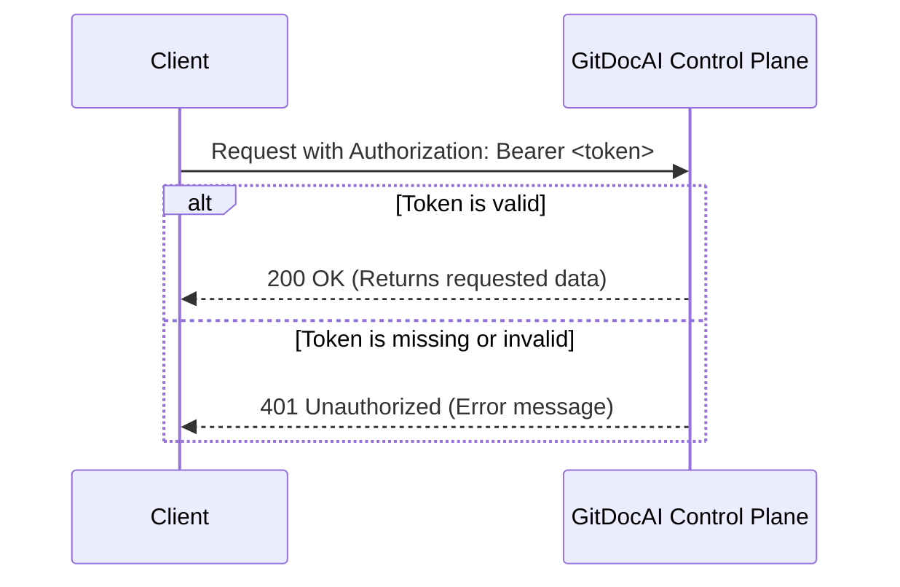

To securely interact with the GitDocAI Control Plane Service, you'll need to authenticate your API requests. This guide shows you how to structure your authentication headers and make your first secure request to manage your organizations, documentation, domains, and analytics.

## Authentication Method

The GitDocAI API uses **Bearer Token Authentication**. This means you must include a valid API key in the HTTP headers of every request you make to the server.

| Property | Details |
|----------|---------|
| **Security Type** | API Key (Bearer) |
| **Header Name** | `Authorization` |
| **Value Format** | `Bearer <YOUR_API_KEY>` |
| **Base Path** | `/control-plane/api/v1` |
| **Supported Protocols** | HTTPS (recommended), HTTP |

> [!WARNING]  
> Treat your API keys like passwords. Never commit them to version control, embed them in client-side code, or share them publicly. Always use environment variables or a secure secrets manager.

## How to Authenticate

Follow these steps to successfully authenticate your requests against the Control Plane API:

<Steps>
<Step title="Get your API key">
Obtain your unique API key from your GitDocAI developer dashboard.
</Step>
<Step title="Construct the Authorization header">
Create an HTTP header named `Authorization`. Set its value to the word `Bearer`, followed by a single space, and then your API key.
</Step>
<Step title="Send your request">
Attach this header to your request and send it to the appropriate `/control-plane/api/v1` endpoint.
</Step>
</Steps>

### Code Example

Here is how you can make an authenticated request using cURL. Replace `YOUR_API_KEY` with your actual token.

```bash
curl -X GET "https://api.gitdocai.com/control-plane/api/v1/organizations" \
  -H "Authorization: Bearer YOUR_API_KEY" \
  -H "Content-Type: application/json"
```

> [!TIP]
> If your token is invalid, expired, or missing, the API will return a `401 Unauthorized` status code. 

## Authentication Flow

The following diagram illustrates how the Control Plane Service processes your authenticated requests:



## Troubleshooting

<Accordion>
<AccordionTab title="Why am I getting a 401 Unauthorized error?">
This usually happens for one of three reasons:
1. The `Authorization` header is missing from your request.
2. The header is formatted incorrectly (e.g., missing the word `Bearer ` before the token).
3. Your API key has expired or was revoked.
</AccordionTab>
<AccordionTab title="Can I use HTTP instead of HTTPS?">
While the API technically accepts both `http` and `https` schemes, we strongly recommend using **HTTPS** for all requests. Sending Bearer tokens over unencrypted HTTP exposes your credentials to interception.
</AccordionTab>
</Accordion>