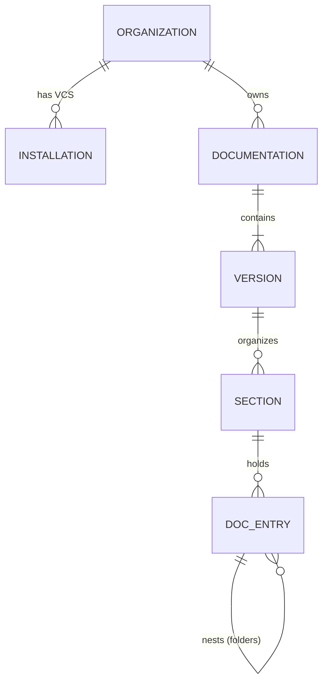

This reference guide covers the fundamental data structures and models used throughout the GitDocAI API. Understanding these core concepts will help you navigate the API, structure your requests, and interpret responses effectively.

> [!TIP]
> If you are just getting started with the API, we recommend reviewing these models to understand how GitDocAI organizes your content, from the top-level Organization down to individual documentation pages.

## Data Model Architecture

The GitDocAI data model follows a strict hierarchy. An **Organization** owns multiple **Documentation** projects. Each project can have multiple **Versions**, which are organized into **Sections** that contain nested **DocEntries** (your actual pages and folders).

---

## Core Entities

### Organization
The `Organization` is the top-level container for all your users, billing, and documentation projects. 

| Property | Type | Description |
|----------|------|-------------|
| `id` | `string` | Unique identifier for the organization. |
| `name` | `string` | The display name of the organization. |
| `logoUrl` | `string` | URL pointing to the organization's logo. |
| `onboardingComplete` | `boolean` | Indicates if the initial setup is finished. |

### Installation
An `Installation` represents a connection to a Version Control System (VCS) provider, allowing GitDocAI to sync your repositories.

| Property | Type | Description |
|----------|------|-------------|
| `id` | `string` | Unique identifier for the installation. |
| `provider` | `string` | The VCS provider (`github`, `gitlab`, `bitbucket`, `azure_devops`). |
| `accountName` | `string` | The name of the connected VCS account or organization. |
| `status` | `string` | Current status (`active`, `suspended`, `revoked`). |

### Documentation
The `Documentation` object represents a single documentation website or project. It holds the global configuration, styling, and deployment status.

| Property | Type | Description |
|----------|------|-------------|
| `id` | `string` | Unique identifier for the project. |
| `name` | `string` | The internal name of the documentation project. |
| `config` | `object` | The `DocumentationConfig` containing theme, SEO, and layout settings. |
| `status` | `string` | Generation status (`pending`, `processing`, `generated`, `failed`, `published`). |
| `publishState` | `string` | Deployment status (`idle`, `in_progress`, `succeeded`, `failed`). |

> [!NOTE]
> The `config` object is highly customizable. It includes nested configurations for your `theme` (colors, fonts, light/dark mode), `seo` (analytics, meta tags), `navbar`, and `footer`.

---

## Content Hierarchy

Content in GitDocAI is structured into Versions, Sections, and DocEntries.

### Version
A `Version` represents a specific release or snapshot of your documentation (e.g., "v1.0", "Latest", "Beta").

| Property | Type | Description |
|----------|------|-------------|
| `id` | `string` | Unique identifier. |
| `name` | `string` | Display name (e.g., "v2.0"). |
| `isLatest` | `boolean` | Flags if this is the primary/latest version. |
| `sections` | `array` | List of `Section` objects belonging to this version. |

### Section
Sections act as the top-level categories in your documentation sidebar.

| Property | Type | Description |
|----------|------|-------------|
| `id` | `string` | Unique identifier. |
| `name` | `string` | Display name of the section. |
| `order` | `integer` | Controls the display order in the sidebar. |
| `docEntries` | `array` | The root-level pages and folders inside this section. |

### DocEntry
The `DocEntry` is the most common model you will interact with. It represents a single node in your documentation tree—this can be a Markdown page, an API endpoint reference, or a folder containing other entries.

| Property | Type | Description |
|----------|------|-------------|
| `id` | `string` | Unique identifier. |
| `title` | `string` | The title of the page or folder. |
| `type` | `string` | The entry type (`page`, `folder`, `api_endpoint`). |
| `content` | `string` | The raw Markdown content (if `type` is `page`). |
| `metadata` | `object` | SEO and display metadata (author, description, reading time). |
| `children` | `array` | Nested `DocEntry` objects (if `type` is `folder`). |

> [!WARNING]
> When updating a `DocEntry` via the API, ensure you maintain the correct `parentID` and `sectionID` to prevent the page from becoming orphaned in the documentation tree.

---

## Common Enumerations

The API uses several standardized enums to represent states and types. 

<Accordion>
<AccordionTab title="DocEntryType">
Defines the behavior of a documentation node.
* `page`: A standard Markdown article.
* `folder`: A structural node that contains other DocEntries.
* `api_endpoint`: An automatically generated API reference page.
</AccordionTab>

<AccordionTab title="DocgenPhase">
Tracks the progress of the AI documentation generation pipeline.
* `loading`: Process initiated.
* `ingesting`: Reading source code/files.
* `analyzing`: AI summarizing the chunks.
* `architecting`: Planning the documentation structure.
* `generating`: Writing the actual pages.
* `enriching`: Adding styling and formatting.
* `saving`: Persisting to the database.
* `completed` / `failed`: Final states.
</AccordionTab>

<AccordionTab title="ThemePreset">
Built-in color and styling presets available in the `ThemeConfig`.
* `pearl`
* `jade`
* `slate`
* `onyx`
* `mist`
</AccordionTab>
</Accordion>