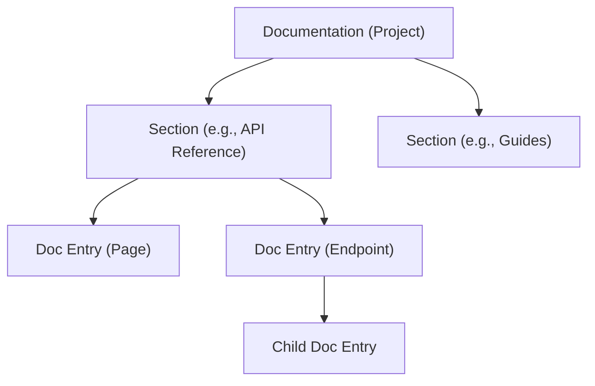

The Documentation Management API allows you to programmatically create, organize, and update your GitDocAI documentation. Whether you are integrating documentation generation into your CI/CD pipelines, bulk-importing existing content, or triggering AI-assisted writing, these endpoints and data models provide full control over your documentation structure.

> [!NOTE]
> All API requests require a valid Bearer token in the `Authorization` header. Ensure your API key has the necessary permissions to create and modify documentation resources.

## Documentation Hierarchy

Before diving into the payloads, it is helpful to understand how documentation is structured in GitDocAI. 



## Core Data Models (DTOs)

When interacting with the Documentation API, you will frequently use the following Data Transfer Objects (DTOs) to define your content.

### Creating Documentation

To initialize a new documentation project, you will send a `CreateDocumentationRequest`. 

| Field | Type | Required | Description |
|-------|------|----------|-------------|
| `name` | string | Yes | The title of the documentation project (max 255 chars). |
| `description` | string | No | A brief overview of what this documentation covers. |
| `audience` | string | No | The target audience type. |
| `status` | string | No | The publication status. |

> [!TIP]
> **About the `status` field:** When omitted, the documentation is created as `pending` (often used when the AI wizard is still generating content). If you are hand-authoring or importing an already-built doc, you can pass `generated` to skip the pending state.

### Creating Sections

Sections act as the main navigational folders for your documentation. Use the `CreateSectionRequest` object to define them.

| Field | Type | Required | Description |
|-------|------|----------|-------------|
| `name` | string | Yes | The display name of the section. |
| `slug` | string | Yes | The URL-friendly identifier. |
| `type` | string | Yes | The type of section (e.g., standard, api_reference). |
| `icon` | string | No | An optional icon identifier. |
| `order` | integer | No | The display order in the sidebar. |
| `visible` | boolean | No | Whether the section is publicly visible. |
| `prompt` | string | No | AI instructions specific to this section's generation. |

### Managing Document Entries

Entries are the actual pages, API endpoints, or folders within a section. You can create them individually or in bulk.

#### Single Entry Creation
The `CreateDocEntryRequest` is used to create a single page.

```json
{
  "title": "Authentication",
  "slug": "authentication",
  "type": "page",
  "content": "## Authenticating your requests...",
  "parent_id": "optional-parent-uuid",
  "order": 1
}
```

#### Batch Entry Creation
For CI/CD pipelines or migrations, creating entries one-by-one is inefficient. Use the `BatchCreateDocEntriesRequest` to send an array of `BatchCreateDocEntryItem` objects.

> [!INFO]
> **Smart Hierarchy:** When batch creating, you can use the `parent_slug` field instead of `parent_id`. This allows you to reference parent entries that are being created *in the exact same batch request*, making it easy to upload deeply nested folders in a single API call.

| Field | Type | Description |
|-------|------|-------------|
| `title` | string | The title of the entry. |
| `slug` | string | The URL slug. |
| `type` | string | The entry type (e.g., `page`, `api_endpoint`). |
| `content` | string | The markdown content of the page. |
| `parent_id` | string | Direct ID reference to an existing parent entry. |
| `parent_slug` | string | Reference to a parent by slug (must exist in the same batch). |
| `metadata_visibility` | object | Controls which metadata (author, reading time, tags) is visible. |

## Advanced Operations

### AI Initialization

If you want GitDocAI to scaffold documentation for you programmatically, you can use the `InitializeFromAIRequest` payload.

| Field | Type | Required | Description |
|-------|------|----------|-------------|
| `prompt` | string | Yes | The natural language instructions for what the AI should generate. |
| `section_name` | string | No | The specific section to target for generation. |

### Reordering Entries

To update the navigation order of your sidebar without updating the content of the pages themselves, use the `ReorderDocEntriesRequest`.

```json
{
  "entry_ids": [
    "uuid-for-introduction",
    "uuid-for-authentication",
    "uuid-for-endpoints"
  ]
}
```
Pass an array of entry IDs in the exact order you want them to appear.

## Entry Metadata & Visibility

When retrieving documentation via the API, the system returns a `DocEntryResponse`. This includes rich metadata about the page's lifecycle.

You can control what end-users see using the `DocEntryMetadataVisibilityDTO`:

*   `show_author`: Display the user who last edited the page.
*   `show_publish_date`: Show when the page first went live.
*   `show_update_date`: Show the last modified timestamp.
*   `show_reading_time`: Display the estimated time to read the page.
*   `show_tags`: Display categorical tags associated with the entry.