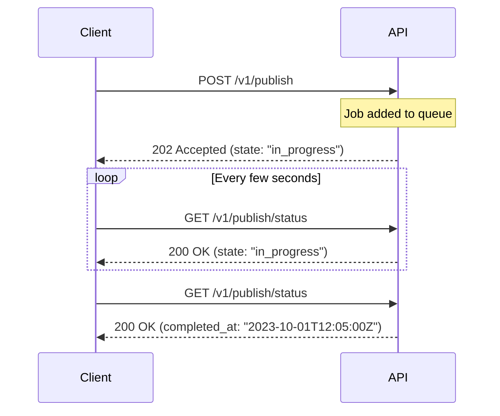

When interacting with the API, you can expect predictable, structured JSON responses. This guide covers how our API formats data, handles large lists through pagination, and manages asynchronous tasks so you can build robust integrations.

## Standard Response Formats

The API returns standard JSON for all successful requests and errors. Depending on the endpoint, you will generally receive one of two response types:

1. **Single Resource:** A direct JSON object representing the entity (e.g., an Organization or a User).
2. **Paginated List:** A wrapper object containing an array of items and pagination metadata.

> [!NOTE]
> All timestamps returned by the API (such as `created_at` or `published_at`) are formatted as strings following the RFC3339 standard (e.g., `2023-10-01T15:04:05Z`).

## Pagination

Endpoints that return collections of items (like listing customers or organizations) use pagination to ensure fast response times and manageable payloads. 

When you request a list, the API wraps the results in a paginated response object. You can control the results by appending `page` and `page_size` query parameters to your request.

### The Pagination Object

A paginated response includes your data array (often labeled `data` or `items`) alongside a `page_info` object that helps you navigate the dataset.

| Field | Type | Description |
|-------|------|-------------|
| `page` | Integer | The current page number you are viewing (typically starts at 1). |
| `page_size` | Integer | The number of items requested per page. |
| `total_items` | Integer | The absolute total number of items across all pages. |
| `total_pages` | Integer | The total number of pages available. |
| `has_next` | Boolean | `true` if there is a subsequent page of results. |
| `has_prev` | Boolean | `true` if there is a preceding page of results. |

### Example Paginated Response

Here is an example of what a paginated response looks like when fetching a list of organizations:

```json
{
  "data": [
    {
      "id": "org_123abc",
      "name": "Acme Corp",
      "created_at": "2023-10-01T12:00:00Z",
      "onboarding_complete": true
    },
    {
      "id": "org_456def",
      "name": "Globex",
      "created_at": "2023-10-02T09:30:00Z",
      "onboarding_complete": false
    }
  ],
  "page_info": {
    "page": 1,
    "page_size": 20,
    "total_items": 45,
    "total_pages": 3,
    "has_next": true,
    "has_prev": false
  }
}
```

> [!TIP]
> Always rely on the `has_next` boolean to determine if you should make another request, rather than calculating pages manually. This ensures your integration remains resilient to underlying data changes.

## Asynchronous Operations

Some actions, such as publishing documentation, take time to process and cannot be completed in a single synchronous HTTP request. For these endpoints, the API uses an asynchronous pattern.

When you initiate an async task, the API immediately returns an "Accepted" response. You can then poll a status endpoint to check when the job completes.



### Async Response Fields

When a job is accepted, you will receive a payload indicating the task is underway:

```json
{
  "message": "Publishing started successfully",
  "state": "in_progress",
  "started_at": "2023-10-01T12:00:00Z"
}
```

When checking the status of the job, the response will eventually include a `completed_at` timestamp or an `error` string if the process failed.

## Common Metadata

Across the API, you will see consistent metadata fields attached to most resources. Familiarizing yourself with these will make parsing responses easier:

| Field | Description |
|-------|-------------|
| `id` | A unique string identifier for the resource. |
| `created_at` | The RFC3339 timestamp indicating when the resource was created. |
| `updated_at` | The RFC3339 timestamp indicating when the resource was last modified. |

<Accordion>
<AccordionTab title="Why are some counts or nested objects empty?">
For performance reasons, some endpoints omit heavy nested objects or external billing data (like `plan_name`) if the organization doesn't have an active subscription, or if the wizard tracking isn't currently active. Always check for `null` or empty strings when parsing optional metadata.
</AccordionTab>
</Accordion>