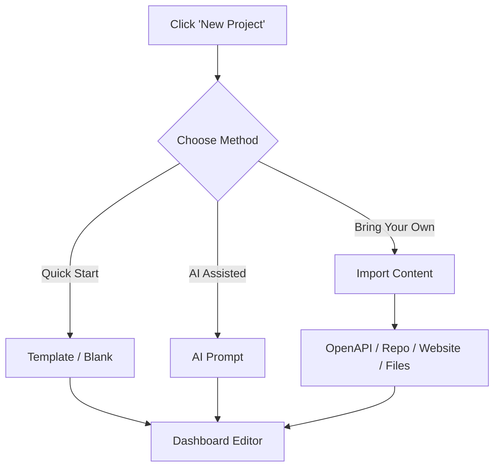

Welcome to your documentation journey! Creating your first project is quick and flexible. Whether you want to start with a polished template, use AI to write your first draft, or import existing content, we have a method that fits your workflow.

<Card title="Start from a Template" icon="pi pi-star" href="#starting-from-a-template">
The fastest way to get a beautiful, pre-configured documentation site with demo content.
</Card>
<Card title="Generate with AI" icon="pi pi-bolt" href="#generating-with-ai">
Describe what you need, and let our AI build your initial documentation structure.
</Card>
<Card title="Import Existing Content" icon="pi pi-cloud" href="#importing-existing-content">
Bring in your OpenAPI specs, GitHub repositories, or existing websites.
</Card>

## How to create your project

No matter which path you choose, creating a project follows a simple flow. 

<Steps>
<Step title="Start a new project">
From your main dashboard, click the **New Project** button to open the project creation wizard.
</Step>
<Step title="Choose your initialization method">
Select how you want to build your foundation. You can start fresh, use a template, prompt our AI, or import existing resources.
</Step>
<Step title="Configure your source">
Depending on your choice, you might need to provide a prompt, upload a file, or connect a repository. 
</Step>
<Step title="Generate and edit">
Once initialized, you'll be taken straight to the dashboard editor. For AI and import methods, generation happens in the background while you watch the progress in real-time!
</Step>
</Steps>

## Choosing the right starting point

### Starting from a Template

If you are new to the platform, we highly recommend starting from a template. This option seeds your project with a polished demo so you can see exactly how features work.

When you select a template, the system automatically applies a preset theme (including colors, fonts, and default light/dark modes) and injects a fully structured documentation section containing 14 sample entries:
* A welcome page with a hero image
* 3 top-level pages
* 2 folders (containing 3 and 6 pages respectively)

> [!TIP]
> Templates are completely editable. Once generated, you can easily delete the sample pages and replace them with your own content while keeping the beautiful theme settings.

### Starting Blank

For users who know exactly what they want and prefer full control from day one, the **Start Blank** path initializes a pending documentation project with a default, empty scaffold. 

### Generating with AI

If you have an idea but don't want to write the boilerplate, use the **Initialize from AI** option. Simply provide a text prompt describing your product or API. 

The system will seed your project with a default version and kick off the AI generation process. You'll be redirected to the editor immediately, where you can watch the sections stream in as the AI builds them.

> [!INFO]
> AI generation runs in the background. You can start tweaking settings or adding manual pages while the AI finishes writing your content.

## Importing existing content

If you already have documentation, code, or APIs, you don't need to start from scratch. We offer several powerful import pipelines.

<Accordion>
<AccordionTab title="Import an OpenAPI / Swagger Specification">
You can automatically generate an `api_reference` section by importing your OpenAPI spec. You have two options:
1. **Upload:** Directly upload your `.json` or `.yaml` specification file.
2. **GitHub Repository:** Connect your GitHub account and provide the `installation_id`, `repository_id`, `branch`, and the `file_path` to the spec inside your repo.
</AccordionTab>

<AccordionTab title="Connect a GitHub Repository">
Initialize your documentation directly from a GitHub repository. Our generator will pull your repository using a secure server-side token and convert your existing markdown files into a structured `product_documentation` section.
</AccordionTab>

<AccordionTab title="Crawl an Existing Website">
Moving from another platform? Provide your current website URL. The system will attach the website as an ephemeral resource, crawl your existing pages, ingest the content, and automatically generate your new documentation structure.
</AccordionTab>

<AccordionTab title="Upload Local Files">
If you have a collection of Markdown files or assets on your computer, you can upload them directly to seed your new project.
</AccordionTab>
</Accordion>

> [!WARNING]
> When importing from a GitHub repository, ensure the platform application has the correct read permissions for the specific repository you are trying to import.