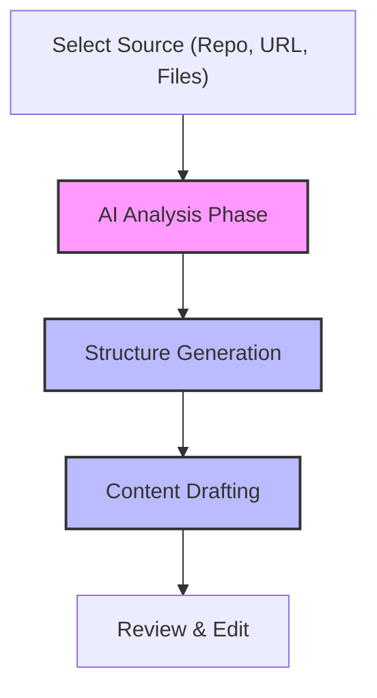

Creating documentation from scratch can be time-consuming. To help you get started quickly, you can use our AI workflows to automatically analyze your existing resources and generate a complete documentation structure with initial content. 

Whether you have an existing codebase, a legacy website, or just a rough idea, the AI engine will process your inputs and draft your pages for you.

## Supported AI Sources

You can initialize your documentation using several different starting points. Choose the one that best fits your current project state:

<Card title="Repository Integration" icon="fa fa-github">
Connect your GitHub repository to generate docs directly from your codebase. You can target specific branches, folders, or individual files.
</Card>

<Card title="Website Crawling" icon="fa fa-globe">
Provide a URL, and the AI will scan the website to extract relevant information and convert it into structured documentation.
</Card>

<Card title="File Uploads" icon="fa fa-file-text">
Upload existing files, PDFs, or unstructured text documents. The AI will parse the content and organize it into logical sections.
</Card>

<Card title="Text Prompts & Templates" icon="fa fa-magic">
Describe what you want to build using a simple text prompt, or select a predefined template preset to generate a standard documentation layout.
</Card>

## How the AI Workflow Operates

When you trigger an AI generation task, the system goes through several phases to ensure your documentation is structured logically.

## Generating Your First Docs

Follow these steps to kick off the AI generation process:

<Steps>
<Step title="Select your source">
Navigate to the **Create Documentation** screen and choose your preferred AI generation method (e.g., "From Repository" or "From Website").
</Step>
<Step title="Configure the inputs">
Provide the necessary details for your source. For example, if you chose a repository, select the installation, repository name, branch, and the specific path you want the AI to analyze.
</Step>
<Step title="Start the generation">
Click **Generate**. The AI engine will begin processing your request. 
</Step>
<Step title="Monitor progress">
You will see a live progress indicator. The system tracks the current phase, the overall completion percentage, and the specific page currently being drafted.
</Step>
</Steps>

> [!TIP]
> If you are generating documentation from a very large repository, try pointing the AI to a specific `folder` rather than the `full_repo`. This keeps the generated content focused and speeds up the process.

## Monitoring Generation Progress

Generating comprehensive documentation can take a few minutes depending on the size of your input. During this time, the dashboard provides real-time feedback:

| Progress Indicator | Description |
|-------------------|-------------|
| **Current Phase** | Shows whether the AI is currently analyzing data, building the structure, or drafting content. |
| **Progress %** | The overall completion percentage of the generation task. |
| **Page Tracking** | Displays the title of the specific page currently being worked on, alongside the total number of pages planned. |
| **Failed Resources**| If any specific files or URLs could not be processed (e.g., due to access issues), they will be listed here so you can review them later. |

> [!WARNING]
> AI-generated content is designed to be a powerful starting point, but it may not be perfect. Always review the generated pages for accuracy, tone, and completeness before publishing them to your audience.

## Frequently Asked Questions

<Accordion>
<AccordionTab title="Can I generate docs from a private repository?">
Yes. As long as you have installed the GitHub App and granted it access to the private repository, the AI can securely read the codebase to generate your documentation.
</AccordionTab>
<AccordionTab title="What happens if the AI encounters an error?">
If the AI cannot process a specific resource (like a broken link or an unsupported file type), it will skip that resource, log it under "Failed Resources," and continue generating the rest of your documentation. You will see an error message detailing what was skipped once the process completes.
</AccordionTab>
<AccordionTab title="Can I use a template instead of AI?">
Absolutely. If you prefer a standardized structure without AI analysis, you can initialize your documentation using a preset template. This instantly creates a skeleton structure that you can fill out manually.
</AccordionTab>
</Accordion>