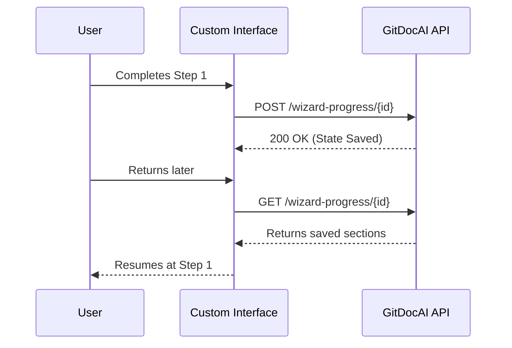

The Setup Wizard guides you through the initial configuration of your documentation projects, ensuring you don't miss any critical steps. Because your progress is saved automatically, you can safely leave the wizard at any time and pick up exactly where you left off.

<Card title="Need API Keys?" icon="pi pi-key" href="/docs/settings/api-keys">
If you plan to manage wizard progress programmatically, make sure you have generated an API key from your organization settings.
</Card>

## Completing the Setup Wizard

When you create a new documentation project, you will automatically be dropped into the Setup Wizard. 

<Steps>
<Step title="Start the configuration">
Launch the wizard from your project dashboard. The system will initialize a new progress tracking session for your specific `documentation_id`.
</Step>
<Step title="Complete the required sections">
Fill out the necessary fields in each step. As you navigate between sections, your progress is automatically saved in the background.
</Step>
<Step title="Review and finalize">
On the final step, review your configuration. Once submitted, your documentation is generated and the wizard is marked as complete.
</Step>
</Steps>

> [!TIP]
> If you get interrupted, simply navigate back to your project. The wizard will automatically fetch your saved state and resume at your last active section.

---

## Managing Wizard State Programmatically

If you are building a custom onboarding flow or need to reset a user's progress, you can interact directly with the Wizard Progress API. 

All endpoints require a valid Bearer token and are scoped to your `organization_id` and the specific `documentation_id`.

### The Progress Lifecycle



### Endpoints Overview

| Action | Method | Endpoint | Description |
|--------|--------|----------|-------------|
| **Retrieve** | `GET` | `/v1/organization/{org_id}/wizard-progress/{doc_id}` | Gets an array of completed/saved sections. |
| **Save** | `POST` | `/v1/organization/{org_id}/wizard-progress/{doc_id}` | Upserts progress for a specific section. |
| **Reset** | `DELETE` | `/v1/organization/{org_id}/wizard-progress/{doc_id}` | Clears progress. Can target a specific section. |

### Saving Progress (Upsert)

To save a user's progress as they move through your custom wizard, send a `POST` request with the section data.

```bash
curl -X POST "https://api.gitdoc.ai/v1/organization/org_123/wizard-progress/doc_456" \
  -H "Authorization: Bearer YOUR_API_TOKEN" \
  -H "Content-Type: application/json" \
  -d '{
    "section_id": "design_settings",
    "status": "completed",
    "data": { "theme": "dark" }
  }'
```

> [!NOTE]
> If progress for the specified section already exists, the `POST` request will update (upsert) the existing record rather than creating a duplicate.

### Retrieving Progress

To find out where a user left off, fetch their current progress state. This returns an array of all sections the user has interacted with.

```bash
curl -X GET "https://api.gitdoc.ai/v1/organization/org_123/wizard-progress/doc_456" \
  -H "Authorization: Bearer YOUR_API_TOKEN"
```

### Resetting Progress

You can clear a user's progress if they want to start over. 

By default, sending a `DELETE` request to the endpoint will wipe **all** wizard progress for that documentation ID. If you only want to reset a specific step, append the `section_id` as a query parameter.

```bash
# Delete ALL progress for this documentation
curl -X DELETE "https://api.gitdoc.ai/v1/organization/org_123/wizard-progress/doc_456" \
  -H "Authorization: Bearer YOUR_API_TOKEN"

# Delete progress ONLY for the 'design_settings' section
curl -X DELETE "https://api.gitdoc.ai/v1/organization/org_123/wizard-progress/doc_456?section_id=design_settings" \
  -H "Authorization: Bearer YOUR_API_TOKEN"
```

> [!WARNING]
> Deleting wizard progress cannot be undone. If you delete all progress without specifying a `section_id`, the user will have to start the setup process from the very beginning.

---

## Frequently Asked Questions

<Accordion>
<AccordionTab title="What happens if the API returns a 401 Unauthorized error?">
A `401` error means your Bearer token is missing, expired, or invalid. Double-check that you are passing the token correctly in the `Authorization` header and that the token has permissions for the specified `organization_id`.
</AccordionTab>
<AccordionTab title="Can I skip the setup wizard entirely?">
Yes. If you are configuring your documentation entirely via the API or a configuration file, you do not need to use the UI wizard. However, the wizard is highly recommended for first-time setups to ensure all required fields are populated.
</AccordionTab>
</Accordion>