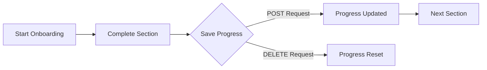

Welcome to GitDocAI! We are thrilled to have you on board. This platform is designed to make managing and generating your documentation as seamless as possible. 

As you set up your first project, you'll go through our onboarding wizard. To help you integrate GitDocAI into your internal developer portals or custom dashboards, we provide a set of endpoints to programmatically track, update, and manage your onboarding progress.


  <Card title="Quickstart Guide" icon="pi pi-rocket" href="/docs/quickstart">
    Jump right in and create your first documentation project.
  </Card>
  <Card title="API Reference" icon="pi pi-code" href="/docs/api">
    Explore the full GitDocAI API capabilities.
  </Card>


## How onboarding tracking works

The GitDocAI onboarding wizard is broken down into sections. As you complete each section, the platform saves your state. You can interact with this state using the Wizard Progress API.



> [!NOTE]
> All requests to the Wizard Progress API require a valid Bearer token in the `Authorization` header. You will also need your `organization_id` and the specific `documentation_id` you are tracking.

## Managing your wizard progress

You can interact with your onboarding progress using three main actions: viewing, updating, and resetting. 

| Action | Method | Endpoint | Description |
|--------|--------|----------|-------------|
| **View** | `GET` | `/v1/organization/{org_id}/wizard-progress/{doc_id}` | Retrieves an array of your completed sections. |
| **Update** | `POST` | `/v1/organization/{org_id}/wizard-progress/{doc_id}` | Saves new progress (upserts the data). |
| **Reset** | `DELETE` | `/v1/organization/{org_id}/wizard-progress/{doc_id}` | Clears progress. Can target a specific section. |

### Tracking progress step-by-step

If you are building a custom integration, here is how you can manage the onboarding flow programmatically.

<Steps>
<Step title="Check current progress">
Before updating, you might want to check which sections have already been completed. Use the `GET` endpoint to retrieve your current status.

```bash
curl -X GET "https://api.gitdoc.ai/v1/organization/org_123/wizard-progress/doc_456" \
  -H "Authorization: Bearer YOUR_API_TOKEN" \
  -H "Accept: application/json"
```
</Step>

<Step title="Save new progress">
When a user completes a step in your custom UI, send a `POST` request to save their progress. This endpoint acts as an "upsert"—it will create the progress record if it doesn't exist, or update it if it does.

```bash
curl -X POST "https://api.gitdoc.ai/v1/organization/org_123/wizard-progress/doc_456" \
  -H "Authorization: Bearer YOUR_API_TOKEN" \
  -H "Content-Type: application/json" \
  -d '{
    "section_id": "getting_started",
    "status": "completed"
  }'
```
</Step>

<Step title="Reset progress (Optional)">
If a user wants to restart the onboarding tutorial, you can clear their progress using the `DELETE` endpoint. 

```bash
# Delete all progress for this documentation
curl -X DELETE "https://api.gitdoc.ai/v1/organization/org_123/wizard-progress/doc_456" \
  -H "Authorization: Bearer YOUR_API_TOKEN"

# Delete progress for only a specific section
curl -X DELETE "https://api.gitdoc.ai/v1/organization/org_123/wizard-progress/doc_456?section_id=getting_started" \
  -H "Authorization: Bearer YOUR_API_TOKEN"
```
</Step>
</Steps>

> [!WARNING]
> Deleting progress without providing a `section_id` query parameter will permanently erase **all** onboarding progress for that specific documentation ID. Use this with caution!

## Frequently asked questions

<Accordion>
<AccordionTab title="Where do I find my Organization ID and Documentation ID?">
Your Organization ID can be found in your GitDocAI dashboard under **Settings > Organization**. The Documentation ID is available in the URL when you are viewing a specific project, or it can be retrieved via the Projects API.
</AccordionTab>
<AccordionTab title="What happens if my API token expires?">
If your Bearer token is invalid or expired, the API will return a `401 Unauthorized` error. You will need to generate a new token from your developer settings and update your integration.
</AccordionTab>
</Accordion>