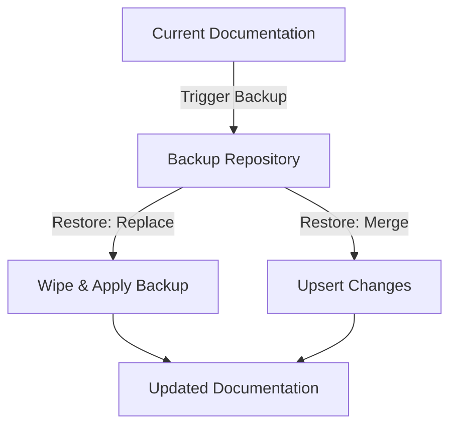

Creating and editing pages is the core of your workflow. Whether you are drafting a new guide, updating existing content, or enriching your pages with images and videos, the built-in tools give you full control over your documentation's lifecycle.

<Card title="Manage Content" icon="fa fa-book">
Create, update, and organize your documentation projects and pages.
</Card>

<Card title="Rich Media" icon="mi-storage">
Upload and manage images, videos, and other visual assets.
</Card>

## Managing Your Documentation

Every documentation project belongs to your organization. You can create, update, and organize these projects as your content grows. 

- **Viewing**: Access a list of all documentation projects within your organization, or drill down into a specific document to see its configuration and versions.
- **Updating**: Modify the settings, structure, and content of your documentation at any time.
- **Deleting**: Remove outdated or unnecessary documentation projects to keep your workspace clean.

> [!WARNING]
> Deleting a documentation project is permanent and will remove all associated pages and assets. Ensure you have a backup before proceeding.

## Working with Assets

Rich media makes your documentation easier to understand and more engaging to read. You can manage assets (like images and videos) directly within your documentation project.

<Steps>
<Step title="Upload a new asset">
Select the file you want to upload from your computer. You can provide a custom name and add alt text for accessibility.
</Step>
<Step title="Import from a URL">
Alternatively, provide a public URL to an image or video. The system will automatically download and store it as an asset in your project.
</Step>
<Step title="Manage existing assets">
View your asset library, update metadata (like changing the alt text), or delete assets you no longer need.
</Step>
</Steps>

> [!TIP]
> Always include descriptive **alt text** when uploading images. This improves accessibility for users with screen readers and helps with search visibility.

## Backing Up and Restoring Content

To keep your content safe and track changes over time, you can configure backup repositories for your documentation. When you trigger a backup, the current state of your pages is saved safely to your configured repository.

<Accordion>
<AccordionTab title="How do backups work?">
You can link your documentation to a specific backup repository branch and path. When you trigger a backup, the system uses your saved configuration (or a one-time override) to push the latest content. You can always view a paginated history of all your past backups.
</AccordionTab>
<AccordionTab title="What happens during a restore?">
When restoring from a backup, you can choose between two modes:
- **Replace**: Wipes the current documentation entirely before applying the backup. Use this when you want a clean slate matching the backup exactly.
- **Merge**: Upserts the backup on top of your existing content. Use this to restore specific pages without losing newer changes made elsewhere.
</AccordionTab>
</Accordion>