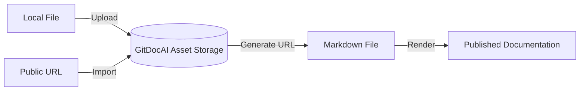

Visuals like images, diagrams, and videos make your documentation more engaging and easier to understand. GitDocAI provides a built-in asset management system that allows you to upload, import, and organize media files directly within your documentation projects.



## Adding assets to your documentation

You can add assets to your documentation either by uploading a local file or by importing an existing file from a public URL. Every asset belongs to a specific documentation project within your organization.

### Uploading a local file

To upload a file from your computer, use the asset upload endpoint. This accepts a standard `multipart/form-data` request.

```bash
curl -X POST "https://api.gitdocai.com/v1/documentation/$ORG_ID/$DOC_ID/asset" \
  -H "Authorization: Bearer YOUR_TOKEN" \
  -F "file=@/path/to/your/image.png" \
  -F "name=architecture-diagram" \
  -F "alt=A diagram showing the system architecture"
```

> [!TIP]
> Always include the `alt` parameter when uploading images. Alt text is crucial for screen readers and improves the accessibility of your published documentation.

### Importing from a public URL

If your images are already hosted elsewhere (like an AWS S3 bucket or another public server), you can instruct GitDocAI to download and store them automatically. 

```bash
curl -X POST "https://api.gitdocai.com/v1/documentation/$ORG_ID/$DOC_ID/asset/import" \
  -H "Authorization: Bearer YOUR_TOKEN" \
  -H "Content-Type: application/json" \
  -d '{
    "url": "https://example.com/images/logo.png",
    "name": "company-logo",
    "alt": "Company Logo"
  }'
```

## Embedding assets in your pages

Once an asset is uploaded, you can embed it directly into your Markdown files. 

<Steps>
<Step title="Retrieve the Asset ID">
When you upload or import an asset, the system returns an `asset_id`. You can also find this by listing all assets for a specific documentation project.
</Step>
<Step title="Construct the file URL">
The raw file is served at the following URL structure:
`/v1/documentation/{organization_id}/{documentation_id}/asset/{asset_id}/file`
</Step>
<Step title="Add to your Markdown">
Use standard Markdown image syntax to embed the file in your content:
``
</Step>
</Steps>

## Managing existing assets

You can update an asset's metadata or remove it entirely if it's no longer needed.

### Updating metadata

If you need to fix a typo in the asset's name or improve its accessibility description, you can update the metadata without having to re-upload the file.

```bash
curl -X PUT "https://api.gitdocai.com/v1/documentation/$ORG_ID/$DOC_ID/asset/$ASSET_ID" \
  -H "Authorization: Bearer YOUR_TOKEN" \
  -H "Content-Type: application/json" \
  -d '{
    "name": "new-diagram-name",
    "alt": "Updated accessibility description"
  }'
```

### Deleting an asset

> [!WARNING]
> Deleting an asset is permanent. Any documentation pages that still reference the deleted asset's URL will display a broken image link.

To remove an asset:

```bash
curl -X DELETE "https://api.gitdocai.com/v1/documentation/$ORG_ID/$DOC_ID/asset/$ASSET_ID" \
  -H "Authorization: Bearer YOUR_TOKEN"
```

## Asset API Reference Summary

For quick reference, here are the available operations for managing your documentation assets:

| Action | Method | Endpoint |
|--------|--------|----------|
| **List assets** | `GET` | `/v1/documentation/{org_id}/{doc_id}/asset` |
| **Upload asset** | `POST` | `/v1/documentation/{org_id}/{doc_id}/asset` |
| **Import asset** | `POST` | `/v1/documentation/{org_id}/{doc_id}/asset/import` |
| **Get metadata** | `GET` | `/v1/documentation/{org_id}/{doc_id}/asset/{asset_id}` |
| **Update metadata** | `PUT` | `/v1/documentation/{org_id}/{doc_id}/asset/{asset_id}` |
| **Delete asset** | `DELETE` | `/v1/documentation/{org_id}/{doc_id}/asset/{asset_id}` |
| **Serve file** | `GET` | `/v1/documentation/{org_id}/{doc_id}/asset/{asset_id}/file` |