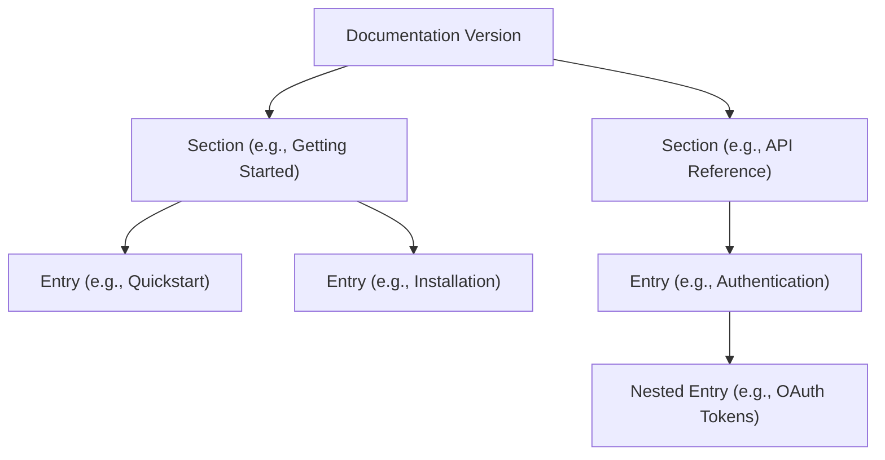

A well-organized documentation site helps your users find exactly what they need without frustration. By grouping your content into logical categories and building a clear hierarchy, you create a seamless reading experience. 

If you are integrating with our API to manage your documentation, this guide will walk you through the core structural components: **Sections** and **Entries**.

> [!NOTE]
> All API requests to manage your documentation structure require a valid Bearer token in the `Authorization` header, and are scoped to your `organization_id`, `documentation_id`, and `version_id`.

## Understanding the Hierarchy

Your documentation is organized into a simple but powerful tree structure. 

<Card title="Sections" icon="pi pi-folder">
Sections act as the top-level categories or folders for your documentation. They group related topics together but typically do not contain reading content themselves.
</Card>

<Card title="Entries" icon="pi pi-file">
Entries are the actual pages of your documentation. Entries live inside Sections and can be nested inside one another to create multi-level navigation trees.
</Card>

## Building Your Structure

When setting up a new version of your documentation, you will generally follow these steps to build out your navigation.

<Steps>
<Step title="Create your Sections">
Start by defining the broad categories of your documentation. Use the `POST /section` endpoint to create top-level buckets like "Tutorials", "Concepts", or "Troubleshooting".
</Step>
<Step title="Add Entries to Sections">
Once your sections exist, populate them with content pages using the `POST /section/{section_id}/entry` endpoint. 
</Step>
<Step title="Organize and Reorder">
As your documentation grows, you may need to adjust the flow. Use the dedicated `reorder` endpoints to update the display sequence of your sections and entries so they appear exactly how you want them in your sidebar.
</Step>
</Steps>

> [!TIP]
> **Migrating existing docs?** Use the `POST /section/{section_id}/entry/batch` endpoint to create multiple entries at once, saving you from making dozens of individual API calls.

## API Reference: Managing Content

Below are the primary endpoints available for managing your documentation's structure. All paths are prefixed with `/v1/documentation/{organization_id}/{documentation_id}/version/{version_id}`.

### Sections

| Action | Endpoint | Description |
|--------|----------|-------------|
| **List** | `GET /section` | Retrieves all sections for the specified version. |
| **Create** | `POST /section` | Creates a new section category. |
| **Get Details** | `GET /section/{section_id}` | Retrieves a specific section and its associated entries. |
| **Update** | `PUT /section/{section_id}` | Renames or updates section metadata. |
| **Delete** | `DELETE /section/{section_id}` | Removes a section entirely. |
| **Reorder** | `POST /section/reorder` | Updates the display order of all sections. |

### Entries

Entries are always managed within the context of their parent section. The base path for these endpoints is `/section/{section_id}/entry`.

| Action | Endpoint | Description |
|--------|----------|-------------|
| **List** | `GET /` | Retrieves a flat list of all entries in the section. |
| **Get Tree** | `GET /tree` | Retrieves all entries formatted as a nested hierarchy (ideal for rendering sidebars). |
| **Create** | `POST /` | Creates a single new entry. |
| **Batch Create** | `POST /batch` | Creates multiple entries in a single request. |
| **Get Details** | `GET /{entry_id}` | Retrieves a specific entry and its direct children. |
| **Reorder** | `POST /reorder` | Updates the display order of entries within the section. |

> [!WARNING]
> Deleting a section or an entry is a destructive action. If you delete a parent entry, all of its nested child entries may also be affected. Always double-check your IDs before issuing a `DELETE` request.

## Frequently Asked Questions

<Accordion>
<AccordionTab title="How do I render a navigation sidebar?">
The easiest way to build a navigation sidebar is to call the `GET /section/{section_id}/entry/tree` endpoint. Unlike the standard list endpoint, the `tree` endpoint returns your entries already nested in their proper parent-child relationships, making it trivial to map them to UI components.
</AccordionTab>
<AccordionTab title="What happens if a request fails?">
The API uses standard HTTP status codes. A `400 Bad Request` usually means your JSON payload is malformed or missing required fields. A `404 Not Found` means the Section or Entry ID you provided doesn't exist. Ensure your path parameters (Organization, Documentation, and Version IDs) are correct.
</AccordionTab>
</Accordion>