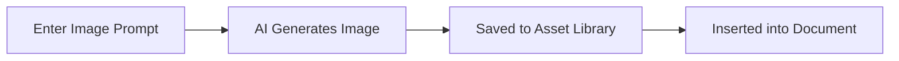

GitDocAI includes built-in AI tools to help you write, refine, and illustrate your documentation. Whether you need to rewrite a confusing paragraph, summarize a long guide, or generate custom images for your tutorials, the AI assistant is seamlessly integrated into your workflow to help you produce high-quality content faster.

<Card title="AI Text Assistant" icon="hi-sparkles-solid">
Highlight any markdown text and provide a prompt to rewrite, expand, or summarize your content.
</Card>

<Card title="AI Image Generation" icon="fa fa-magic">
Describe the image you need, and the AI will generate and automatically save it to your documentation assets.
</Card>

## Editing text with AI

The AI text assistant doesn't just blindly overwrite your work. When you ask the AI to modify your content, it generates a **diff** (a comparison between your original text and the new suggestions), allowing you to review exactly what will change before accepting it.

<Steps>
<Step title="Select your content">
In the editor, highlight the markdown text you want to improve. If you want to generate entirely new content, place your cursor on an empty line.
</Step>
<Step title="Provide a prompt">
Open the AI assistant and type your instructions. You can be as specific or as broad as you like. 
</Step>
<Step title="Review the diff">
The AI will process your request and display a side-by-side comparison. Additions are typically highlighted in green, and removals in red.
</Step>
<Step title="Apply changes">
If you are happy with the result, click **Apply** to update your document. If not, you can tweak your prompt and try again.
</Step>
</Steps>

### Example prompts

Not sure what to ask the AI? Here are a few common prompts to get you started:

| Goal | Example Prompt |
|------|----------------|
| **Tone adjustment** | "Rewrite this paragraph to sound more professional and less conversational." |
| **Summarization** | "Summarize these three paragraphs into a single bulleted list." |
| **Expansion** | "Expand on this concept by providing a real-world example." |
| **Formatting** | "Convert this comma-separated text into a markdown table." |

## Generating images

Sometimes a visual aids comprehension better than text. You can use the AI image generator to create custom graphics directly within your documentation space.

When you generate an image, GitDocAI automatically saves it to your project's asset library. This means you can reuse the same image across multiple pages without having to upload it manually.

> [!TIP]
> Be descriptive with your image prompts. Including details about the style (e.g., "minimalist vector illustration", "isometric 3D icon") will yield much better results.

## Usage limits and billing

Because AI generation requires significant computational resources, these features are tied to your organization's subscription plan. 

> [!WARNING]
> If you encounter a `Payment Required` error or a message about reaching your limit, your organization has exhausted its AI credits for the current billing cycle. 

<Accordion>
<AccordionTab title="Why did my text edit fail?">
This usually happens if the selected text is too large or if the prompt violates safety guidelines. Try selecting a smaller chunk of text (like a single section or paragraph) and running the AI assistant again.
</AccordionTab>
<AccordionTab title="Where do I check my image generation limits?">
Image generation limits (`images_generated`) are tracked at the organization level. Workspace administrators can view current usage and upgrade limits in the organization's Billing settings.
</AccordionTab>
</Accordion>