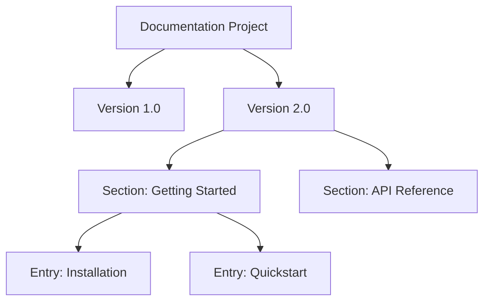

When your product evolves, your documentation needs to keep up. Versioning allows you to maintain separate sets of documentation for different releases of your product, ensuring users always have access to the right information for their specific version.

## The Content Hierarchy

Every version of your documentation is organized into a strict hierarchy to keep your content clean and navigable. 



<Card title="Sections" icon="fa fa-cubes">
High-level categories that group related content together (e.g., "Tutorials" or "API Reference").
</Card>

<Card title="Document Entries" icon="fa fa-cube">
The actual documentation pages or articles that live inside a specific section.
</Card>

## Managing Your Content

Sections help you build the skeleton of your documentation version, while entries fill it with actual knowledge. You can manage both to create a seamless reading experience.

<Steps>
<Step title="Create a Section">
Define a new category for your version. You'll need to specify the organization, documentation project, and version it belongs to.
</Step>
<Step title="Populate with Entries">
Add individual pages to your new section. If you have a lot of content, you can batch-create multiple entries at once to speed up your workflow.
</Step>
<Step title="Reorder Content">
Change the display order of your sections and entries to ensure a logical reading flow for your users.
</Step>
</Steps>

> [!TIP]
> Use the **Tree View** API endpoint to get a bird's-eye view of your documentation structure. It returns a nested list of all entries, which is especially helpful when reorganizing large sections!

## Automating via the API

If you prefer to manage your documentation programmatically (for example, as part of your CI/CD pipeline), you can use the Documentation API to fully control your versions, sections, and entries.

> [!WARNING]
> All API requests require a valid Bearer token in the `Authorization` header. Never commit your tokens to source control—use environment variables or a secrets manager instead.

### Common API Operations

| Resource | Action | Endpoint Path |
|----------|--------|---------------|
| **Sections** | Create | `POST /v1/documentation/{org_id}/{doc_id}/version/{version_id}/section` |
| | Reorder | `POST /v1/documentation/.../section/reorder` |
| | Get/Update/Delete | `GET`, `PUT`, `DELETE /v1/documentation/.../section/{section_id}` |
| **Entries** | Create | `POST /v1/documentation/.../section/{section_id}/entry` |
| | Batch Create | `POST /v1/documentation/.../section/{section_id}/entry/batch` |
| | Reorder | `POST /v1/documentation/.../section/{section_id}/entry/reorder` |
| | Get Tree | `GET /v1/documentation/.../section/{section_id}/entry/tree` |

### Example: Creating a new section

Here is how you can programmatically add a new "Getting Started" section to an existing documentation version:

```bash
curl -X POST "https://api.yourservice.com/v1/documentation/org_123/doc_456/version/v2/section" \
  -H "Authorization: Bearer $YOUR_API_TOKEN" \
  -H "Content-Type: application/json" \
  -d '{
    "title": "Getting Started",
    "description": "Basic tutorials for new users"
  }'
```

## Frequently Asked Questions

<Accordion>
<AccordionTab title="What happens if I delete a section?">
Deleting a section will also permanently remove all document entries contained within it. Make sure to back up or move important content before issuing a `DELETE` request to a section.
</AccordionTab>
<AccordionTab title="Can I create multiple entries at once?">
Yes! The API supports a batch creation endpoint (`/entry/batch`) that allows you to upload multiple document entries in a single request. This is perfect for migrating existing documentation or generating docs from code comments.
</AccordionTab>
</Accordion>