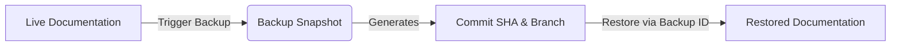

Safeguard your documentation by creating backups and easily restoring them when needed. This guide walks you through snapshotting your current progress and rolling back to previous versions, ensuring you never lose important content.

> [!TIP]
> We recommend creating a backup before making major structural changes to your documentation, such as deleting multiple sections or changing your publishing configuration.

## How backups work

When you create a backup in GitDocAI, the system takes a snapshot of your documentation's current state. Because GitDocAI is built on Git, this snapshot corresponds to a specific branch and commit in your repository. 

Every time you generate a backup, the system records:
* **Branch:** The specific Git branch where the backup is stored.
* **Commit SHA:** The unique identifier for the exact point in time the backup was made.
* **File count:** The total number of documentation files included in the snapshot.
* **Path:** The directory path where the backed-up files are located.



## Creating a backup

Creating a backup ensures you have a safe restore point. 

<Steps>
<Step title="Navigate to Backups">
Go to your project settings and select the **Backups** tab from the Publishing & Customization menu.
</Step>
<Step title="Generate a new snapshot">
Click the **Create Backup** button. The system will process your current documentation files.
</Step>
<Step title="Verify your backup">
Once complete, you will see a confirmation displaying the new backup's branch, commit SHA, and the total number of files safely stored.
</Step>
</Steps>

## Restoring from a backup

If you need to revert to a previous state, you can restore your documentation using any previously generated backup.

> [!WARNING]
> Depending on the restore mode you select, restoring a backup may overwrite your current working draft. Always double-check that you are restoring the correct `backup_id`.

### Restore configuration

When initiating a restore, you will need to provide specific parameters to tell the system exactly what to recover and how to handle the existing files.

| Parameter | Type | Description | Required |
|-----------|------|-------------|----------|
| `backup_id` | String | The unique identifier of the backup you want to restore. | **Yes** |
| `mode` | String | The strategy used for the restore (e.g., overwriting current files or restoring to a new draft branch). | No |

### The restore process

<Steps>
<Step title="Select a backup">
Locate the backup you want to restore from your history list and copy its `backup_id`.
</Step>
<Step title="Choose a restore mode">
Select how you want the backup applied. You can choose to safely merge the files or overwrite your current working directory.
</Step>
<Step title="Confirm the restore">
Initiate the restore. The system will return a summary of the action, including the target **branch**, the **path** updated, and the **file count** of the restored documents.
</Step>
</Steps>

<Accordion>
<AccordionTab title="Can I see the API payload for a restore request?">
If you are automating your backups via the GitDocAI API, a standard restore request looks like this:

```json
POST /v1/documentation/restore
{
  "backup_id": "bkp_12345abcde",
  "mode": "overwrite"
}
```
</AccordionTab>
</Accordion>