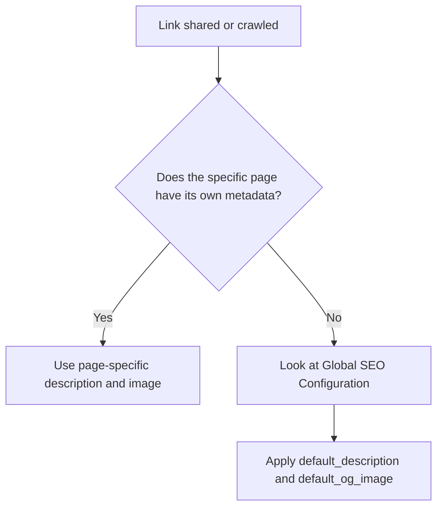

Making your documentation easy to find is just as important as writing it. By configuring your Search Engine Optimization (SEO) settings, you can ensure your pages rank well on search engines, look great when shared in apps like Slack or Discord, and track visitor analytics. 

This guide walks you through the global SEO configurations available for your documentation portal.

## Available SEO Settings

Your global SEO configuration acts as the foundation for your documentation's discoverability. When you configure these settings, they apply across your entire documentation site.

| Setting Name | API Field | Description |
|--------------|-----------|-------------|
| **Site Title** | `site_title` | The overarching name of your documentation portal (e.g., "Acme Corp Docs"). |
| **Title Template** | `title_template` | A formatting template for individual page titles. |
| **Default Description** | `default_description` | The fallback summary of your site used by search engines if a specific page lacks its own description. |
| **Default Social Image** | `default_og_image` | The fallback Open Graph (OG) image URL displayed when a link is shared on social media or messaging platforms. |
| **Google Analytics ID** | `google_analytics_id` | Your GA tracking measurement ID (usually starts with `G-`) to monitor page views and user behavior. |

> [!TIP]
> **Optimizing your social image:** For the best display across Twitter, LinkedIn, and Slack, we recommend using a `default_og_image` that is exactly **1200 x 630 pixels**.

## How Metadata Fallbacks Work

When a user shares a link to a specific page in your documentation, the system determines which preview image and description to show based on a simple fallback process:

## Configuring Your Settings

Follow these steps to update your global SEO and analytics preferences.

<Steps>
<Step title="Navigate to settings">
Open your project dashboard and navigate to **Settings** > **Documentation Config**.
</Step>
<Step title="Open the SEO panel">
Locate the **SEO & Analytics** section. This is where your global metadata is managed.
</Step>
<Step title="Enter your metadata">
Fill out your Site Title, Default Description, and paste the URL for your Default Social Image. If you use Google Analytics, paste your Measurement ID here as well.
</Step>
<Step title="Save and publish">
Click **Save Changes**. Your new meta tags and analytics scripts will be injected into your documentation site immediately.
</Step>
</Steps>

> [!WARNING]
> It can take a few days for search engines like Google to re-crawl your site and update their search results with your new `default_description` and `site_title`.

## Frequently Asked Questions

<Accordion>
<AccordionTab title="How does the Title Template work?">
The `title_template` allows you to define a consistent format for your browser tabs and search results. It uses a placeholder for the page name. For example, if your template is `%s | Acme Docs` and a user visits the "Authentication" page, the browser tab will display **Authentication | Acme Docs**.
</AccordionTab>
<AccordionTab title="Where do I find my Google Analytics ID?">
Log in to your Google Analytics account, go to **Admin** > **Data Streams**, and select your web stream. You will see a "Measurement ID" in the top right corner that begins with `G-`. Copy and paste that exact string into the `google_analytics_id` field.
</AccordionTab>
<AccordionTab title="Can I override these settings on a specific page?">
Yes! The settings configured here act as your global defaults. Individual documentation entries can still have their own custom titles and descriptions defined in their specific metadata, which will override the global defaults.
</AccordionTab>
</Accordion>