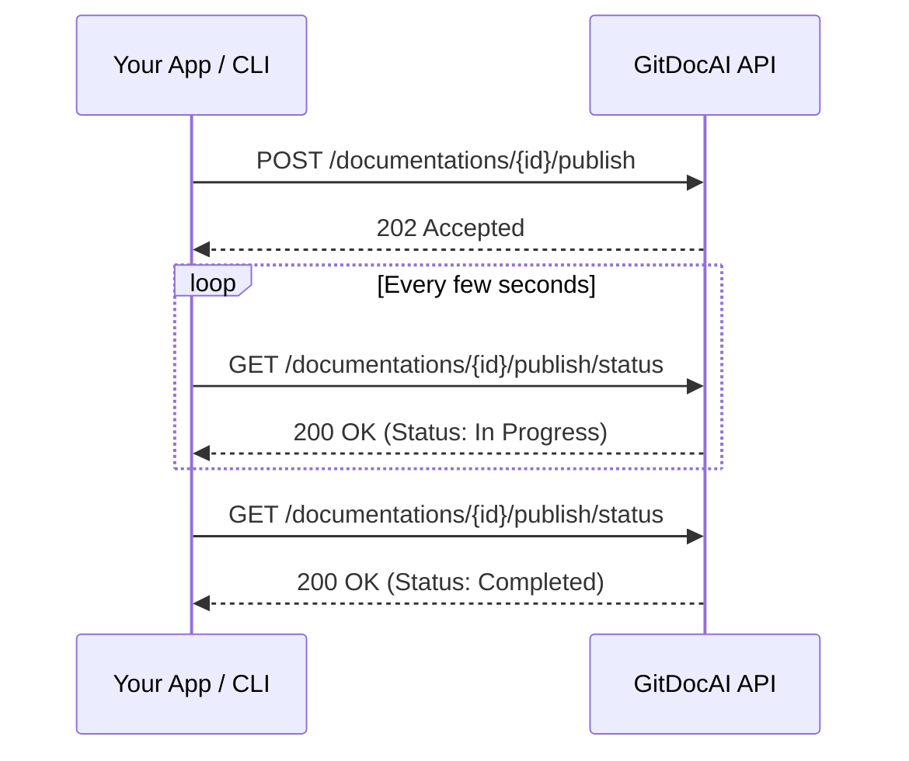

When you are ready to share your documentation updates with the world, it's time to publish. Publishing is handled as an asynchronous background job, which means you trigger the process once and then monitor its status until your new documentation is live.

Here is a quick look at how the publishing lifecycle works:



## The Publishing Workflow

Follow these steps to safely push your changes live and verify they were successful.

<Steps>
<Step title="Trigger the publish job">
Start the process by calling the publish endpoint. This queues your documentation to be built and deployed.
</Step>
<Step title="Poll for status">
Because building documentation can take a few moments, continuously check the status endpoint until the job finishes.
</Step>
<Step title="Verify the release">
Once complete, check the publish history to confirm the deployment details and review your live site.
</Step>
</Steps>

---

## 1. Starting a Publish Job

To initiate a new publish, make a `POST` request to the publish endpoint. 

```bash
curl -X POST "https://api.gitdocai.com/v1/documentations/{documentation_id}/publish" \
  -H "Authorization: Bearer YOUR_API_TOKEN" \
  -H "Content-Type: application/json" \
  -d '{
    "message": "Added new authentication guide"
  }'
```

| Parameter | Type | In | Description |
|-----------|------|----|-------------|
| `documentation_id` | `string` | Path | The unique identifier for your documentation project. |
| `message` | `string` | Body | An optional message describing what changed in this release. |

**Expected Result:** You will receive a `202 Accepted` response immediately. This indicates that the job has been successfully queued.

> [!WARNING]
> If you receive a `409 Conflict` response, it means another publish job is already in progress for this documentation. Wait for the current job to finish before starting a new one.

## 2. Monitoring Job Status

Once your job is queued, you need to check its progress. Dashboards and CI/CD pipelines typically poll this endpoint every few seconds.

```bash
curl -X GET "https://api.gitdocai.com/v1/documentations/{documentation_id}/publish/status" \
  -H "Authorization: Bearer YOUR_API_TOKEN"
```

This endpoint returns the current state of the publishing pipeline, letting you know if the job is still building, has succeeded, or encountered an error.

> [!TIP]
> We recommend polling the status endpoint every 3 to 5 seconds to avoid hitting rate limits while still getting near real-time updates.

## 3. Reviewing Publish History

It's helpful to keep track of when updates went live and what was included in them. You can retrieve a paginated list of all past publish events.

```bash
curl -X GET "https://api.gitdocai.com/v1/documentations/{documentation_id}/publish/history?page=1&page_size=20" \
  -H "Authorization: Bearer YOUR_API_TOKEN"
```

| Parameter | Type | In | Default | Description |
|-----------|------|----|---------|-------------|
| `page` | `integer` | Query | `1` | The page number to retrieve. |
| `page_size` | `integer` | Query | `20` | Number of records per page (maximum 100). |

### Getting the Latest Publish

If you only need to check the most recent deployment (for example, to display a "Last updated" badge), use the dedicated `latest` endpoint:

```bash
curl -X GET "https://api.gitdocai.com/v1/documentations/{documentation_id}/publish/latest" \
  -H "Authorization: Bearer YOUR_API_TOKEN"
```

## Frequently Asked Questions

<Accordion>
<AccordionTab title="Why is publishing asynchronous?">
Building documentation involves compiling markdown, generating assets, and deploying files to a global Edge network. Handling this asynchronously ensures your application or CLI doesn't hang waiting for a long HTTP request to finish.
</AccordionTab>
<AccordionTab title="What happens if a publish fails?">
If a job fails, the status endpoint will reflect an error state. Your live documentation will not be affected; it will continue serving the last successfully published version.
</AccordionTab>
</Accordion>


<Card title="Need to update content using AI?" icon="fa fa-magic" href="/docs/ai-editing">
Before publishing, you can use our AI endpoints to automatically edit content or generate missing images.
</Card>