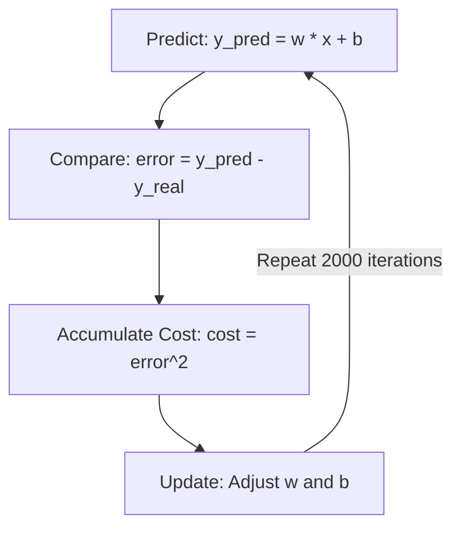

In mechatronics, predicting how much current a DC motor will draw at a specific Pulse Width Modulation (PWM) level is crucial for power management and system safety. This guide walks you through modeling this relationship using linear regression and gradient descent, applying fundamental machine learning concepts to a practical hardware problem.

## The Problem

When you apply a PWM signal to a DC motor, the current it consumes changes. Experimental data shows that the relationship between the PWM percentage and the current drawn is approximately linear. 

Our goal is to find the slope (`w`) and the intercept (`b`) that minimize the prediction error in the following linear model:

`I = w * PWM + b`

| Variable | Description |
|----------|-------------|
| `I` | The estimated current consumed by the motor (in Amperes). |
| `PWM` | The applied Pulse Width Modulation (as a percentage). |
| `w` | The weight or slope of the line. |
| `b` | The bias or y-intercept of the line. |

> [!NOTE]  
> While real-world motors have non-linear characteristics at extreme limits, a linear model provides a highly effective and computationally cheap approximation for standard operating ranges.

## Modeling Methodology

To build an accurate model, we follow a structured machine learning approach.

<Steps>
<Step title="Collect Experimental Data">
Gather real-world measurements. For this model, we start with 4 experimental pairs of measured PWM percentages and their corresponding current values.
</Step>
<Step title="Define the Model">
Establish the linear equation (`I = w * PWM + b`) that the system will use to make its predictions.
</Step>
<Step title="Calculate the Error">
Use a cost function to measure how far off the model's predictions are from the actual measured current. We use Mean Squared Error (MSE) for this calculation.
</Step>
<Step title="Optimize the Parameters">
Run a Gradient Descent optimization loop for 2,000 iterations to continuously adjust `w` and `b` until the error is minimized.
</Step>
</Steps>

<Accordion>
<AccordionTab title="What is Mean Squared Error (MSE)?">
Mean Squared Error is a mathematical way to measure the average squared difference between the estimated values (what the model predicts) and the actual value (what you measured). By squaring the errors, MSE heavily penalizes large mistakes, forcing the model to fit the data more closely.
</AccordionTab>
</Accordion>

## The Learning Cycle

The optimization process relies on a continuous feedback loop. The model makes a guess, checks its accuracy, and corrects itself.



### Updating Parameters with Gradient Descent

During the "Update" phase of the cycle, the algorithm calculates the gradient (the direction of the steepest error). It then adjusts the weights in the *opposite* direction of the gradient to find the minimum error.

Here is how the parameter update looks in code:

```python
# Update weights and bias using gradients
w = w - alpha * dw
b = b - alpha * db
```

> [!TIP]  
> The `alpha` ($\alpha$) variable represents the **learning rate**. It controls the size of the step the algorithm takes in each iteration. If `alpha` is too large, the model might overshoot the minimum error; if it's too small, the model will take too long to learn.

## Expected Results

After running the gradient descent loop for 2,000 iterations, the model will converge. If you plot the results, you will see a graph where:
* **The points** represent your actual experimental measurements (the 4 PWM/Current pairs).
* **The line** represents your optimized linear model.

This line can now be used to accurately predict the current consumption for any PWM value within your tested range, allowing your mechatronic system to anticipate power requirements dynamically.