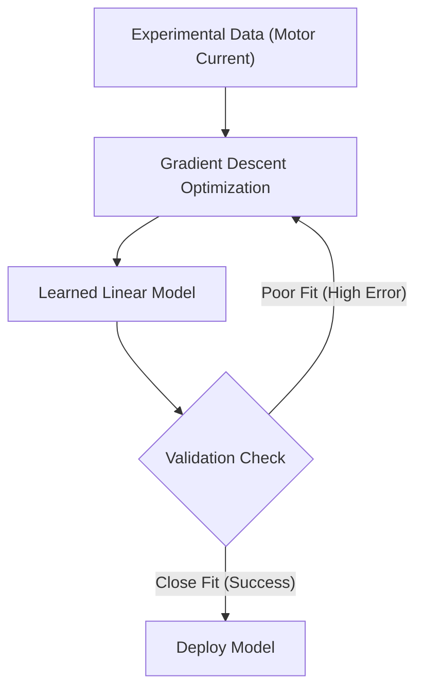

Once your linear regression model has finished training, it is crucial to validate its effectiveness. This guide helps you interpret your results, verify the algorithm's accuracy, and confirm that the model reliably represents your DC motor's current behavior.

## Understanding the Optimization Process

Before diving into the final results, it helps to understand how the model learned. During the training phase, the algorithm utilized **Gradient Descent** to minimize the prediction error. 

The system automatically adjusted the model's parameters by moving them in the opposite direction of the error gradient. This process continued iteratively without manual intervention until it reached the minimum error, resulting in the most accurate fit for your data.

> [!NOTE]
> Because the algorithm handles parameter adjustments automatically, you can focus entirely on analyzing the final output rather than manually tuning weights.

## Interpreting the Results Graph

When you generate the results plot for your motor current estimation, you will see a visual representation of how well the model performed. 

Here is how to read the components of your results graph:

| Graph Element | What It Represents | Significance |
| :--- | :--- | :--- |
| **Data Points** | Experimental measured data | Represents the actual current readings taken directly from the physical DC motor. |
| **Solid Line** | The learned model | Represents the predictions generated by your linear regression algorithm. |
| **Distance (Gap)** | The error margin | The closer the data points are to the solid line, the more accurate your model is. |

## Validating Your Model

To confirm that your model is successful and ready for real-world application, follow this validation checklist:

<Steps>
<Step title="Check the visual fit">
Examine the results graph. The learned model (the line) should pass smoothly through the center of your experimental data points.
</Step>
<Step title="Confirm linear behavior">
Verify that the data points generally follow a straight path. A tight clustering of points around the regression line confirms that the motor's current exhibits linear behavior within the analyzed operating range.
</Step>
<Step title="Review parameter adjustments">
Ensure that the final model parameters were reached successfully by the algorithm without requiring manual overrides. This confirms the machine learning pipeline is functioning correctly.
</Step>
</Steps>

> [!TIP]
> If your data points curve significantly away from the straight line, the motor may be operating outside of its linear range (e.g., reaching saturation). You may need to restrict the operating range or consider a non-linear modeling approach for those extremes.

## The Modeling Workflow

The following diagram illustrates how your experimental data transforms into a validated, usable model:

## Real-World Applications

A successfully validated linear regression model is a powerful tool. By accurately estimating the motor current, you have established a reliable foundation for more advanced engineering tasks.

<Card title="System Identification" icon="pi pi-search" href="#">
Use your validated model as the baseline for identifying broader system dynamics and control parameters.
</Card>

<Card title="Actuator Modeling" icon="pi pi-cog" href="#">
Integrate the current estimation model into larger simulations to accurately predict physical actuator behavior in real-time.
</Card>

<Accordion>
<AccordionTab title="What if my model validation fails?">
If the model does not fit the experimental data well, verify that your sensor readings are clean and free of excessive noise. You may also need to adjust your Gradient Descent learning rate or ensure you are only analyzing the motor within its linear operating constraints.
</AccordionTab>
</Accordion>