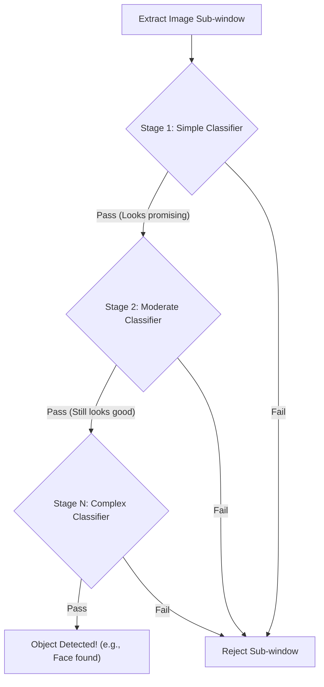

In computer vision, identifying objects within an image requires extracting unique characteristics and evaluating them against known patterns. This guide introduces common feature descriptors used to analyze images and explains how classifiers—specifically cascade classifiers—evaluate that data to detect objects like faces or pedestrians.

## Feature Descriptors

Feature descriptors are algorithms that process an image and extract specific, identifiable characteristics (features) such as edges, textures, or shapes. These features are then used to represent the image in a way that a machine learning model can understand.

Here are the most common feature descriptors you will encounter:

| Descriptor | Full Name | Description | Best For |
|------------|-----------|-------------|----------|
| **HOG** | Histogram of Oriented Gradients | Characterizes local object appearance based on the distribution of local intensity gradients and edge directions. | Detailed spatial structure, pedestrian detection. |
| **SIFT** | Scale Invariant Feature Transform | A distribution-based descriptor for grayscale images. It is invariant to rotation, scale, and translation, and partially invariant to lighting changes. | General object recognition, robust matching. |
| **SURF** | Speeded-up Robust Features | An efficient alternative to SIFT. It establishes a reproducible orientation using a circular region, then extracts the descriptor from an aligned square area. | High-speed, robust feature tracking. |
| **LBP** | Local Binary Pattern | A texture-based descriptor that compares a pixel to its neighbors. If a neighbor's grayscale value is lower, it gets a `0`; if higher or equal, it gets a `1`. | Texture classification, facial recognition. |
| **Haar-like** | Haar-like features | Evaluates adjacent rectangular regions at a specific location in a detection window, sums up the pixel intensities, and calculates the difference. | Rapid face detection (Viola-Jones). |

> [!TIP]
> **Choosing a descriptor:** If you need raw speed for real-time video, **SURF** or **Haar-like** features are excellent choices. If you need high accuracy regardless of image rotation or scale, **SIFT** is the industry standard.

## How Classifiers Work

A classifier is a systematic approach or algorithm that groups individual elements based on shared characteristics. It maps the input attributes (the features extracted by your descriptors) to predefined classes or categories.

Classification is typically a two-step process:

<Steps>
<Step title="Training Phase">
Also known as the learning stage. You provide the algorithm with a large dataset of labeled input features. The classifier builds an objective function (a mathematical model) that best describes the relationship between the features and their corresponding class.
</Step>
<Step title="Testing and Application Phase">
Once the model is built, you feed it new, unseen data. The classifier applies its learned objective function to predict and assign the correct category label to the new input.
</Step>
</Steps>

## Cascade Classifiers

A **Cascade Classifier** (popularized by the Viola-Jones object detection framework) is a highly efficient method for detecting objects in images. Instead of using a single, massive classifier, it uses a successive combination of smaller classifiers arranged in a "cascade." 

The difficulty and complexity of these classifiers increase stage by stage.

### The Sliding Window Process

To find an object, the algorithm moves a small "sub-window" across the entire input image. At each stop, the sub-window is evaluated by the cascade:

1. **Positive evaluation:** If the first, simplest classifier thinks the window contains the object, it passes the window to the next, slightly more complex classifier.
2. **Negative evaluation:** If *any* classifier in the chain determines the object is not present, the window is immediately rejected, and the algorithm moves on to the next window.

This "early rejection" mechanism is what makes cascade classifiers incredibly fast.

> [!NOTE]
> A sub-window is only declared a definitive "match" if it successfully passes through every single stage of the cascade.

## Advanced Concepts

<Accordion>
<AccordionTab title="HOG Block Normalization and Grouping">
When working specifically with **HOG (Histogram of Oriented Gradients)**, the image is divided into small connected regions called cells, and a histogram of gradient directions is compiled for the pixels within each cell.

To improve accuracy and account for changes in illumination and contrast, these cells are grouped into larger, spatially connected blocks (typically `2x2` cells, containing 64 pixels). 

The histograms within these blocks are normalized using a vector equation:

`v_normalized = v / sqrt(||v_k||^2 + e)`

Where:
* `v` is the non-normalized vector containing all histograms in a block.
* `||v_k||` is the k-normalized vector (usually k=1 or 2).
* `e` is a tiny constant added to prevent division by zero.

Finally, the normalized descriptors from all blocks are concatenated to form the final descriptor vector that is fed into the classifier.
</AccordionTab>
</Accordion>