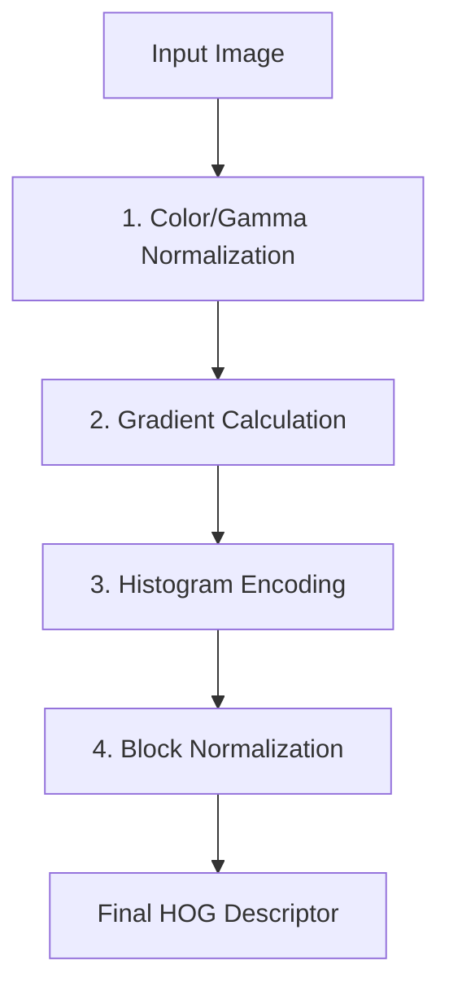

The Histogram of Oriented Gradients (HOG) is a powerful feature descriptor used in computer vision for object and face detection. By capturing the structure of edges and gradients, HOG allows your applications to reliably identify features even in cluttered environments or under poor lighting conditions. 

Unlike other descriptors such as SIFT, HOG operates on a dense grid of uniformly spaced cells and uses overlapping local contrast normalization to achieve excellent detection results.



## The HOG Workflow

Generating a HOG descriptor involves a four-stage pipeline. Follow these steps to understand how an image is transformed into a robust feature vector.

<Steps>
<Step title="Color and Gamma Normalization (Pre-processing)">
Before analyzing the image, you can equalize the color or gamma to reduce the influence of harsh lighting or shadows. 

> [!NOTE]
> This step is often considered optional. In practice, normalizing the overall size of the image usually yields a more significant performance improvement than gamma normalization.
</Step>

<Step title="Gradient Calculation">
Next, calculate the horizontal and vertical gradients of the image. This is typically done by filtering the image with a 1D discrete derivative mask (a centered point derivative).

The masks applied are:
*   **Horizontal (Dx):** `[-1, 0, 1]`
*   **Vertical (Dy):** `[1, 0, -1]^T`

Using these masks, you calculate the gradient magnitude (`|G|`) and the orientation angle (`θ`) for every pixel.
</Step>

<Step title="Orientation Histograms Encoding">
Divide the image into small, rectangular spatial regions called **cells**. For each cell, create a histogram based on the gradient orientations of its pixels. 

Each pixel casts a "weighted vote" for a histogram channel based on its gradient magnitude. This step introduces non-linearity, making the descriptor highly tolerant to slight changes in pose or appearance.
</Step>

<Step title="Block Normalization">
To protect against localized variations in illumination and contrast, group the cells into larger, spatially connected **blocks**. 

These blocks are designed to overlap, meaning each individual cell contributes to the final descriptor multiple times. The histograms within each block are then mathematically normalized to produce the final HOG feature vector.
</Step>
</Steps>

## Implementation Details

### Gradient Mathematics

When calculating gradients in step 2, the horizontal (`Ix`) and vertical (`Iy`) derivatives are used to find the magnitude and angle. If you were to implement this in code, the core logic looks like this:

```python
# Pseudo-code for gradient magnitude and angle
Ix = image * Dx  # Apply horizontal mask
Iy = image * Dy  # Apply vertical mask

# Calculate Magnitude
magnitude = sqrt(Ix**2 + Iy**2)

# Calculate Angle (converted to degrees if necessary)
angle = arctan(Ix / Iy)
```

### Cell Configuration Best Practices

> [!TIP]
> For standard face and object detection, using **8x8 pixel cells** (64 pixels total per cell) consistently offers the best performance.

Research (such as the foundational work by Dalal and Triggs) suggests the following configuration for your histograms:
*   **Channels:** Use **9 bins** (channels) for the histogram.
*   **Gradient Type:** Use **unsigned gradients**, meaning angles are mapped to the `[0°, 180°]` range rather than the full 360°.
*   **Pixel Weighting:** Use the raw gradient magnitude as the weight (though the square root or square of the magnitude can also be used depending on the specific use case).

### Block Normalization Methods

When normalizing blocks in step 4, you can choose from several mathematical approaches. In the formulas below, `v` represents the unnormalized vector containing all histograms in a block, and `e` is a small constant added to prevent division by zero.

| Method | Formula | Description |
|--------|---------|-------------|
| **L2-norm** | `f = v / √(‖v‖₂² + e²)` | The standard Euclidean norm. Generally provides the most robust results for HOG. |
| **L1-norm** | `f = v / (‖v‖₁ + e)` | Uses the sum of absolute values. Faster to compute but slightly less robust to extreme contrast. |
| **L1-sqrt** | `f = √(v / (‖v‖₁ + e))` | The square root of the L1-norm, offering a middle ground between L1 and L2. |

## Frequently Asked Questions

<Accordion>
<AccordionTab title="Why do blocks need to overlap?">
Overlapping blocks ensure that the boundaries between different regions of the image are smoothed out. Because a single cell contributes to multiple overlapping blocks, the final descriptor captures local contrast variations much more effectively, significantly improving detection accuracy.
</AccordionTab>
<AccordionTab title="Why use unsigned gradients (0-180°) instead of signed (0-360°)?">
Unsigned gradients group opposite directions together (e.g., a dark-to-light transition is treated the same as a light-to-dark transition along the same axis). For detecting shapes like faces or pedestrians, the orientation of the edge is usually more important than the specific polarity of the contrast.
</AccordionTab>
</Accordion>


<Card title="Ready to build?" icon="pi pi-code" href="/docs/tutorials/implementing-hog">
Learn how to implement HOG descriptors from scratch using Python and OpenCV in our step-by-step tutorial.
</Card>