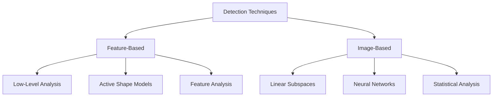

When building computer vision applications, understanding how objects—like human faces—are detected is a foundational skill. This guide explores the differences between feature-based and image-based detection techniques, explains why we use features instead of raw pixels, and outlines the core properties of robust feature detectors.

> [!NOTE]
> **Real-World Detection Challenges**
> Before an algorithm can detect an object, it must overcome environmental factors. Pose, facial expressions, occlusions (when objects are partially hidden), camera orientation, and lighting conditions all significantly impact the accuracy of your detection models.

## The Object Detection Pipeline

Most modern object and face detection workflows follow a similar high-level process. 

<Steps>
<Step title="Image Acquisition">
The system captures an image, accounting for environmental conditions like lighting, movement, and camera orientation.
</Step>
<Step title="Feature Detection">
An algorithm scans the image to locate key points of interest (features). A good detector will find these points even if the object is rotated or scaled.
</Step>
<Step title="Feature Description">
Once located, the feature's visual information is encoded into a compact representation called a **descriptor** (such as SIFT or HOG), making it easy to classify and match.
</Step>
</Steps>

## Classification of Detection Techniques

Detection techniques generally fall into two main categories: **Feature-Based** and **Image-Based**. 

### Feature-Based Detection
Feature-based techniques analyze the angles, lengths, and areas of visual characteristics to find specific elements that make up an object (like the geometry of a face). 

* **Low-level analysis:** Uses basic image data like edges, pixel intensity, color, and motion. While fast, it can sometimes produce ambiguous results.
* **Active shape models:** Uses local image traits (edges and brightness) to gradually deform a template until it matches the target shape. Examples include snakes, deformable templates, and Point Distribution Models (PDMs).
* **Feature analysis:** Applies strict geometric knowledge to detect and verify traits. This is generally more accurate than low-level analysis because it relies on the known structure of the object.

### Image-Based Detection
Instead of looking for specific geometric traits, image-based techniques compare your input (test) images against a large dataset of training images. This category heavily relies on machine learning, utilizing Neural Networks, Linear Subspaces, and Statistical Analysis to determine if an object is present.

## Understanding Features

In computer vision, **features** are individual, relevant attributes that describe an object. You will almost always choose to work with features rather than raw pixel values because features encode high-level information and are significantly faster to process.

Features are classified by their complexity and the scope of information they provide:

| Classification | Type | Description |
|---|---|---|
| **Complexity** | Low-Level | Extracted automatically from the image without any prior knowledge of the object's shape (e.g., simple edges). |
| **Complexity** | High-Level | Requires preprocessing to search for specific shapes and objects. These are usually built on top of low-level features. |
| **Information** | Global | Describes the image as a single whole, taking all pixels into account. |
| **Information** | Local | Focuses on specific key points and the small areas immediately surrounding them. |

## Feature Detectors

A feature detector's job is to find these points of interest. Depending on your needs, you might use a **single-scale detector** (handles rotation and lighting, but fails if the object changes size), a **multi-scale detector** (handles resizing), or an **affine invariant detector** (handles images taken from entirely different perspectives).

To be effective in production, a feature detector must possess specific properties.

<Accordion>
<AccordionTab title="Accuracy & Repeatability">
**Accuracy:** The detector must locate features precisely, which is critical for matching objects across different frames. 
**Repeatability:** It must consistently find the exact same features on an object, even if the scene is viewed under different conditions.
</AccordionTab>
<AccordionTab title="Robustness & Generality">
**Robustness:** The detector should successfully find features even if the object has been displaced, rotated, or scaled. 
**Generality:** The features detected should be versatile enough to be used across various different applications and object types.
</AccordionTab>
<AccordionTab title="Efficiency & High Density">
**Efficiency:** The algorithm must run quickly. If you are building a real-time application, slow detection will create unacceptable lag. 
**High Density:** The detector should find a large enough quantity of features to accurately represent the rich information contained in the image.
</AccordionTab>
</Accordion>

> [!TIP]
> **Next Steps: Descriptors**
> Once your robust detector finds the features, you need to describe them. Algorithms like **SIFT** (Scale Invariant Feature Transform) take these points and create distribution-based descriptors that your application can easily recognize.

<Card title="Explore Descriptors" icon="fa fa-cube" href="/docs/descriptors-overview">
Learn how SIFT, HOG, and other descriptors encode feature data for machine learning models.
</Card>