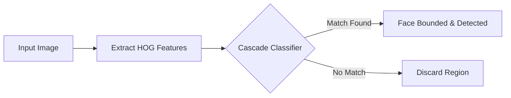

Face detection is the foundational step for many computer vision applications, allowing systems to locate and measure human faces within digital images. In this guide, you will learn the basics of face detection, the unique challenges systems face, and how modern methodologies overcome these hurdles.

> [!INFO]
> **Detection vs. Recognition:** Face *detection* simply answers the question "Is there a face in this image, and where is it?" Face *recognition* goes a step further to answer "Whose face is this?" 

## Understanding the Challenges

Detecting a specific object is usually straightforward—you look for visual characteristics inherent to that object. However, human faces introduce an extra degree of complexity. Our brains easily distinguish between a person and a background, but teaching a computer to do the same requires overcoming several major hurdles:

1. **Structural Variability:** Every face is unique. Differences in intrinsic features (like face shape, skin color, and size) combined with extrinsic features (like beards, mustaches, or glasses) drastically change a face's visual profile.
2. **Pose and Angle:** The position of the face relative to the camera directly influences its appearance. A profile view looks entirely different to a computer than a straight-on frontal view.
3. **Lighting Conditions:** Shadows, overexposure, and varied lighting environments can hide facial features or create false edges.

## How Face Detection Works

To reliably detect faces despite these challenges, modern systems often rely on a combination of feature descriptors and classifiers. One of the most effective methodologies uses **HOG (Histogram of Oriented Gradients)** combined with **Cascade Classifiers**.

Here is a simplified look at how this process works:

<Steps>
<Step title="Scan the image">
The system divides the digital image into smaller, overlapping regions to analyze them one by one.
</Step>
<Step title="Extract HOG features">
Instead of looking at individual pixels, the HOG descriptor looks at the *direction* of changes in light and dark areas (gradients). This creates a structural outline of the face that is highly resistant to lighting changes.
</Step>
<Step title="Apply the cascade classifier">
The extracted features are passed through a series of tests (the "cascade"). If a region fails a test, it is immediately discarded as "not a face." If it passes all tests, the system confirms a face is present.
</Step>
</Steps>

## Comparing Methodologies

Historically, many systems relied on Haar Cascades for face detection. While effective for simple, straight-on images, they struggle with angled faces. By utilizing HOG descriptors alongside cascade classifiers, detection robustness improves significantly.

| Feature | Haar Cascades | HOG + Cascade Classifiers |
|----------|---------------|---------------------------|
| **Pose Variation** | Limited to ~15 degrees of rotation. | Handles >30 degrees (horizontal, vertical, superior, inferior). |
| **Lighting** | Highly sensitive to shadows and varied lighting. | Robust against lighting variations due to gradient-based outlines. |
| **Best Use Case** | Controlled environments with strict frontal faces. | Dynamic environments with moving subjects and varied angles. |

> [!TIP]
> If you are building an application where users might not look directly at the camera, prioritizing a HOG-based approach will drastically reduce your false-negative rate.

## Common Applications

Because robust face detection can handle variations in pose and lighting, it serves as the backbone for a wide variety of intelligent systems:

<Card title="Authentication & Security" icon="pi pi-lock">
Securely unlock devices, authorize payments, or manage access to restricted areas using facial biometrics.
</Card>

<Card title="Emotion & Fatigue Monitoring" icon="pi pi-eye">
Detect drowsiness, fatigue, or boredom by capturing and processing facial expressions in real-time (e.g., for driver safety systems).
</Card>

## Frequently Asked Questions

<Accordion>
<AccordionTab title="Why do glasses or beards cause issues for older detectors?">
Older detectors often relied on strict pixel patterns (like expecting a specific shadow under the nose or clear visibility of the eyes). Glasses and facial hair disrupt these expected patterns, causing the detector to skip the face entirely.
</AccordionTab>
<AccordionTab title="What is a Cascade Classifier?">
A cascade classifier is a machine learning model trained on hundreds of positive images (faces) and negative images (backgrounds). It works like a multi-stage filter: it quickly rejects obvious non-faces in the early stages, saving processing power for the more complex task of verifying actual faces in the final stages.
</AccordionTab>
</Accordion>