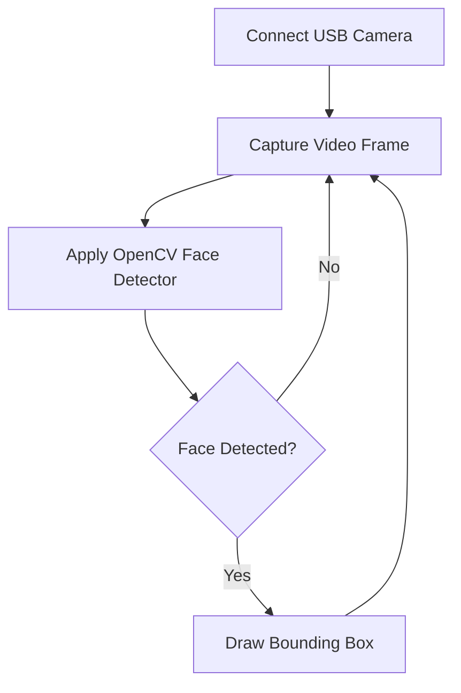

To get the best results from your face detection models, starting with the right hardware is essential. This guide covers our recommended camera specifications and explains how to run your first preliminary detection tests using OpenCV to establish a baseline.

## Choosing Your Camera

During our testing with 3MP, 5MP, and 8MP cameras, we found that 3 Megapixel (3MP) cameras often produce images that are too blurry for reliable face detection. For the best balance of performance and clarity, we strongly recommend using a camera with **at least 5MP resolution**. 

For optimal results, your camera should also connect via USB and have an easily adjustable focus angle. 

| Feature | Minimum Requirement | Recommended (e.g., Logitech C525) |
|---------|---------------------|-----------------------------------|
| **Resolution** | 5MP | 8MP (with HD video support) |
| **Connection** | USB | USB 2.0 (with a 1.8m or longer cable) |
| **Focus** | Manual adjustable | Auto-focus (effective at 7 cm or more) |
| **Lighting** | Standard | Automatic light correction |

> [!TIP]
> A flexible mounting angle and a long USB cable will make it much easier to position your camera perfectly for capturing frontal faces in your workspace.

## Running Preliminary Tests

Before diving into advanced HOG (Histogram of Oriented Gradients) descriptors, it is highly recommended to run a preliminary test to ensure your hardware is capturing frames correctly. 

We use Python and the OpenCV library—specifically the pre-trained Viola-Jones frontal face detector—to establish this initial baseline.



### Testing Steps

Follow these steps to run your first detection cycle:

<Steps>
<Step title="Connect your hardware">
Plug your USB camera into your machine and ensure it is recognized by your operating system.
</Step>
<Step title="Set up the OpenCV detector">
Initialize the pre-trained Viola-Jones frontal face cascade classifier in your Python environment.
</Step>
<Step title="Capture and process frames">
Read the video stream from your camera and pass the frames to the detector. 
</Step>
<Step title="Evaluate the results">
Draw bounding boxes around the detected faces and display the output on your screen to review the camera's positioning and lighting.
</Step>
</Steps>

### Example Baseline Script

If you are using Python, you can use this basic snippet to verify your camera feed and run the preliminary OpenCV detector:

```python
import cv2

# Load the pre-trained frontal face detector
face_cascade = cv2.CascadeClassifier(cv2.data.haarcascades + 'haarcascade_frontalface_default.xml')

# Initialize the USB camera (0 is usually the default built-in/USB camera)
cap = cv2.VideoCapture(0)

while True:
    ret, frame = cap.read()
    if not ret:
        break
        
    # Convert to grayscale for the detector
    gray = cv2.cvtColor(frame, cv2.COLOR_BGR2GRAY)
    
    # Detect faces
    faces = face_cascade.detectMultiScale(gray, scaleFactor=1.1, minNeighbors=5)
    
    # Draw bounding boxes
    for (x, y, w, h) in faces:
        cv2.rectangle(frame, (x, y), (x+w, y+h), (255, 0, 0), 2)
        
    cv2.imshow('Preliminary Face Detection', frame)
    
    if cv2.waitKey(1) & 0xFF == ord('q'):
        break

cap.release()
cv2.destroyAllWindows()
```

> [!WARNING]
> **Expect inconsistent bounding boxes during this phase.** 
> Because these preliminary tests are run without rigorous image pre-processing, you may notice that the bounding boxes sometimes cut off parts of the forehead or chin. This is expected behavior! This baseline simply confirms your hardware is working and highlights the exact inconsistencies that our advanced HOG descriptors will solve.

## Next Steps

Once your camera is securely mounted and you have successfully run the preliminary tests, you are ready to move on to robust feature extraction.

<Card title="HOG Descriptors" icon="pi pi-image" href="/docs/hog-descriptors">
Learn how to implement Histogram of Oriented Gradients (HOG) to fix bounding box inconsistencies and improve detection accuracy.
</Card>