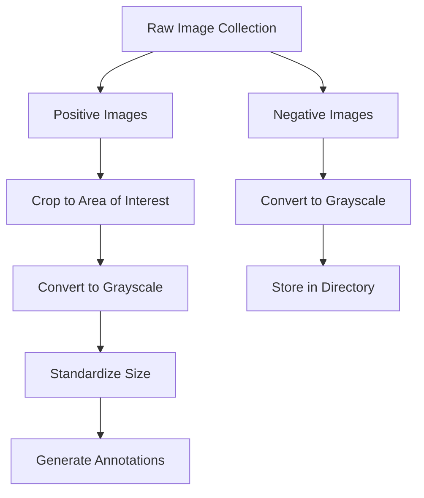

Building a robust object detection model starts with high-quality training data. This guide walks you through selecting, preprocessing, and organizing your positive and negative image datasets to ensure your classifier learns exactly what to look for—and what to ignore.

<Card title="Positive Images" icon="pi pi-check">
Images that contain the specific object you want to detect (e.g., a complete face). These teach the model what the target looks like.
</Card>

<Card title="Negative Images" icon="pi pi-exclamation-triangle">
Images that do not contain your target object. These teach the model what to ignore and help reduce false positives.
</Card>

Here is a high-level overview of the data preparation workflow:



## Preparing Positive Images

Positive images are the foundation of your model's accuracy. If you are training a face detector, for example, every positive image must contain a face. 

To ensure your model is robust and versatile, follow these selection guidelines:

* **Maintain consistent resolution:** Choose images that have similar sizes and resolutions.
* **Vary the environment:** Include images with different lighting conditions and diverse backgrounds.
* **Vary the position:** Include different angles and slight rotations, but ensure the essential features are always visible. For a face detector, this means both eyes, the nose, the mouth, and the forehead must be clearly identifiable.
* **Use real data:** Only use photographs of real objects. Discard images containing 2D or 3D animations, as they can confuse the model's understanding of real-world textures.

### Preprocessing Steps

Once you have gathered your positive images (often requiring thousands of samples), you need to standardize them.

<Steps>
<Step title="Crop to the area of interest">
Remove unnecessary background from the image. The cropped area should look exactly like the bounding box you want the final detector to draw. 
</Step>
<Step title="Standardize the color">
Convert all images to grayscale. This reduces computational load and helps the model focus on shapes and gradients rather than color variations.
</Step>
<Step title="Standardize the size">
Resize all cropped images to a uniform dimension (for example, `576 x 768` pixels).
</Step>
<Step title="Save and document">
Save the processed images into a dedicated directory. You will need to create an annotation file to map these images for the training algorithm.
</Step>
</Steps>

### Creating the Annotation File

Your training process requires a text file (usually `.txt`) that lists every positive image along with the exact location of the object within it. 

This file should include:
1. The file path or name of the image.
2. The coordinates where the object is located.
3. The size (width and height) of the bounding box.

```text
# Example annotation format
positives/image_001.jpg 1 0 0 576 768
positives/image_002.jpg 1 10 15 550 740
```

## Preparing Negative Images

Negative images are just as important as positive ones. They represent the "background" and teach your model how to avoid false positives.

When selecting negative images, consider the following:
* **Contextual scenes:** Use images of environments where your object *might* be found, but isn't currently present. For face detection, this could be empty offices, car interiors, or street scenes.
* **Partial features:** Include images that have *parts* of your target object, but not the whole thing. For example, an image of just an eye or just a nose. This forces the model to look for the complete set of features (eyes, nose, mouth, forehead) rather than triggering on a single matching part.

> [!WARNING]  
> **Quantity Matters**  
> The number of negative images should be considerably higher than your positive images. A common practice is a 1:3 ratio. For example, if you use 8,000 positive images, aim for around 24,000 negative images to ensure a highly accurate classifier.

Like positive images, negative images should be converted to grayscale to maintain consistency across your training pipeline. While standardizing their exact size is less critical than it is for positive images, keeping them relatively uniform is a good practice. Save all negative samples in their own separate directory.