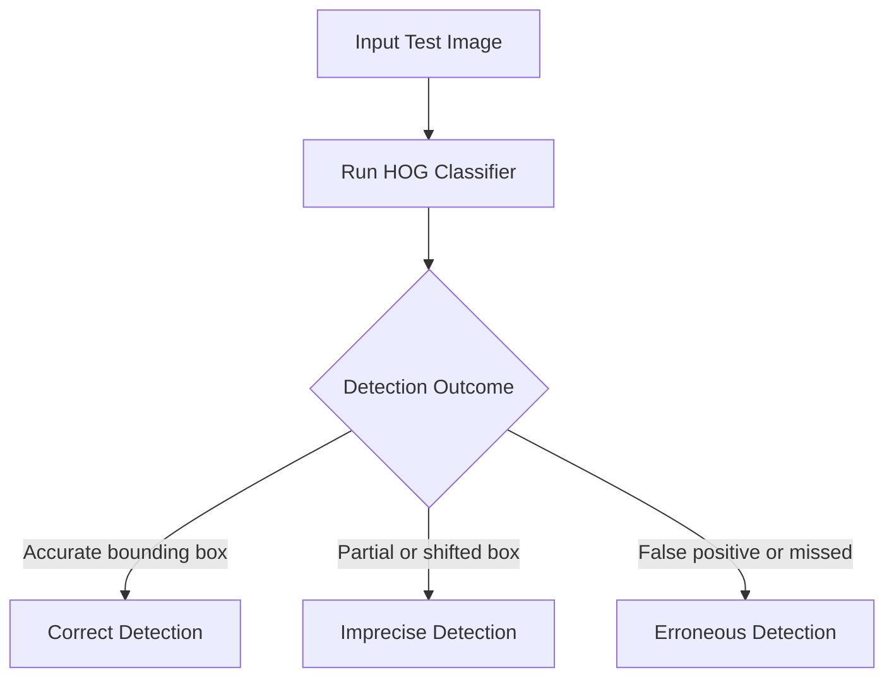

In this guide, you will learn how to train a face detection classifier using MATLAB's Histogram of Oriented Gradients (HOG) features. You will also learn how to evaluate the model's efficiency across different facial positions and combine detectors for improved robustness.

Before you begin, ensure you have your training images prepared. You will need a set of positive images (containing the faces you want to detect) and a set of negative images (backgrounds without faces).

> [!NOTE]
> For optimal training results, maintain a **1:3 ratio** of positive to negative images. Standardize the color of your negative images and ensure they are approximately 4 times larger than your positive samples.

## Training the Classifier

We will use MATLAB's built-in `trainCascadeObjectDetector()` function to train the model. While this function supports Haar, LBP, and HOG descriptors, we will focus on HOG due to its highly effective and efficient performance.

<Steps>
<Step title="Organize your dataset">
Store your negative images in a dedicated directory. Create and save a record (list) of all the filenames in this group, as MATLAB will need to reference this directory during the training process.
</Step>
<Step title="Configure the HOG parameters">
By default, the HOG descriptor needs to be configured to capture the right level of detail. Set the function to use `[2 x 2]` cell blocks, with each cell made up of `[8 x 8]` pixels.
</Step>
<Step title="Run the training function">
Pass your positive image data and the path to your negative images into the training function. 
</Step>
</Steps>

Here is an example of how you might initiate this in MATLAB:

```matlab
% Define paths to your image data
positiveInstances = imageDatastore('path/to/positive/images');
negativeFolder = 'path/to/negative/images';

% Train the cascade object detector using HOG features
detector = trainCascadeObjectDetector('hogFaceDetector.xml', positiveInstances, negativeFolder, ...
    'FeatureType', 'HOG');
```

## Evaluating the Model

Once your classifier is trained, it is crucial to test it against a robust dataset (such as the 2,511 images from the Gourier et al. database) to determine its detection range and accuracy. 

When evaluating your model, categorize the results into three distinct outcomes:



> [!WARNING]
> You may notice that a single detector can yield up to 78% *imprecise* detections at certain extreme angles. An imprecise detection means the face was found, but the bounding box alignment is off. 

### Performance by Facial Position

To create a truly robust system, you can train multiple detectors and combine the top three performers. The table below illustrates the expected detection efficiency of a **combined detector** based on the user's facial position (measured in degrees of variation from a direct frontal view).

| Facial Position (X / Y) | Detection Percentage |
|-------------------------|----------------------|
| -15° / -15°             | 92.6%                |
| -15° / 0°               | 100%                 |
| -15° / +15°             | 92.6%                |
| 0° / -15°               | 96.3%                |
| 0° / 0°                 | 100%                 |
| 0° / +15°               | 100%                 |
| 0° / +30°               | 96.3%                |
| +15° / -15°             | 96.3%                |
| +15° / 0°               | 96.3%                |
| +15° / +15°             | 96.3%                |
| +15° / +30°             | 96.3%                |
| +30° / -15°             | 96.3%                |
| +30° / 0°               | 96.3%                |
| +30° / +15°             | 85.2%                |

> [!TIP]
> By combining the best detectors, your system can maintain over **85% detection efficiency** even when the subject's face is angled more than 30 degrees horizontally or vertically from the camera.

## Frequently Asked Questions

<Accordion>
<AccordionTab title="Why choose HOG over Haar or LBP?">
While MATLAB supports Haar and Local Binary Patterns (LBP), Histogram of Oriented Gradients (HOG) is often selected for its superior ability to evaluate edge directions and structural shapes, making it highly efficient for human face detection.
</AccordionTab>
<AccordionTab title="Why do I need so many negative images?">
Negative images teach the classifier what a face *is not*. Providing a large, varied dataset of negative images (ideally 3 times the amount of your positive images) drastically reduces false positives in your final model.
</AccordionTab>
</Accordion>


<Card title="Need a testing dataset?" icon="fa fa-database" href="https://www-prima.inrialpes.fr/perso/Gourier/Faces/HPDatabase.html">
For robust evaluation, we recommend testing your trained model against a standardized dataset, such as the Pointing Head Pose Image Database (Gourier et al., 2004), which contains thousands of images at various documented angles.
</Card>