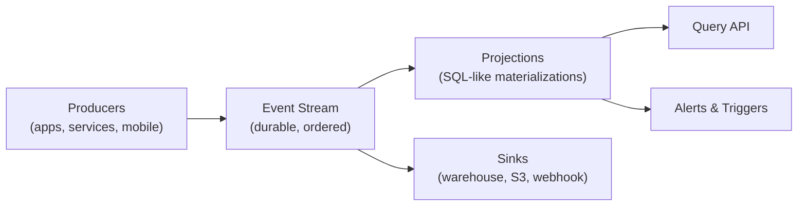

# Core Concepts

Polaris has a small surface area: four primitives that compose into everything else. Once you know the four, the rest of the platform is a thin layer on top.

## The mental model



Every byte of data in Polaris starts as an **event** in the **stream**. Everything you can query, alert on, or export is derived from that stream.

## The four primitives

| Concept | What it is | When you reach for it |
|---|---|---|
| Event | An immutable record of something that happened. | Capturing user actions, system signals, business transactions. |
| Stream | The ordered, durable log all events live in. | Replay, audit, downstream sinks. |
| Projection | A SQL-like materialized view derived from the stream. | Anything you want to query at low latency. |
| Sink | A continuous push of events or projection rows to another system. | Warehouse, data lake, third-party tools. |

> [!INFO]
> Projections and sinks both read from the same stream, but they answer different questions. Projections are **queryable**; sinks are **destinations**. Use a projection when you want to ask "what does the world look like right now?" — use a sink when you want a copy of the data elsewhere.

## Deep dives

<Accordion multiple={true}>
  <AccordionTab title="Event anatomy" icon="pi pi-bolt">

    Every event is a JSON document with three reserved fields and an open-ended `properties` bag.

    ```json
    {
      "type": "checkout.completed",
      "actor": { "id": "user_842", "tenant": "acme" },
      "occurred_at": "2026-05-27T14:02:09Z",
      "properties": {
        "order_id": "ord_19f0",
        "total_usd": 142.50
      }
    }
    ```

    `type` and `actor` are required. `actor.tenant` is the multi-tenancy key that powers per-tenant projections and access control.

  </AccordionTab>

  <AccordionTab title="Streams and ordering" icon="pi pi-list">

    Within a single `actor.id`, events are strictly ordered by server-assigned sequence number. Across actors, ordering is best-effort but causal: events that depend on each other (same session, same request) preserve order.

    If you need stricter cross-actor ordering, pin events to the same **partition key** when sending them.

  </AccordionTab>

  <AccordionTab title="Projection freshness" icon="pi pi-clock">

    Projections are updated incrementally as new events land. End-to-end latency from event arrival to projection query is typically under one second, with a 99th percentile of about three seconds under normal load.

    > [!WARNING]
    > Projections that join across more than two event types or use sliding windows over 24+ hours can lag during traffic spikes. Use the **Projection Health** view in the dashboard to monitor lag.

  </AccordionTab>

  <AccordionTab title="Sinks vs. exports" icon="pi pi-cloud-download">

    A **sink** is a continuous, low-latency push. An **export** is a one-shot dump of historical data. Sinks are for keeping another system in sync; exports are for audits, migrations, and offline analysis.

  </AccordionTab>
</Accordion>

## Where to next

<Card title="Architecture" href="/docs-new/platform/architecture">
  The actual moving parts behind the four primitives — how durability, replay, and projection storage work under the hood.
</Card>

<Card title="Data Model" href="/docs-new/platform/data-model">
  Field-by-field reference for events and the rules Polaris enforces on schema.
</Card>
