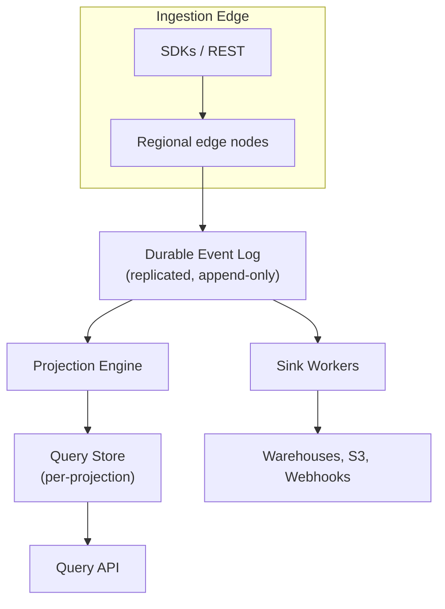

# Architecture

Polaris is a four-layer system: an ingestion edge, a durable log, a projection engine, and a query path. Each layer scales independently and fails independently — back pressure in one does not cascade into the others.

## High-level diagram

## Components

| Component | Role | Failure mode |
|---|---|---|
| Edge nodes | Authenticate the caller, validate the payload, batch into the log. | A failed edge node sheds traffic to the next-closest region; clients retry transparently. |
| Durable log | Replicated append-only log. Source of truth for everything downstream. | Triple-replicated per region. Loss of one node is invisible to readers and writers. |
| Projection engine | Consumes the log, applies projection definitions, writes to the query store. | Lag increases under spike; projections never serve stale-and-claim-fresh data. |
| Sink workers | Push events / projection rows to external destinations with at-least-once delivery. | Stalled destination causes the sink to back off, never the log. |
| Query API | Serves projection rows and ad-hoc SQL over recent events. | Read replicas auto-failover within the region. |

> [!NOTE]
> The log is the **only** stateful contract. Edge nodes are stateless, projection workers are restartable, and sinks rebuild their cursor from the log on restart. This is why Polaris can do zero-downtime rolling deploys of the projection engine and query layer.

## Replay

Anything that reads from the log can be rewound. Projection bugs are fixable by rewriting the definition and replaying. New sinks can be backfilled by starting their cursor from the oldest log offset within retention.

<Accordion>
  <AccordionTab title="When does replay finish?">

    Replay throughput is roughly **10× the live event rate** per region. So a workspace ingesting 1K events/sec can backfill 24 hours of history in about two and a half hours.

  </AccordionTab>

  <AccordionTab title="What happens to live traffic during replay?">

    Replay runs in a separate worker pool. Live projection updates continue without interruption, and the query API serves the latest committed offset, not the replay frontier.

  </AccordionTab>
</Accordion>

> [!WARNING]
> Replay reads from durable storage and counts against your I/O quota. Plan large backfills outside peak hours, or open a ticket for a temporary quota lift.
