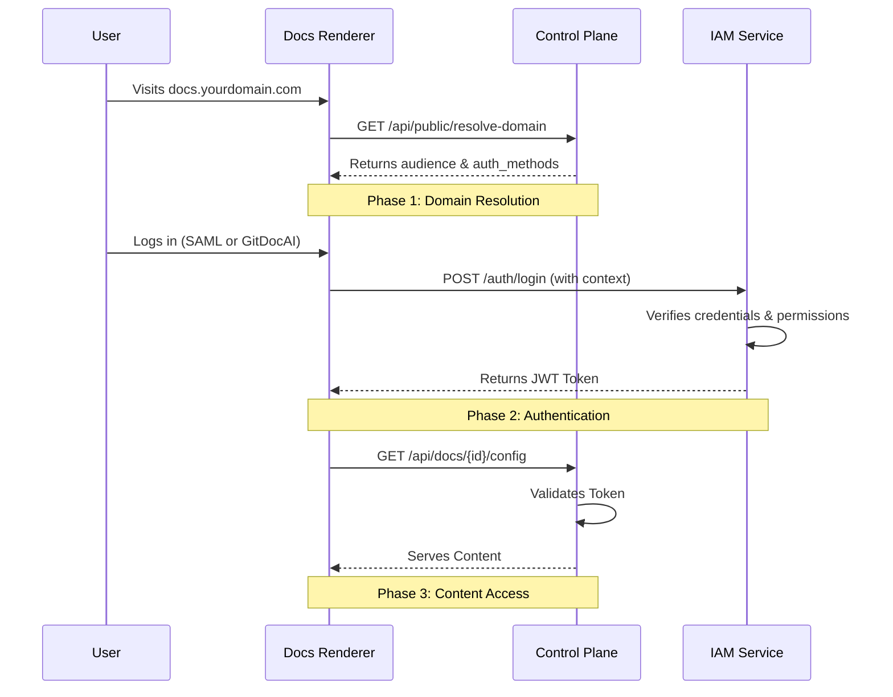

Secure your private documentation by configuring the right authentication methods for your users. GitDocAI supports standard accounts (including OAuth) and Enterprise SSO (SAML) to give you full control over who can view your content.

<Card title="Public vs. Private Documentation" icon="pi pi-globe">
If your documentation is set to public (`"audience": "public"`), users bypass authentication entirely. The system resolves the domain and serves content directly without requiring a login.
</Card>

## Choosing an Authentication Method

While both standard OAuth (like "Sign in with Google") and SAML SSO might use the same provider, they serve very different purposes. 

Use this comparison to decide which method is right for your documentation:

| Feature | Standard OAuth ("Sign in with Google") | Enterprise SAML SSO |
|---------|----------------------------------------|---------------------|
| **Who can log in?** | Anyone with a valid account (e.g., `user@gmail.com`) | Only verified company employees (e.g., `user@acme.com`) |
| **Account Ownership** | The user owns their GitDocAI account | The enterprise controls the access |
| **Provider Role** | Verifies identity ("You are who you say you are") | Verifies employment ("You work for Acme Corp") |
| **Best For** | Open-source projects, external collaborators | Internal company documentation, strict compliance |

> [!TIP]
> For internal company documentation, we highly recommend using **SAML** exclusively. This ensures that when an employee leaves your company, they automatically lose access to your private documentation.

## Configuring Authentication

You can control which login methods are available to your users by updating the `auth_methods` array in your documentation configuration. 

<Steps>
<Step title="Determine your required methods">
Decide if you want to allow standard GitDocAI accounts, Enterprise SSO, or both. 
- `["gitdocai"]`: Allows email/password and standard OAuth (Google, GitHub).
- `["saml"]`: Strictly enforces Enterprise SSO.
- `["gitdocai", "saml"]`: Displays both options on the login screen.
</Step>

<Step title="Update your configuration">
In your Control-Plane configuration, set the `auth_methods` property for your specific documentation ID. 

```json
{
  "id": "doc-xxx1",
  "audience": "private",
  "auth_methods": ["gitdocai", "saml"]
}
```
</Step>

<Step title="Verify the Login UI">
Once configured, the GitDocAI Docs Renderer automatically adapts the login screen based on your settings. If you enabled both methods, users will see a dedicated "Enterprise SSO" section alongside the standard "Sign in with Google/GitHub" and Email/Password fields.
</Step>
</Steps>

## Understanding the Authentication Flow

When a user attempts to access private documentation, GitDocAI orchestrates a secure, three-phase authentication flow behind the scenes.



### How IAM Verification Works

During **Phase 2**, the Identity and Access Management (IAM) service doesn't just check if the password is correct. It performs a strict sequence of checks before issuing an access token.

<Accordion>
<AccordionTab title="View the exact IAM verification steps">
When a login request is made, the IAM service verifies the following in order:

1. **Valid Credentials**: Checks if the email/password or SSO assertion is correct. If not, it returns a `401 Invalid credentials` error.
2. **Organization Membership**: Queries the database to ensure the user is actually a member of the organization tied to the documentation. If not, it returns a `403 You are not a member of this organization` error.
3. **Role Permissions**: Ensures the user has at least a `reader` role for the content. If not, it returns a `403 Insufficient permissions` error.
4. **Token Generation**: If all checks pass, IAM generates a secure JWT token containing the user's ID, email, verified Organization ID, and Role.
</AccordionTab>
</Accordion>

> [!WARNING]
> Never share your generated JWT tokens. The `org_id` and `role` embedded in the token are explicitly trusted by the Content-Runtime during Phase 3 to serve your private documentation.