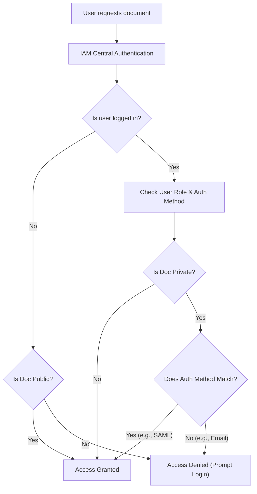

Managing access to your documentation platform is crucial for both security and effective collaboration. By assigning specific roles to your users, you can ensure that team members, external partners, and clients have exactly the permissions they need—nothing more, nothing less. 

Our Identity and Access Management (IAM) system centralizes all authentication, meaning you can manage access seamlessly whether your users log in via Single Sign-On (SAML), Google OAuth, or a standard email and password.

## Understanding User Roles

Every user in your workspace is assigned one of three primary roles. These roles dictate what a user can see and do within the platform.

| Role | Description | Typical Use Case |
|---|---|---|
| **Admin** | Full platform control. Can manage users, configure SSO/SAML, and adjust global settings. | Internal IT staff, Team Leads |
| **Editor** | Can create, modify, and manage documentation content, but cannot alter platform security settings. | Technical Writers, Developers |
| **Reader** | Read-only access to private documentation. Cannot make changes to content or settings. | Clients, External Partners |

> [!NOTE]
> **Auto-Provisioning Default:** If you have auto-provisioning enabled (for example, through Google Workspace or a SAML provider), new users who log in for the first time are automatically assigned the **Reader** role by default. An Admin must manually upgrade them to an Editor or Admin if needed.

## Document-Level Access Control

Beyond platform roles, you also have granular control over who can view specific documentation portals. The standalone Docs Renderer application checks a user's role and their authentication method before granting access.

Documentation can be categorized into two main visibility levels:

1. **Public (`public`)**: Open to the internet. No authentication is required.
2. **Private (`private`)**: Requires the user to be logged in. 

### Restricting Private Docs by Authentication Method

For private documentation, you can restrict access based on *how* the user logged in. This is highly useful for separating internal employee documentation from external partner documentation.

*   **Internal Docs:** Can be restricted to `saml` authentication only. Only employees logging in via your corporate SSO can view these.
*   **Partner Docs:** Can be restricted to traditional `email/password` logins.
*   **Platform Docs:** Can be configured to accept multiple methods, such as both `saml` and standard logins.

```json
// Example of how document access rules are structured
{
  "docs": [
    {
      "name": "Internal Docs",
      "visibility": "private",
      "allowed_auth_methods": ["saml"]
    },
    {
      "name": "Open Source Docs",
      "visibility": "public",
      "allowed_auth_methods": []
    }
  ]
}
```

## How Access is Evaluated

When a user attempts to view a document, the system evaluates their access in real-time using secure JWT tokens. Here is how the decision process works:



## Managing Users

<Steps>
<Step title="Navigate to User Management">
Log in to your dashboard as an Admin and click on **Settings**, then select **Users & Roles**.
</Step>
<Step title="Invite or Select a User">
Click **Invite User** to add someone new, or click on an existing user in the list to edit their permissions.
</Step>
<Step title="Assign the Role">
Select Admin, Editor, or Reader from the role dropdown menu. 
</Step>
<Step title="Save Changes">
Click **Save**. The user's permissions are updated immediately across the platform.
</Step>
</Steps>

> [!WARNING]
> Be cautious when assigning the **Admin** role. Admins have the ability to delete entire documentation projects and revoke access for other users.

## Frequently Asked Questions

<Accordion>
<AccordionTab title="Can a Reader view all private documentation?">
Not necessarily. Even if a user has the Reader role, they must still meet the authentication method requirements for that specific document. For example, a Reader who logged in via Google OAuth cannot view a private document restricted strictly to SAML users.
</AccordionTab>
<AccordionTab title="Do external clients need to pay for a seat?">
No. Users assigned the **Reader** role (such as external partners or clients logging in via email/password or OAuth) typically do not consume a paid editor seat on your billing plan.
</AccordionTab>
</Accordion>

<Card title="Configure Single Sign-On (SSO)" icon="pi pi-shield" href="/docs/security/sso-setup">
Ready to automate user provisioning? Learn how to connect your SAML or Google Workspace identity provider.
</Card>