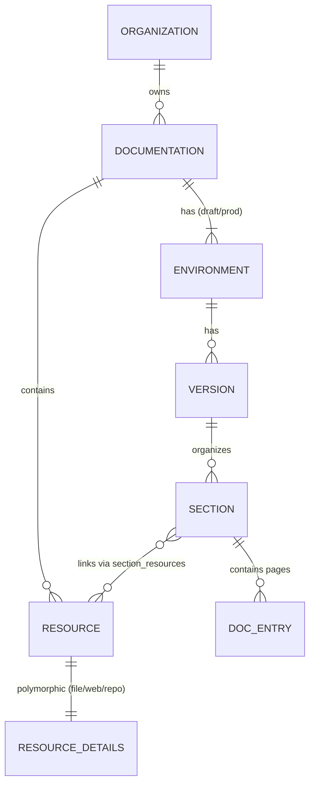

This guide explains how GitDocAI structures its control-plane domain models, database schemas, and asset storage architecture. Whether you are building integrations or just want to understand how your data is organized under the hood, this reference provides a complete overview of the system's architecture.

## Domain Entity Relationships

At the core of GitDocAI is a hierarchical data model that organizes everything from your top-level organization down to individual documentation pages and synced resources.



### Key Entities

*   **Documentation**: The primary container for a documentation project.
*   **Environment**: Separates your workspace into `draft` (work-in-progress) and `production` (live) states.
*   **Version**: Allows you to maintain multiple iterations of your docs (e.g., `v1.0`, `v2.0`).
*   **Section**: Logical groupings within a version that contain your actual pages (`Doc_Entries`).
*   **Resource**: The external data sources (Files, Websites, or Repositories) that feed content into your sections.

## Database Schema

The control-plane relies on a relational PostgreSQL database to maintain state. Here is a breakdown of the primary tables used to manage your documentation and resources:

| Module | Table | Description |
|--------|-------|-------------|
| Documentation | `documentations` | Main documentation records. |
| Documentation | `documentation_environments` | Tracks `draft` and `production` environments. |
| Documentation | `documentation_versions` | Manages different versions of the documentation. |
| Documentation | `documentation_sections` | Defines the structure and sections within versions. |
| Documentation | `documentation_entries` | The actual generated documentation pages. |
| Resources | `resources` | Base records for all synced resources. |
| Resources | `resource_files` | Specific details for uploaded file resources. |
| Resources | `resource_websites` | Specific details for scraped website resources. |
| Resources | `resource_repositories` | Specific details for connected Git repositories. |
| Resources | `section_resources` | The many-to-many mapping linking resources to sections. |

## Asset Management and Storage

GitDocAI explicitly manages assets (like logos, screenshots, and diagrams) to ensure they are securely stored and properly versioned alongside your documentation.

Assets are stored in a shared, private GCS/S3 bucket (`gitdocai-assets`), organized by environment, organization, documentation ID, and version.

```text
gitdocai-assets/
├── draft/{org_id}/{doc_id}/
│   ├── logo.png
│   └── screenshot.jpg
│
└── prod/{org_id}/{doc_id}/{version}/
    ├── logo.png
    └── screenshot.jpg
```

### Asset Metadata

While the physical files live in object storage, the control-plane PostgreSQL database tracks their metadata in an `assets` table. This table includes:
*   `id` and `documentation_id`
*   `filename` and `storage_path`
*   `mime_type` and `size`
*   `created_at`

> [!NOTE]
> **Secure by Default**
> Assets are never exposed publicly by default. Access requires authentication:
> *   **Draft**: The Control-Plane verifies your authentication and generates a temporary Signed URL to access the GCS/S3 object.
> *   **Production**: If the documentation is private, the Content-Runtime verifies authentication before generating a Signed URL.

## The Publishing Workflow

When you are ready to push your draft documentation to production, GitDocAI handles the migration of your content and assets automatically.

<Steps>
<Step title="Trigger Publish">
You initiate a publish action from the dashboard for a specific documentation version.
</Step>
<Step title="Copy Assets">
The system explicitly copies all assets from the `draft/{doc_id}/` folder to the `prod/{doc_id}/{version}/` folder in the storage bucket. This ensures the production version maintains its own independent copy of the assets.
</Step>
<Step title="Update Content-Runtime">
The stateless Content-Runtime receives the complete payload (including the new asset paths, theme configurations, and navigation structure) to serve the live documentation.
</Step>
</Steps>

> [!TIP]
> Because production maintains its own independent copy of assets, you can safely delete or replace images in your draft environment without breaking your live production documentation.

## Advanced Architecture Details

<Accordion>
<AccordionTab title="Domain File Structure">
If you are contributing to the GitDocAI codebase, domain models are organized into modular directories within the control-plane:

```text
control-plane/modules/
├── documentation/domain/
│   ├── documentation.go
│   ├── environment.go
│   ├── version.go
│   ├── section.go
│   └── doc_entry.go
│
└── resources/domain/
    ├── resource.go
    ├── resource_file.go
    └── ...
```
</AccordionTab>
<AccordionTab title="AI Services (core-ai)">
GitDocAI utilizes a unified AI service architecture (`core-ai`). It shares a common codebase for LLM clients and prompts, but operates in different modes based on environment variables:
*   `MODE=assistant`: Powers the conversational AI assistant features.
*   `MODE=docgen`: Handles the automated generation of documentation entries from your synced resources.
</AccordionTab>
</Accordion>