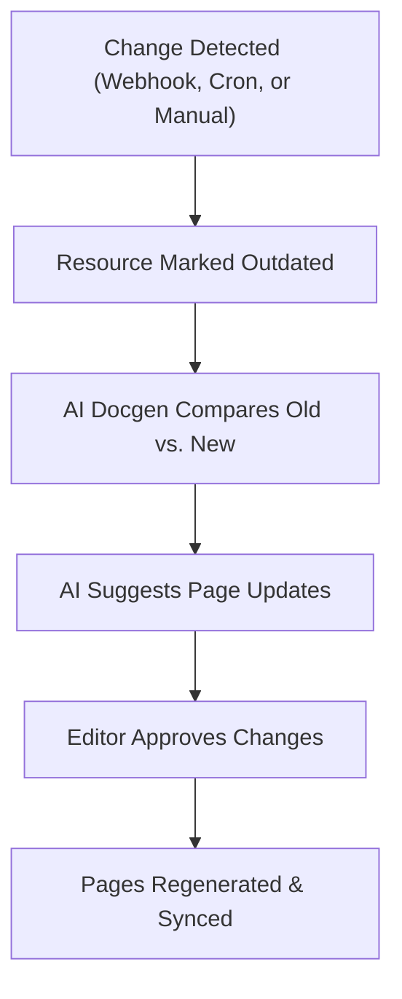

Welcome to the GitDocAI system architecture guide! This page explores how data flows through our platform, the separation between your draft and production environments, and how our AI services work behind the scenes to generate and manage your documentation.

## Core Services Overview

GitDocAI is built on a microservices architecture designed to separate editing workflows from live, public-facing documentation. 

| Service | Storage | Primary Users | Responsibilities |
|---------|---------|---------------|------------------|
| **Control-Plane** | PostgreSQL | Editors | Manages CRUD operations for docs, resources, assets, previews, and publishing. |
| **Content-Runtime** | OpenSearch | Readers | Serves live pages, powers semantic search, and delivers production assets. |
| **AI Docgen** | None (Calls others) | System | Generates documentation content and writes metadata to the Control-Plane. |
| **AI Assistant** | OpenSearch (Prod) | All Users | Powers the editing assistant in drafts and the Q&A chatbot in production. |
| **Object Storage** | GCS / S3 | All Users | Stores physical assets (images, files) for both draft and production. |

## Environments: Draft vs. Production

To ensure your live documentation is incredibly fast and secure, we strictly separate the editing environment from the published environment.

* **Draft Environment (Control-Plane):** This is where you work. It uses **PostgreSQL** to store all metadata, user roles, markdown content, and configuration. Because you are actively editing, it does not use semantic search (OpenSearch) here.
* **Production Environment (Content-Runtime):** This is what your users see. Once published, data is indexed into **OpenSearch**. This allows for lightning-fast page delivery and enables the AI chatbot to perform semantic searches (RAG) across your live content.

> [!TIP]
> **Why the separation?** By keeping drafts in PostgreSQL and production in OpenSearch, your readers never experience slowdowns while your team is running heavy AI generation tasks in the background.

## The Visual Editor

Traditional documentation platforms often suffer from fragmented settings—you edit content in one place, tweak settings in another, and have to constantly check a separate preview window. 

GitDocAI solves this with a **Hybrid Visual Editor**. Everything you edit, from text to theme settings, happens directly over the real documentation preview. What you see is exactly what your users will get, preventing accidental broken layouts.

## Data Flow: Resources to Documentation

When you connect an external resource (like a GitHub repository, an OpenAPI file, or a website), GitDocAI processes it into readable documentation through a structured pipeline.

<Steps>
<Step title="Upload or Connect a Resource">
You provide a resource. The system validates it based on its type (for example, validating OpenAPI schemas for API docs) and creates a base resource record.
</Step>
<Step title="Link to a Section">
The resource is linked to a specific section in your documentation. At this stage, synchronization is enabled, but the status is marked as `never_synced`.
</Step>
<Step title="Generate Documentation">
The generation process reads the linked resources, processes the content using AI, and generates the actual documentation pages (`DocEntries`). The status is then updated to `synced`.
</Step>
</Steps>

## Resource Synchronization

Documentation is rarely static. When your connected resources change, GitDocAI detects those changes and helps you keep your documentation up to date safely.

1. **Detection:** Changes are detected via GitHub webhooks, website cron jobs, or manual file uploads.
2. **Review:** The system marks the resource as outdated and alerts you in the dashboard.
3. **AI Comparison:** The AI Docgen service compares the old and new content to identify exactly which pages are affected.
4. **Approval:** You review the AI's suggestions. Once approved, the draft is updated and the resource is marked as synced.

## AI Services Deep Dive

GitDocAI utilizes two distinct AI services depending on what you are trying to accomplish.

### AI Docgen (Generation)
This is an asynchronous, queue-based service. It ingests your raw resources, chunks them for future comparison, generates the actual markdown pages, and writes everything to your PostgreSQL draft database. Because it handles heavy lifting, large repositories might take a few minutes to process.

### AI Assistant (Editing & Chat)
The assistant behaves differently depending on the environment:

* **In Draft Mode (Editing):** The assistant helps you write. It takes your current page content and your prompt, modifies the text directly, and returns the new content. It does *not* use OpenSearch or RAG (Retrieval-Augmented Generation) here.
* **In Production Mode (Chatbot):** The assistant helps your readers. When a user asks a question, it uses OpenSearch (RAG) to find relevant context across your published pages, generating an accurate, context-aware response.

> [!NOTE]
> The AI Chatbot will only ever answer questions using the context of your published production documentation, ensuring it doesn't leak draft content or hallucinate outside information.

## Authentication & Access Control

GitDocAI centralizes all authentication through a unified IAM (Identity and Access Management) system using JWT tokens. Whether users log in via email/password, OAuth (Google/GitHub), or Enterprise SAML/SSO, they receive the same type of secure token.

* **Membership Verification:** Having a GitDocAI account does not automatically grant access to private docs. Users must belong to your organization and have the appropriate role (e.g., Reader, Editor).
* **Flexible Configuration:** SAML/SSO is configured once per organization, but authentication methods can be toggled on a per-documentation basis.

<Accordion>
<AccordionTab title="View Authentication Endpoints">

| Endpoint | Auth Required | Purpose |
|----------|---------------|---------|
| `GET /api/public/resolve-domain` | No | Get documentation info by domain |
| `POST /auth/login` | No | Standard login with doc context |
| `GET /auth/saml/init?org_id=X` | No | Initiate SAML flow |
| `POST /auth/saml/callback` | No | IdP Callback |
| `GET /api/public/docs/{id}/*` | No | Fetch public content |
| `GET /api/docs/{id}/*` | Yes | Fetch private content (requires token & verification) |

</AccordionTab>
</Accordion>