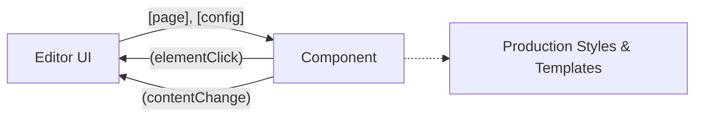

The Visual Editor is built on a modular Angular architecture designed for performance, extensibility, and a seamless content editing experience. This guide details the core component structure and the technical approaches used for communication between the editor interface and the document frame.

## Component Structure

The editor's frontend is organized into distinct, focused modules. This separation of concerns ensures that the UI remains responsive and easy to maintain.

### Core Editor Components

These components handle the primary user interface and interactive elements of the editing experience.

| Component | Description |
|-----------|-------------|
| `inline-editor` | A rich text editor featuring a contextual toolbar that appears directly over the text being edited. |
| `context-panel` | A contextual side panel that dynamically appears when selecting structural elements like the navbar or footer. |
| `page-tree` | A compact sidebar displaying the hierarchical tree of sections and pages within the current project. |
| `resource-list` | A secondary sidebar listing all connected API resources and external integrations. |
| `asset-picker` | A media management interface combining an asset gallery with file upload capabilities. |

### Services and Settings

State management and global configurations are handled outside the visual components:

*   **Services**: 
    *   `editor.service.ts`: Manages the global state of the editor (current selection, active page, etc.).
    *   `autosave.service.ts`: Handles background synchronization and automatic saving of draft content.
*   **Settings Module**: Contains global configuration panels, including `domain-settings`, `access-settings`, `team-settings`, and `analytics`.

## Frame ↔ Editor Communication

Rendering the user's documentation inside the editor requires a robust communication bridge. There are two distinct architectural approaches for this, depending on your isolation requirements.

### Option A: Direct Angular Component (Recommended)

For standard draft editing, the recommended approach is to use a direct Angular component rather than a traditional `<iframe>`. 

In this architecture, the "frame" is actually an Angular component (`<doc-frame>`) that renders the documentation using the exact same styles and templates as the production build.



**Implementation:**

```html
<doc-frame
  [page]="currentPage"
  [config]="docConfig"
  (elementClick)="onElementClick($event)"
  (contentChange)="onContentChange($event)">
</doc-frame>
```

> [!TIP]
> **Why use a direct component?**
> This approach offers significant advantages: it utilizes native Angular data binding, completely avoids cross-origin (CORS) iframe issues, provides direct DOM access for inline editing, and is generally much easier to implement and debug.

### Option B: Iframe with postMessage (Isolated)

If your architecture requires strict security isolation (for example, rendering untrusted custom code or third-party scripts), you must use a real `<iframe>` and communicate via the browser's `postMessage` API.

<Accordion>
<AccordionTab title="View Iframe Implementation Details">

When using an iframe, direct data binding is no longer possible. You must pass the preview URL to the `src` attribute and set up event listeners for cross-window communication.

**1. Template Setup:**

```html
<iframe
  [src]="previewUrl"
  #docFrame
  (load)="onFrameLoad()">
</iframe>
```

**2. Communication via postMessage:**

To trigger actions inside the iframe (or listen to events from it), you must serialize your commands into message objects:

```typescript
// Sending a command to the iframe to edit a specific element
window.postMessage({ 
  type: 'EDIT_ELEMENT', 
  path: '/intro#title' 
}, '*');
```

> [!WARNING]
> When implementing `postMessage`, always validate the origin of the message in your event listeners to prevent cross-site scripting (XSS) vulnerabilities. Replace `*` with the specific target origin in production.

</AccordionTab>
</Accordion>