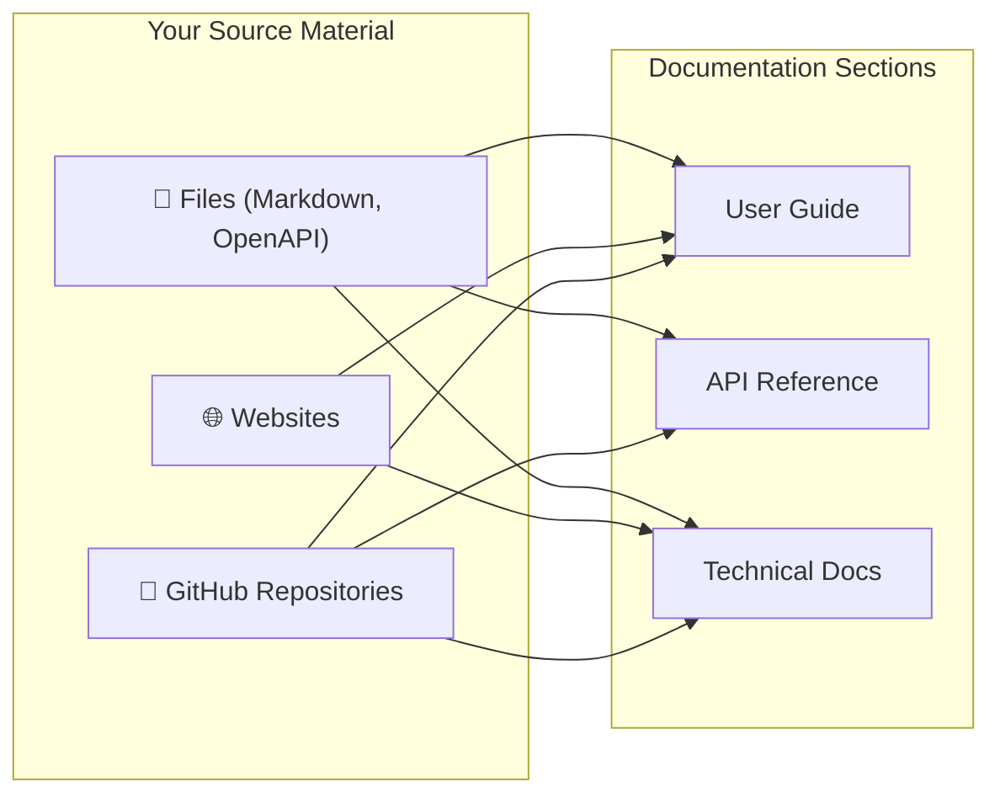

Sections are the building blocks of your documentation, helping you organize content logically for your users. To populate these sections, you'll add **Resources**—the actual files, websites, or GitHub repositories that contain your source material. 

By linking resources to sections, you can automatically generate structured, readable documentation pages.

## Understanding Sections and Resources

Think of **Sections** as the folders or categories in your documentation (like "Getting Started" or "API Reference"), and **Resources** as the raw data you feed into them. 

You can mix and match resources to build a comprehensive section. For example, your "Getting Started" section might pull an introductory `README.md` file and a few pages from your existing website.

### Supported Resource Types

Different sections support different types of resources. Most sections are flexible, but the **API Reference** section has specific requirements to ensure your endpoints are rendered correctly.

| Section Type | Files | Websites | GitHub Repos |
|--------------|-------|----------|--------------|
| **User Guide** (Getting Started) | ✅ Yes | ✅ Yes | ✅ Yes |
| **Technical** (Architecture) | ✅ Yes | ✅ Yes | ✅ Yes |
| **Custom** | ✅ Yes | ✅ Yes | ✅ Yes |
| **API Reference** | ✅ Yes* | ❌ No | ✅ Yes* |

> [!WARNING]
> **API Reference Restrictions**
> When adding resources to an API Reference section, you **must** use valid OpenAPI or Swagger files. Websites cannot be used as source material for API documentation.

## Adding Resources and Generating Docs

Once you've decided how to structure your sections, it's time to add your resources and let the system generate your documentation pages.

<Steps>
<Step title="Create a Section">
Navigate to your documentation builder and create a new section. Choose the appropriate type (e.g., User Guide or API Reference) based on the content you plan to add.
</Step>
<Step title="Attach Resources">
Select the resources you want to use. You can upload a file directly, paste a website URL, or link a GitHub repository. 
</Step>
<Step title="Generate Documentation">
Click the **Generate** button. The system will process your resources, analyze the content, and automatically create individual documentation pages (entries) organized under your section.
</Step>
</Steps>

> [!TIP]
> After generating, you can freely move, rename, or reorganize the generated pages to perfectly fit your users' needs.

## Keeping Content Synchronized

Documentation is rarely static. Because your sections are linked directly to your source resources, you can easily track when your source material changes and sync those updates to your documentation.

Every resource attached to a section has a **Sync Status** to help you manage updates:

| Status | What it means |
|--------|---------------|
| `synced` | Everything is up to date. Your documentation matches the source. |
| `pending_changes` | There are new changes in the source waiting for your review. |
| `outdated` | The source resource has been updated, and your documentation needs to be synced. |
| `error` | Something went wrong during the last sync attempt. |
| `never_synced` | The resource was just added and hasn't been processed yet. |

## Publishing Your Documentation

When you generate documentation, it lives in a **Draft Environment**. This gives you a safe space to review the generated pages, tweak the structure, and ensure everything looks perfect.

When you are ready to share your work with the world:

1. Click the **Publish** button.
2. The system will copy your draft version, sections, and pages into the **Production Environment**.
3. Your documentation is now live and accessible to your users on the internet!

<Accordion>
<AccordionTab title="What happens to my live docs if I generate new changes?">
Generating new documentation only affects your Draft Environment. Your live, published documentation will remain unchanged until you explicitly click **Publish** again.
</AccordionTab>
<AccordionTab title="Can I add an API Reference later?">
Yes! You can always go back to the builder, add a new "API Reference" section, attach your OpenAPI file, and generate the new pages without disrupting your existing sections.
</AccordionTab>
</Accordion>