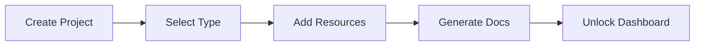

Welcome to GitDocAI! Generating your first set of documentation is designed to be fast, intuitive, and completely distraction-free. This guide will walk you through our setup wizard so you can get your first project drafted in minutes.

## Using the Setup Wizard

When you log in for the first time, you'll be greeted by a clean welcome screen. We intentionally hide advanced settings and sidebars initially so you can focus entirely on creating your content. 

<Steps>
<Step title="Start your project">
Click the **Create Documentation** button on your welcome dashboard. You'll be prompted to enter a name and a brief description for your new project.
</Step>
<Step title="Select a documentation type">
GitDocAI will ask: *"What would you like to generate first?"* Choose the type of section that best fits your current goal (you can always add the others later):
*   **Getting Started Guide**: Perfect for user onboarding, quick starts, and tutorials.
*   **API Reference**: Best for documenting endpoints, payloads, and authentication.
*   **Technical Docs**: Ideal for architecture overviews, internal guidelines, and deep dives.
</Step>
<Step title="Add your resources">
Provide the source material GitDocAI will use to understand your product. You can upload local **Files**, link to a live **Website**, or connect a **GitHub** repository. 
</Step>
<Step title="Generate your content">
Confirm your selections and let the AI do the heavy lifting. GitDocAI will process your resources and instantly generate your first document entry (such as a "Quick Start" page).
</Step>
</Steps>

> [!INFO]
> **What happens behind the scenes?**
> While you click through the wizard, GitDocAI automatically provisions your organization, sets up a `v1` draft environment, and applies sensible default themes. You don't need to worry about configuring environments, versions, or styling until you are completely ready!

## Exploring Your New Dashboard

Once your first document is generated, you'll experience the "magic" of GitDocAI—and your full workspace will unlock. A sidebar will appear on the left side of your screen, giving you complete control over your new documentation site.

Here is what you will find in your newly unlocked sidebar:

| Menu Item | What you can do here |
|-----------|----------------------|
| **Editor + Preview** | Edit your AI-generated content in Markdown and see a live preview of your changes. |
| **Resources** | Manage, update, or add new files, links, and repositories that feed your AI. |
| **Styling** | Customize themes, colors, and fonts to perfectly match your company's brand. |
| **Domain** | Configure custom domains for publishing your documentation to the world. |
| **Team** | Invite colleagues, assign roles, and manage access permissions. |
| **Settings** | Update project details, manage environments (like draft vs. production), and tweak advanced configurations. |

<Card title="Next Step: Customize Your Theme" icon="pi pi-palette" href="/docs/getting-started/styling">
Now that your content is generated, head over to the Styling section to learn how to apply your brand colors and fonts.
</Card>