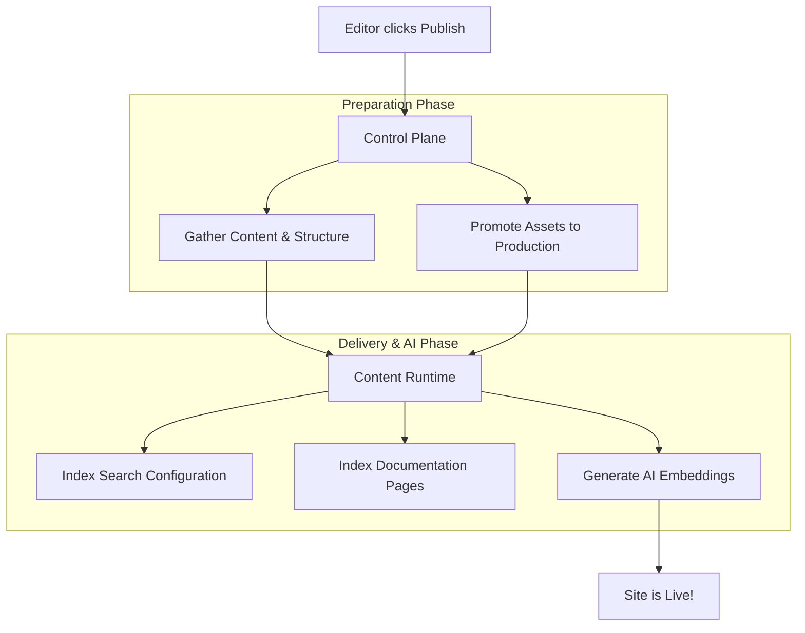

Once your initial documentation is generated, you'll land in the management dashboard. Here, you can refine your content, add new sections, keep your source resources synchronized, and finally publish your site to the world.

## Dashboard Overview

The dashboard is your central hub for managing your documentation project. From here, you can freely move between different configuration areas before making your site live.

<Card title="Customize Styles" icon="pi pi-desktop">
Tweak the look and feel of your documentation to match your brand's colors and typography.
</Card>
<Card title="Configure Domain" icon="pi pi-globe">
Set up a custom domain so your users can access your documentation at `docs.yourcompany.com`.
</Card>
<Card title="Manage Resources" icon="pi pi-database">
View, add, or remove the source files and repositories that power your documentation.
</Card>

## Adding New Sections

You don't have to generate everything at once. You can easily expand your documentation by adding new sections using the integrated mini-wizard.

<Steps>
<Step title="Start the wizard">
Click the **+ Add Section** button in your dashboard navigation menu.
</Step>
<Step title="Select a section type">
Choose the template that best fits your new content. Available options include:
* **Getting Started**: Best for tutorials and onboarding.
* **API Reference**: Optimized for endpoints, parameters, and code snippets.
* **Technical**: Great for architecture deep-dives and internal guides.
* **Custom**: A blank slate for unique documentation needs.
</Step>
<Step title="Attach resources">
Select the source files, code repositories, or raw text that the AI should use to write this specific section.
</Step>
<Step title="Generate">
Click **Generate**. The system will process your resources and create a new draft section that you can review and edit.
</Step>
</Steps>

## Synchronizing Resources

Documentation is rarely static. As your product evolves, your source files and code repositories will change. 

When you update your underlying resources, you can synchronize them directly from the dashboard. The system will pull the latest information, update your current draft, and mark your content status as `synced`.

> [!TIP]
> Always review your draft after a synchronization. The AI will incorporate the latest changes from your resources, but you may want to manually tweak the wording before publishing.

## Publishing Your Documentation

When you are happy with your generated drafts, it's time to share your documentation with your users. 

Click the **🚀 Publish** button in the dashboard. Behind the scenes, a powerful deployment process ensures your documentation is fast, searchable, and AI-ready.

### What happens when you publish?

1. **Asset Promotion**: All your images, diagrams, and static assets are securely copied from your private draft environment to the production delivery network.
2. **Search Indexing**: Your configuration and page contents are indexed into our search engine, ensuring your users get instant, accurate search results.
3. **AI Embeddings**: The system generates vector embeddings for every published page. This is what powers the AI-assistant features, allowing users to ask natural language questions and get precise answers based *only* on your documentation.

> [!INFO]
> Because we generate AI embeddings and search indexes during the publish phase, it might take a few moments for the process to complete. You will see a `published` confirmation message as soon as your site is live.