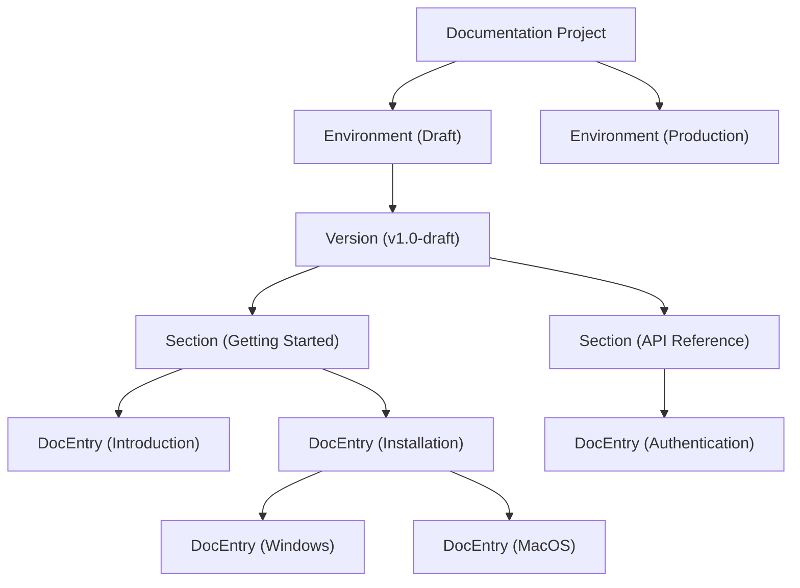

Understand how GitDocAI organizes your documentation to help you manage and scale your content effectively. This guide covers the core hierarchy, how source resources are linked, and the lifecycle of publishing your pages.

## The Documentation Hierarchy

GitDocAI uses a structured, nested hierarchy to keep your documentation organized, version-controlled, and easy to navigate. 

Here is a breakdown of the core components:

*   **Environment:** Separates your work-in-progress (`draft`) from your live, public-facing content (`production`).
*   **Version:** Allows you to maintain multiple iterations of your docs simultaneously (e.g., `v1.0`, `v2.0`).
*   **Section:** Broad categories or folders that group related content together, such as "Getting Started" or "API Reference".
*   **DocEntry:** The actual documentation pages. These can be nested infinitely to create sub-pages (for example, nesting "Windows" and "MacOS" under an "Installation" parent page).

## How Content is Generated

GitDocAI doesn't just give you empty pages; it uses your existing resources to write the documentation for you. 

You attach specific resources (like a GitHub `readme.md`, a code file, or an external URL like `docs.example.com`) directly to a **Section**. GitDocAI maps these resources to the section and uses them as the context to automatically generate your `DocEntry` pages.

> [!TIP]
> By linking specific resources to specific sections, you control exactly what context the AI uses. For example, link your authentication code solely to the "API Reference" section to keep the generated content highly focused.

## The Publishing Lifecycle

Moving your documentation from raw source files to a live, published website follows a simple, linear workflow:

<Steps>
<Step title="Attach Resources">
Link your source materials (files, URLs, or repositories) to a specific Section in your Draft environment.
</Step>
<Step title="Generate Content">
GitDocAI processes your attached resources and automatically generates structured `DocEntry` pages.
</Step>
<Step title="Review and Edit">
Read through the generated content in your Draft environment. You can manually edit, reorganize, or tweak the pages to perfection.
</Step>
<Step title="Publish to Production">
When you are ready, hit publish. GitDocAI copies your draft version, sections, and entries into the Production environment, making them instantly available to your users.
</Step>
</Steps>

<Accordion>
<AccordionTab title="What exactly happens during publishing?">
When you publish, GitDocAI takes a snapshot of your current Draft environment and safely copies it over to the Production environment. Your Draft remains intact so you can immediately start working on the next set of updates without affecting the live site.
</AccordionTab>
</Accordion>

## Plan Limits and Features

Depending on your GitDocAI plan, your access to certain structural features (like the number of top-level documentations and custom domains) will vary.

| Feature | Free | Pro | Enterprise |
|---------|------|-----|------------|
| **Documentations** | 1 | 5 | Unlimited |
| **Sections & Pages** | Unlimited | Unlimited | Unlimited |
| **AI Generation** | Included | Included | Included |
| **Content Editing** | Included | Included | Included |
| **Public Publishing** | Included | Included | Included |
| **Custom Domain** | No (`*.gitdocai.io`) | Yes (`docs.yoursite.com`) | Yes |

> [!NOTE]
> All tiers, including the Free tier, allow you to create an unlimited number of Sections and DocEntries within your allowed Documentation projects.