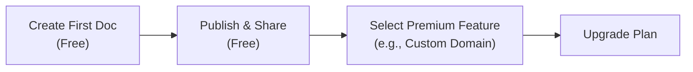

We believe you should experience the full value of our platform before committing to a paid plan. This page outlines our premium capabilities, how our plans compare, and how our value-first upgrade system works.

## The Value-First Experience

Our platform is designed around a "value-first, pay-later" philosophy. When you sign up, you are automatically placed on the Free plan. You can create, design, and publish your first documentation project completely free of charge. 

You only need to upgrade when your documentation needs grow and you require advanced capabilities like custom domains, private access, or team collaboration.

> [!NOTE]
> **Your hard work is safe.** If you encounter a premium feature prompt while building, you will never lose your progress. You can always choose "Maybe Later" and continue using the free features.

## Plan Comparison

Here is a quick overview of what is included in each tier to help you decide when it's time to upgrade.

| Feature | Free | Pro | Enterprise |
|---------|------|-----|------------|
| **Documentation Projects** | 1 maximum | Up to 5 | Unlimited |
| **Custom Domains** | ✗ | ✓ | ✓ |
| **Private Documentation** | ✗ | ✓ | ✓ |
| **Team Members** | 1 (Owner only) | Multiple | Unlimited |
| **Advanced Analytics** | ✗ | ✓ | ✓ |
| **Remove Branding** | ✗ | ✓ | ✓ |
| **SAML / SSO** | ✗ | ✗ | ✓ |

## Premium Feature Triggers

As you explore the platform, you might click on a feature that requires a premium plan. When this happens, you'll see a friendly prompt explaining the feature and offering a quick path to upgrade. 

Here are the key premium features that will trigger an upgrade prompt:

### 1. Scaling Your Projects
The Free plan allows you to host one complete documentation project. If you attempt to create a second documentation site, you will be prompted to upgrade to Pro (up to 5 projects) or Enterprise (unlimited projects).

### 2. Custom Branding & Domains
To make your documentation look like a seamless part of your own product, you'll need the Pro plan. 
* **Custom Domains:** Host your docs at `docs.yourdomain.com`.
* **Remove Branding:** Remove the "Powered by" badge from your published site footer.

### 3. Privacy and Access Control
By default, free documentation is public. If you are building internal wikis or partner-only guides, you will need to upgrade to make your documentation **Private**. 

### 4. Team Collaboration
Documentation is often a team effort. While the Free plan is limited to a single administrator, upgrading allows you to invite additional editors and writers to your workspace.

<Accordion>
<AccordionTab title="What about Enterprise Single Sign-On (SSO)?">
If you need to manage team access through your company's identity provider (like Okta or Azure AD), SAML/SSO configuration is available exclusively on the Enterprise plan.
</AccordionTab>
<AccordionTab title="What are Advanced Analytics?">
Advanced analytics give you deep insights into what your users are searching for, which pages are most popular, and where readers are dropping off. This feature unlocks on the Pro plan.
</AccordionTab>
</Accordion>

## How to Upgrade

Upgrading is a seamless process that won't disrupt your current workspace. You can upgrade directly from any feature prompt, or manually through your organization settings.

<Steps>
<Step title="Navigate to Settings">
Click on your organization name in the top left corner and select **Billing & Plans**.
</Step>
<Step title="Choose Your Plan">
Review the features for the **Pro** and **Enterprise** plans. Click **Upgrade** on the plan that best fits your needs.
</Step>
<Step title="Enter Payment Details">
Provide your billing information securely. Your new features will unlock immediately upon successful payment.
</Step>
<Step title="Configure Your New Features">
Head back to your documentation dashboard. The premium features (like custom domains or privacy toggles) will now be fully accessible.
</Step>
</Steps>

<Card title="Need an Enterprise solution?" icon="pi pi-briefcase" href="/contact-sales">
If you need unlimited projects, custom contracts, or SAML SSO, contact our sales team to set up an Enterprise workspace tailored to your organization.
</Card>