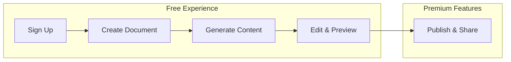

GitDocAI offers flexible pricing plans designed to scale with your documentation needs. Whether you are a solo developer working on an open-source project or a large enterprise needing strict access controls, you can explore our core features for free and upgrade only when you are ready to scale.

<Card title="Try before you buy" icon="pi pi-star">
We believe in a "Value First" approach. You can sign up, create your documentation, generate content, and edit your drafts completely for free. You only hit a paywall when you decide to publish using premium features like custom domains or private access.
</Card>

## Plan Overview

| Feature | Free ($0/mo) | Pro ($29/mo) | Enterprise (Custom) |
|---------|--------------|--------------|---------------------|
| **Active Documents** | 1 max | 5 max | Unlimited |
| **Team Editors** | 1 max | 5 max | Unlimited |
| **Private Readers** | None | 10 max | Unlimited |
| **Custom Domain** | ✗ (*.gitdocai.io only) | ✓ | ✓ |
| **Remove Branding** | ✗ (Shows "Powered by") | ✓ | ✓ |
| **Private Docs** | ✗ (Public only) | ✓ | ✓ |
| **Multiple Versions** | ✗ | ✓ | ✓ |
| **Analytics** | Basic (Page views) | Advanced (+ sources, time) | Advanced + API access |
| **API Access** | ✗ | Read-only | Full CRUD |
| **SAML / SSO** | ✗ | ✗ | ✓ |
| **Support** | Community | Priority Email | Dedicated + Slack |

> [!NOTE]
> On the **Free** tier, your documentation will be hosted on a `*.gitdocai.io` subdomain and will include a small "Powered by GitDocAI" badge in the footer. 

## The Upgrade Experience

We want you to experience the full power of GitDocAI's editing and generation tools before asking for a credit card. Our workflow is designed to let you build your entire documentation site in a draft state for free.

You will only be prompted to upgrade to a Pro or Enterprise plan when you attempt to:
* Connect a custom domain (e.g., `docs.yourcompany.com`).
* Restrict access to your documentation (Private Docs).
* Invite more than 1 editor to collaborate.
* Remove the GitDocAI branding.

## Frequently Asked Questions

<Accordion>
<AccordionTab title="What counts as an 'Active Document'?">
An active document refers to a single documentation project or site. For example, if you have documentation for "Project A" and "Project B", that counts as two active documents.
</AccordionTab>
<AccordionTab title="What is the difference between Editors and Readers?">
**Editors** are team members who can write, edit, and publish documentation from the GitDocAI dashboard. **Readers** are authenticated users who are granted access to view your *Private* documentation sites. Public documentation sites have unlimited unauthenticated readers across all plans.
</AccordionTab>
<AccordionTab title="How does API access work on the Pro tier?">
The Pro tier includes Read-only API access, allowing you to programmatically fetch your documentation content and analytics data. If you need to programmatically create, update, or delete documentation (Full CRUD), you will need an Enterprise plan.
</AccordionTab>
<AccordionTab title="Can I test SAML/SSO before upgrading to Enterprise?">
SAML/SSO configuration is exclusive to the Enterprise tier. If you need to evaluate this feature for your organization's security compliance, please contact our sales team to arrange a trial.
</AccordionTab>
</Accordion>

> [!TIP]
> Ready to upgrade? Head over to the **Billing** section in your GitDocAI dashboard to select the Pro plan, or contact our sales team to discuss a custom Enterprise package.