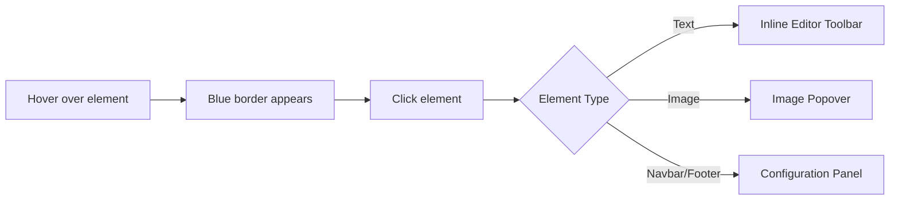

The Visual Editor allows you to modify your documentation's content and layout directly on the page. Learn how to interact with different elements, edit text inline, and configure global components like your navigation bar and footer.

## Interacting with the editor

The editor is designed to be intuitive—if you see something you want to change, just click it. 

As you move your mouse over the page, you will notice a **blue dotted border** and an edit icon (✏️) appear around editable elements. This hover state indicates that the element is ready to be modified.

## Editing text

When you click on any text block (like a paragraph or a heading), the inline editor activates. 

<Steps>
<Step title="Select the text">
Click directly on the text you want to change. A blinking cursor will appear, allowing you to type immediately.
</Step>
<Step title="Format your content">
Use the contextual toolbar that appears above the text to apply formatting. You can make text bold or italic, insert links, format as code, change heading levels (H1, H2), or create bulleted and numbered lists.
</Step>
<Step title="Save changes">
Simply click anywhere outside the text block to apply and save your changes.
</Step>
</Steps>

> [!TIP]
> Keyboard shortcuts work here too! You can use standard shortcuts like `Ctrl+B` (or `Cmd+B` on Mac) for bold text while typing.

## Managing images

Clicking on an image opens a popover menu that lets you quickly replace the current graphic. You have three ways to swap out an image:

| Source Option | Description |
|----------|----------|
| **From Assets** | Select from a grid of thumbnails showing images you have already uploaded to your project. |
| **Upload New** | Browse your computer to upload a brand new image file. |
| **From URL** | Paste a direct web link to embed an image hosted elsewhere. |

## Configuring layout components

Global layout elements, such as your navigation bar (Navbar) and Footer, are managed through a dedicated configuration panel rather than inline.

### Customizing the Navbar

Your navbar is the primary way users navigate your documentation. 

1. Click anywhere on the **Navbar** at the top of the frame.
2. The **Navbar Config** panel will slide open on the right side of your screen.
3. From this panel, you can:
   * **Upload a Logo**: Add your company or project logo.
   * **Set the Title**: Change the main text displayed next to your logo.
   * **Manage Links**: Add, remove, or reorder navigation links (e.g., Home, Docs, Blog, GitHub).

> [!NOTE]
> All changes made in the configuration panel are reflected **live** in the frame. You don't need to refresh the page to see how your new logo or links look!

### Customizing the Footer

Just like the navbar, clicking the **Footer** at the bottom of the page opens its configuration panel on the right. Here, you can update your copyright text, add links to your Privacy Policy or Terms of Service, and adjust the footer's layout.

## Frequently asked questions

<Accordion>
<AccordionTab title="Why don't I see the blue dotted border?">
Ensure you are in the Visual Editor mode and not in "Preview" mode. The blue borders and edit icons are only visible when the editor is actively engaged.
</AccordionTab>
<AccordionTab title="Can I change the overall theme or colors?">
Yes! Clicking on "Appearance" or any global styling element will open the Styling Mode panel on the right, where you can adjust your project's theme, colors, and typography.
</AccordionTab>
</Accordion>