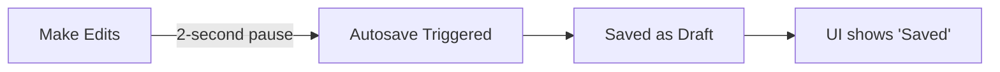

When you work in the Visual Editor, your changes are automatically saved as drafts in the background. This allows you to write, experiment, and format your content safely without affecting your live documentation until you are completely ready to share it with your users.

## How Autosave Works

You never have to worry about losing your work or remembering to click a "Save" button. The Visual Editor uses a continuous autosave system. 

Whenever you make an edit, the system waits for a brief 2-second pause in your typing and then automatically syncs your changes to the server as a draft. 

### Status Indicators

You can always check the current save status of your document by looking at the indicator in the top navigation bar, right next to the **Publish** button.

| Indicator | Status | Description |
|-----------|--------|-------------|
| ⚪ **No changes** | Up to date | No edits have been made since your last save. |
| 🟡 **Saving...** | In progress | Currently syncing your latest changes to the server. |
| ☁️ **Saved** | Success | Changes saved successfully (this indicator fades out after 3 seconds). |
| 🔴 **Error** | Failed | Could not reach the server to save. The system will automatically retry. |
| 🟠 **Offline** | Local mode | No internet connection detected. Changes are saved locally to your browser. |

> [!NOTE]  
> **Working offline?** Don't worry if your internet drops. The editor will automatically switch to Offline mode (🟠) and save your progress locally. Once your connection is restored, it will sync all your pending changes back to the server.

## Drafts vs. Published Content

It is important to understand the difference between your workspace and what your users see:
* **Drafts:** The Visual Editor always operates in "Draft" mode. Every change you make, page you add, or typo you fix is saved here first.
* **Production:** Your live documentation site (e.g., `https://my-project.gitdocai.io`) remains completely untouched by your draft edits until you explicitly choose to publish them.

## Publishing Your Changes

When you are happy with your draft and ready to make it visible to your users, you need to publish your changes.

<Steps>
<Step title="Click the Publish button">
Locate and click the **Publish** button in the top navigation bar of the Visual Editor.
</Step>
<Step title="Review your changes">
The system will display a summary of what has been modified since your last publish (for example, "You have 5 unpublished changes"). Take a moment to review this diff to ensure you are only publishing what you intend to.
</Step>
<Step title="Confirm and push live">
Confirm the action. Your draft changes will immediately be pushed to your live production environment, making them visible to your audience.
</Step>
</Steps>

> [!TIP]
> Because the Visual Editor is a true WYSIWYG (What You See Is What You Get) environment, the draft you see on your screen is exactly how it will look to your users once published.